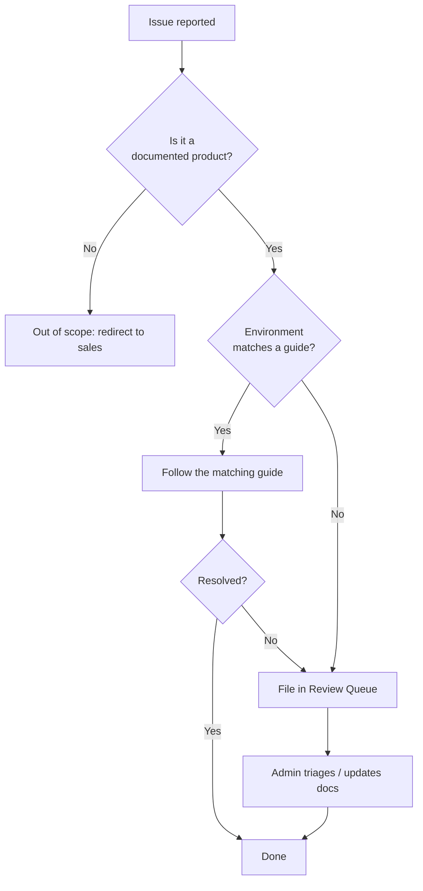

# Support Policy

This page explains what the Yupitek Wiki covers, what is out of scope, and how requests are triaged.

## What this wiki supports

This wiki is the **technical reference** for the five product families we sell:

- **ALFA Network** — Linux/Wi-Fi driver setup, monitor mode, hardware integration.
- **Hak5** — setup, firmware and usage of pentesting tools.
- **Flipper Zero** — firmware, the mobile app and accessories.
- **SDRLAB** — software-defined radio setup and Flipper expansion modules.
- **ACS** — smart card reader drivers and NFC use.

Content is written for **students and beginners**: clear, step-by-step, with working commands and expected output.

## Support levels

| Level | What it covers | Example |
|-------|----------------|---------|
| **Documented** | Covered by a guide in this wiki | Installing the `rtl8812au` DKMS driver |
| **Best-effort** | Reasonably expected to work, but environment-dependent | Linux on unusual hardware |
| **Out of scope** | Not covered by Yupitek support | Third-party firmware forks, unsupported kernels |

## Out of scope

The following are **not** covered by this wiki's support:

- Issues caused by third-party firmware forks not published by the manufacturer (for example, unofficial Flipper builds).
- Drivers on kernels older than those listed in each chipset guide.
- Defective hardware — please contact [Yupitek sales](https://www.yupitek.com) for RMA.
- Products we no longer sell (see the Product Registry for current inventory).

## How requests are triaged

## Reporting a problem with this wiki

If a guide is wrong, missing a step, or a command no longer works, please let us know. Problems are tracked in the Review Queue, and fixes are recorded in the [Change Log](/admin/change-log/).

Remember the golden rule: always verify commands in a test environment before running them on a production or assessment target.
