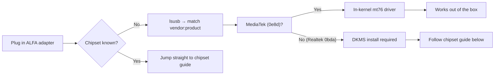

# ALFA Driver Guides — Overview

> **Quick Summary**: Every ALFA wireless adapter on Linux is powered by one of **seven chipsets** — three MediaTek chipsets with **in-kernel** drivers that work out of the box, and four Realtek chipsets that need an **out-of-tree DKMS** build. Find your chipset below and jump to its guide.

## Chipset Map

| Chipset | Adapters | Driver binding | In-kernel? | Guide |
|---------|----------|----------------|------------|-------|
| MT7612U | AWUS036ACM | `mt76x2u` | ✅ In-kernel | [MT7612U guide](/alfa-network/drivers/mt7612u/) |
| MT7610U | AWUS036ACHM | `mt76x0u` | ✅ In-kernel | [MT7610U guide](/alfa-network/drivers/mt7610u/) |
| MT7921AUN | AWUS036AXM, AWUS036AXML | `mt7921u` | ✅ In-kernel | [MT7921AUN guide](/alfa-network/drivers/mt7921aun/) |
| RTL8812AU | AWUS036ACH | Out-of-tree / DKMS | ❌ Not in-kernel | [RTL8812AU guide](/alfa-network/drivers/rtl8812au/) |
| RTL8811AU | AWUS036ACS | Out-of-tree / DKMS | ❌ Not in-kernel | [RTL8811AU guide](/alfa-network/drivers/rtl8811au/) |
| RTL8832BU | AWUS036AX, AWUS036AXER | Out-of-tree / DKMS | ❌ Not in-kernel | [RTL8832BU guide](/alfa-network/drivers/rtl8832bu/) |
| RTL8821CU | AWUS036EACS | Out-of-tree / DKMS | ❌ Not in-kernel | [RTL8821CU guide](/alfa-network/drivers/rtl8821cu/) |

## How to Pick

1. **Identify the chipset** — run `lsusb` and match the `vendor:product` pair against your adapter's spec sheet.
2. **MediaTek chipset?** You are done — the driver is in the kernel. Go straight to the guide to confirm with `dmesg` / `iw dev` and enable monitor mode.
3. **Realtek chipset?** Follow the matching guide to build the DKMS module. Remember: a kernel update needs `sudo dkms autoinstall` afterwards.

The full system walk-throughs live in the [Linux setup guides](/alfa-network/linux-setup-ubuntu/) and the [compatibility matrix](/alfa-network/linux-compatibility-matrix/).