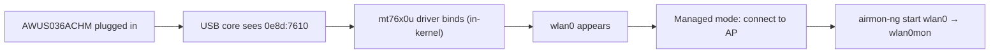

# MT7610U Driver Guide (AWUS036ACHM)

> **Quick Summary**: The **MediaTek MT7610U** is the 1T1R (one stream) dual-band chipset inside the **AWUS036ACHM** — a budget-friendly AC433 adapter whose `mt76x0u` driver is **in the Linux kernel since 4.19**. Like its big brother the MT7612U, it is plug-and-play on any modern Linux.

## Concept: the "little brother" chipset

Where the MT7612U is a 2×2 radio, the MT7610U is a **1×1** — one spatial stream, so 433 Mbps max on 5 GHz instead of 867. That is exactly the AC433 spec of the AWUS036ACHM. What you lose in speed you gain in simplicity and price: it is the cheapest ALFA adapter that still gives you **in-kernel driver + dual-band + working monitor mode**.

The driver lives in the same mainline `mt76` family (`drivers/net/wireless/mediatek/mt76/mt76x0/`), so the experience is identical to the MT7612U:

- Plug in → interface appears. No installation.
- No DKMS → nothing to maintain across kernel updates.
- Monitor mode + injection via standard `mac80211` tooling.



## Prerequisites

- [ ] Linux with kernel **4.19 or newer**
- [ ] `sudo` access
- [ ] AWUS036ACHM (or any MT7610U dongle)

## Step 1: Verify the driver

```bash
lsusb | grep -i mediatek
lsmod | grep mt76x0
```

**Expected output**:

```text
Bus 001 Device 005: ID 0e8d:7610 MediaTek Inc. MT7610U
mt76x0u                20480  0
mt76x02_common         49152  2 mt76x0u
mt76                   94208  2 mt76x0u,mt76x02_common
```

If `lsmod` is empty but `lsusb` sees the device: `sudo modprobe mt76x0u`.

## Step 2: Confirm the interface

```bash
iw dev
```

**Expected output**:

```text
phy#0
	Interface wlan0
		ifindex 3
		addr 00:c0:ca:xx:xx:xx
		type managed
```

## Step 3: Connect

```bash
nmcli device wifi connect "MySSID" password "my-passphrase"
```

**Expected output**: `Device 'wlan0' successfully activated with 'MySSID'.`

> Expect roughly **half the throughput** of an AWUS036ACM at the same distance — that is the 1×1 radio. For class exercises, note-taking, and light captures it is completely fine.

## Step 4: Monitor mode

```bash
sudo ip link set wlan0 down
sudo iw wlan0 set monitor none
sudo ip link set wlan0 up
iw dev
```

**Expected output**: `type monitor`. Or use Aircrack-ng's helper:

```bash
sudo airmon-ng start wlan0
```

Injection check:

```bash
sudo aireplay-ng --test wlan0mon
```

**Expected output**: `30/30: 100%` and `Injection is working!`

## Step 5: Back to normal

```bash
sudo airmon-ng stop wlan0mon
sudo systemctl restart NetworkManager
```

## Troubleshooting

| Symptom | Cause | Fix |
|---|---|---|
| Not in `lsusb` | Power / cable | Different port, powered hub — [troubleshooting index](/alfa-network/troubleshooting/) |
| No interface | Driver not loaded | `sudo modprobe mt76x0u`; check `dmesg \| grep mt76` |
| Throughput caps at ~150 Mbps on 5 GHz | That is the 1×1 hardware limit | Not a bug — AC433 class means ~300–400 Mbps link, ~150–250 real-world |
| Monitor mode refused | Kernel < 4.19 | Upgrade kernel / OS |
| Injection test fails | Dead channel / RF zone | `sudo iw wlan0mon set channel 6`, test near an AP |

## References

- [AWUS036ACHM product page](/alfa-network/products/awus036achm/)
- [Ubuntu setup guide](/alfa-network/linux-setup-ubuntu/) and [Kali setup guide](/alfa-network/linux-setup-kali/)
- [Compatibility matrix](/alfa-network/linux-compatibility-matrix/)
- Mainline driver source: `drivers/net/wireless/mediatek/mt76/mt76x0/` in the Linux kernel tree
