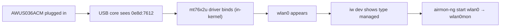

# MT7612U Driver Guide (AWUS036ACM)

> **一句話定位（One-liner）**: The **MediaTek MT7612U** is the chipset inside the **AWUS036ACM** — and its `mt76x2u` driver has been **built into the Linux kernel since version 4.19**. That single fact makes the ACM the lowest-friction ALFA adapter on Linux: no installation, no DKMS, no maintenance.

## Concept: what "in-kernel" means for MT7612U

The MT7612U is a **2T2R** (2 transmit / 2 receive) dual-band 802.11ac radio — the "300 + 867 Mbps" in the AC1200 spec. Because MediaTek upstreamed the driver into the mainline kernel (`drivers/net/wireless/mediatek/mt76/`), every Linux distribution ships it pre-compiled.

The practical consequences are huge for a student:

- **Ubuntu / Kali / Debian / Fedora**: plug in → `wlan0` exists. Zero commands needed.
- **No DKMS**: nothing to rebuild when the kernel updates. The adapter cannot "break after an upgrade" the way Realtek DKMS modules can.
- **Monitor mode + packet injection** work through the standard `mac80211` interface — no special tools required.



## Prerequisites

- [ ] Linux with kernel **4.19 or newer** (`uname -r` — Ubuntu 20.04+ / any recent Kali is fine)
- [ ] `sudo` access
- [ ] AWUS036ACM (or any MT7612U dongle)

## Step 1: Verify the driver is loaded

Plug in the adapter and check:

```bash
lsusb | grep -i mediatek
lsmod | grep mt76x2u
```

**Expected output**:

```text
Bus 001 Device 004: ID 0e8d:7612 MediaTek Inc. MT7612U 802.11a/b/g/n/ac 2T2R Wireless Adapter
mt76x2u                24576  0
mt76x2_common          36864  1 mt76x2u
mt76                   94208  2 mt76x2u,mt76x2_common
```

The `mt76x2u` line with a nonzero refcount means the driver claimed your adapter. (If `lsmod` shows nothing but `lsusb` sees the device, the driver is a kernel module that loads on demand — run `sudo modprobe mt76x2u`.)

## Step 2: Confirm the interface

```bash
iw dev
```

**Expected output**:

```text
phy#0
	Interface wlan0
		ifindex 3
		addr 00:c0:ca:xx:xx:xx
		type managed
```

> **You might be wondering** — *"Why is my MAC 00:c0:ca:...?"* Because `00:c0:ca` is the **ALFA MAC OUI** — every ALFA adapter starts with those three bytes. Handy when identifying adapters in a lab full of dongles.

## Step 3: Connect (managed mode)

```bash
nmcli device wifi connect "MySSID" password "my-passphrase"
```

**Expected output**: `Device 'wlan0' successfully activated with 'MySSID'.`

## Step 4: Monitor mode (the fun part)

```bash
sudo ip link set wlan0 down
sudo iw wlan0 set monitor none
sudo ip link set wlan0 up
iw dev
```

**Expected output**: the interface line now reads `type monitor`. Alternatively use the Aircrack-ng helper:

```bash
sudo airmon-ng start wlan0
```

**Expected output**:

```text
PHY	Interface	Driver		Chipset
phy0	wlan0		mt76x2u		MediaTek Inc. MT7612U
		(mac80211 monitor mode vif enabled for [phy0]wlan0 on [phy0]wlan0mon)
```

Injection self-test (broadcast — safe on any channel):

```bash
sudo aireplay-ng --test wlan0mon
```

**Expected output**: `30/30: 100%` and `Injection is working!`

## Step 5: Turn it back off

```bash
sudo airmon-ng stop wlan0mon
sudo systemctl restart NetworkManager
```

## Troubleshooting

| Symptom | Cause | Fix |
|---|---|---|
| `lsusb` shows nothing | Power / cable issue | Try another port, powered hub, another cable — see the [troubleshooting index](/alfa-network/troubleshooting/) |
| `lsusb` ok, no `wlan0` | Driver not loaded (very rare) | `sudo modprobe mt76x2u`; check `dmesg \| grep mt76` |
| `airmon-ng` reports "monitor mode not supported" | Kernel older than 4.19 | Upgrade your kernel / OS |
| Monitor mode works but injection fails | Wrong channel / dead RF zone | `sudo iw wlan0mon set channel 6`; test near an AP |
| WLAN disappears on suspend/resume | Known USB quirk on some laptops | Unplug/replug the adapter after resume |

## References

- [AWUS036ACM product page](/alfa-network/products/awus036acm/)
- [Ubuntu setup guide](/alfa-network/linux-setup-ubuntu/) and [Kali setup guide](/alfa-network/linux-setup-kali/)
- [Compatibility matrix](/alfa-network/linux-compatibility-matrix/)
- Mainline driver source: `drivers/net/wireless/mediatek/mt76/mt76x2/` in the Linux kernel tree
