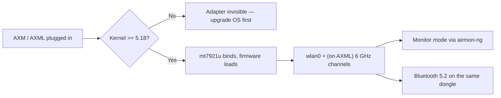

# MT7921AUN Driver Guide (AWUS036AXM / AWUS036AXML)

> **一句話定位（One-liner）**: The **MediaTek MT7921AUN** powers the **AWUS036AXM** (Wi-Fi 6, AX3000) and the **AWUS036AXML** (Wi-Fi 6E, AXE3000 with the 6 GHz band). Its `mt7921u` driver has been **mainline since kernel 5.18** — the modern successor to the beloved MT7612U, and the only path to 6 GHz on Linux in this lineup.

## Concept: what you get with MT7921AUN

This is MediaTek's newest radio in the ALFA line, a **2×2:2 802.11ax** design that also includes **Bluetooth 5.2** on the same dongle. Three things matter for Linux users:

1. **In-kernel driver** (`drivers/net/wireless/mediatek/mt76/mt7921/`) since **Linux 5.18** — no DKMS, no compilation.
2. **Wi-Fi 6E**: the AXML variant opens the **6 GHz band** (channels 1–233 above 5 GHz), which is currently the least congested spectrum available.
3. **Firmware blobs** are required — the driver loads `mt7921` firmware from `linux-firmware`, so keep that package updated.

The main caveat: because the driver needs a **5.18+ kernel**, older OS releases won't see the adapter. Ubuntu 22.04+ and recent Kali are fine; Ubuntu 20.04 is not.



## Prerequisites

- [ ] Linux with kernel **5.18 or newer** (`uname -r`)
- [ ] `linux-firmware` package installed and reasonably recent
- [ ] `sudo` access
- [ ] AWUS036AXM or AWUS036AXML

## Step 1: Kernel check

```bash
uname -r
```

**Expected output** (examples):

```text
6.8.0-51-generic        # Ubuntu 24.04 — OK
6.1.0-kali9-amd64       # Kali — OK
5.15.0-91-generic       # Ubuntu 22.04 base — TOO OLD for mt7921u
```

On 5.15 or older: `sudo apt update && sudo apt upgrade` (or install the HWE kernel on Ubuntu 22.04). The driver will not exist on old kernels — this is a hard requirement, not a config detail.

## Step 2: Verify the driver and firmware

Plug in the adapter:

```bash
lsusb | grep -i mediatek
lsmod | grep mt7921u
dmesg | grep -i mt7921
```

**Expected output**:

```text
Bus 001 Device 006: ID 0e8d:7961 MediaTek Corp. MT7921U
mt7921u                65536  0
[   12.345] mt7921u: probe with 0e8d:7961
[   12.456] mt7921e: HW/SW Version: 0x22010000, Build Time: 20231120163911a
```

No `dmesg` line but `lsusb` shows the device? Update firmware:

```bash
sudo apt install linux-firmware
```

then re-plug the adapter.

## Step 3: Confirm interface and bands

```bash
iw dev
iwlist wlan0 freq | grep -E "^          Channel" | sort -u | tail -5
```

**Expected output**: an interface line, and for the AXML the frequency list should include **6 GHz channels** (`Channel 1 ... Channel 233` under "6 GHz band"). If you only see 2.4/5 GHz entries on the AXML, your regulatory domain may be hiding 6 GHz — `sudo iw reg set TW` (use your country code) and bring the interface down/up.

## Step 4: Connect

```bash
nmcli device wifi connect "MySSID" password "my-passphrase"
```

**Expected output**: `Device 'wlan0' successfully activated with 'MySSID'.`

## Step 5: Monitor mode

Same standard workflow as the other in-kernel chipsets:

```bash
sudo airmon-ng start wlan0
sudo aireplay-ng --test wlan0mon
```

**Expected output**: `wlan0mon` created; injection test reports `30/30: 100%`.

> **You might be wondering** — *"Does monitor mode work on 6 GHz?"* On the AXML, monitor mode is supported on the 6 GHz band with a modern kernel and a 6 GHz-capable AP in range. Early kernels had quirks; if your capture shows nothing on 6 GHz, test on 5 GHz first to isolate the driver from the environment.

## Step 6: Bluetooth

The AXM/AXML expose BT 5.2 on the same USB device. Pair with:

```bash
bluetoothctl
power on
scan on
pair <MAC>
```

**Expected output**: `Pairing successful` for your device. If `bluetoothctl` sees nothing, load the Bluetooth stack module: `sudo modprobe btusb` and retry.

## Troubleshooting

| Symptom | Cause | Fix |
|---|---|---|
| `lsusb` shows nothing | Power (AXML draws more) / cable | Powered hub; USB-C cable with data lines |
| `lsusb` ok, no `wlan0` | Kernel < 5.18, or firmware missing | Upgrade kernel; `sudo apt install linux-firmware`; reboot |
| `dmesg` shows firmware load failure | Stale firmware blob | Update `linux-firmware`, unplug/replug |
| 6 GHz channels missing (AXML) | Regulatory domain unset | `sudo iw reg set <CC>`; bounce the interface |
| BT devices not found | `btusb` not loaded | `sudo modprobe btusb` |
| Monitor mode works on 2.4/5 GHz but not 6 GHz | Early-kernel quirk or no 6 GHz AP | Retest on 5 GHz; update kernel; use a 6 GHz AP |

## References

- [AWUS036AXM product page](/alfa-network/products/awus036axm/) and [AWUS036AXML product page](/alfa-network/products/awus036axml/)
- [Ubuntu setup guide](/alfa-network/linux-setup-ubuntu/) and [Kali setup guide](/alfa-network/linux-setup-kali/)
- [Compatibility matrix](/alfa-network/linux-compatibility-matrix/)
- Mainline driver source: `drivers/net/wireless/mediatek/mt76/mt7921/` in the Linux kernel tree
- [linux-firmware](https://git.kernel.org/pub/scm/linux/kernel/git/firmware/linux-firmware.git/) — firmware blobs for MT7921
