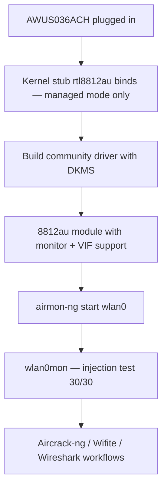

# RTL8812AU Driver Guide (AWUS036ACH)

> **一句話定位（One-liner）**: The **Realtek RTL8812AU** is the legendary 2×2 dual-band chipset inside the **AWUS036ACH** — the adapter from every Kali tutorial you have ever watched. It is **not in the Linux kernel**, so you build the `rtl8812au` driver once with DKMS and it survives every kernel update.

## Concept: the most famous Wi-Fi hacking chipset

The RTL8812AU drives the AC1200 AWUS036ACH with a high-power (500 mW) radio and two external antennas. Its fame comes from the **aircrack-ng community**: years of pentest work hardened the out-of-tree driver for exactly the two things Kali needs — **monitor mode** and **packet injection**.

Why is it not in the kernel? Realtek never upstreamed a clean driver; the kernel keeps a stub (`rtl8812au` in `staging/`) with no monitor support. The community driver (`aircrack-ng/rtl8812au`) replaces it. The cost is that **you must build it once** — the DKMS system then recompiles it automatically on every kernel update, so the "one-time build" really is one time.



## Prerequisites

- [ ] Any recent Linux (Ubuntu 20.04+ / Kali / Debian)
- [ ] Build tools + internet: `sudo apt install -y build-essential dkms git`
- [ ] `sudo` access
- [ ] AWUS036ACH

## Step 1: Remove the (useless) kernel stub

Some distros ship a Realtek stub driver that grabs the adapter and refuses monitor mode. Unload it first:

```bash
sudo modprobe -r rtl8812au 2>/dev/null
```

(If the command errors "not found", great — no stub present. `2>/dev/null` hides the noise.)

## Step 2: Build the community driver with DKMS

```bash
cd /opt
sudo git clone https://github.com/aircrack-ng/rtl8812au.git
cd rtl8812au
sudo make dkms_install
```

**Expected output**:

```text
Kernel preparation unnecessary for this kernel.  Skipping...
...
DKMS: install completed.
```

Verify the module is registered with DKMS:

```bash
dkms status
```

**Expected output**:

```text
rtl8812au/5.6.4.2, 6.8.0-51-generic, aarch64: installed
```

## Step 3: Load it

```bash
sudo modprobe 8812au
iw dev
```

**Expected output**: an `Interface wlan0` (or `wlan1`) appears. If you have the stub loaded again after reboot, blacklist it:

```bash
echo "blacklist rtl8812au" | sudo tee /etc/modprobe.d/alfa-8812au.conf
```

and add the real module to auto-load:

```bash
echo 8812au | sudo tee /etc/modules-load.d/alfa.conf
```

## Step 4: Monitor mode + injection

```bash
sudo airmon-ng check kill
sudo airmon-ng start wlan0
sudo aireplay-ng --test wlan0mon
```

**Expected output**:

```text
PHY	Interface	Driver		Chipset
phy0	wlan0		8812au		Realtek Semiconductor Corp. RTL8812AU
...
12:34:56  Injection is working!
12:34:56  30/30:  100%
```

That `30/30` line is the AWUS036ACH doing what it is famous for.

## Step 5: Back to managed mode

```bash
sudo airmon-ng stop wlan0mon
sudo systemctl restart NetworkManager
```

## Troubleshooting

| Symptom | Cause | Fix |
|---|---|---|
| `make dkms_install` fails with "No rule to make target" | Repo snapshot older than your fresh kernel | `sudo git pull && sudo make dkms_install` again |
| Build fails: missing headers | Headers not installed | `sudo apt install linux-headers-$(uname -r)` |
| Adapter only in managed mode | Kernel stub grabbed it first | Blacklist `rtl8812au` (Step 3) and reboot |
| Injection `0/30` | Channel with no AP / driver quirk | `sudo iw wlan0mon set channel 6`; `git pull` the driver; retest |
| Adapter vanishes after reboot | Module not auto-loaded | `echo 8812au \| sudo tee /etc/modules-load.d/alfa.conf` |
| `dkms status` shows Error after upgrade | Rebuild failed silently | `sudo dkms autoinstall` |

## References

- [AWUS036ACH product page](/alfa-network/products/awus036ach/)
- [Kali setup guide](/alfa-network/linux-setup-kali/) — full monitor/injection workflow
- [Ubuntu setup guide](/alfa-network/linux-setup-ubuntu/)
- [Troubleshooting index](/alfa-network/troubleshooting/)
- Driver repo: [aircrack-ng/rtl8812au](https://github.com/aircrack-ng/rtl8812au)
