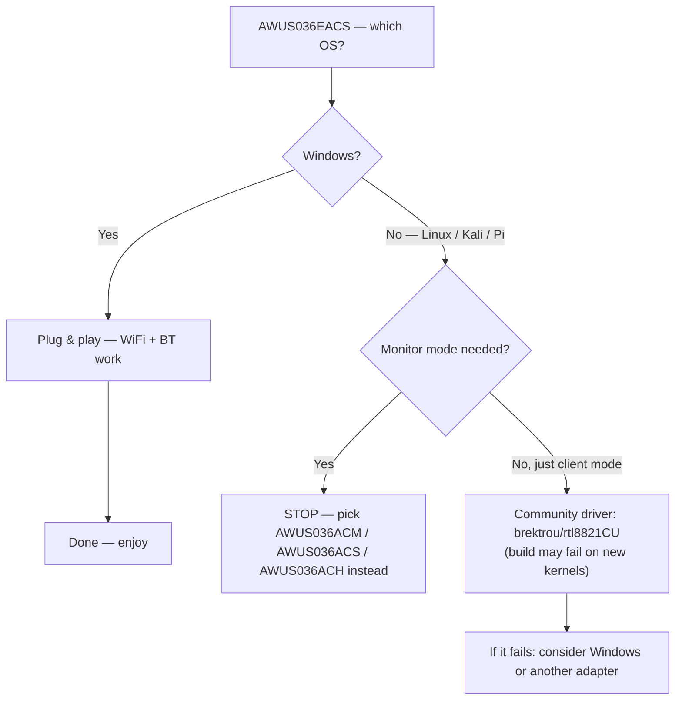

# RTL8821CU Driver Guide (AWUS036EACS)

> **一句話定位（One-liner）**: The **Realtek RTL8821CU** is the WiFi 5 + Bluetooth 4.2 combo chipset inside the nano **AWUS036EACS**. Here is the honest version: on **Windows it is plug-and-play**, on **Linux the driver situation is rough**, and monitor mode / packet injection are **not reliable**. If your project needs Linux monitor mode, choose the [AWUS036ACM](/alfa-network/products/awus036acm/) or [AWUS036ACS](/alfa-network/products/awus036acs/) instead.

## Concept: a Windows-first chipset

The RTL8821CU is designed for a very different buyer than the rest of the ALFA line: desktop/laptop users who want **WiFi + Bluetooth in one tiny dongle** with zero driver drama on Windows. It is AC600-class (150 + 433 Mbps) with an integrated 2 dBi antenna and no external RP-SMA connector.

The Linux story is the awkward part. The kernel has **no upstream driver** for the RTL8821CU, and the community driver situation is unstable:

- The best-known repo, [`brektrou/rtl8821CU`](https://github.com/brektrou/rtl8821CU) (covering RTL8811CU/RTL8821CU), builds against older kernels but **frequently breaks on new ones** — including kernel 6.x on modern distros.
- Reported issues include adapter instability, system freezes on some hardware, and **unreliable monitor mode / no injection**.
- Bluetooth from the same chipset needs a separate driver path (`rtl_bt` firmware) and also lags.

We are not going to pretend otherwise: for Linux, this is the wrong tool for the job.



## Prerequisites (for the adventurous Linux user)

- [ ] Linux with a **kernel ≤ 5.x** for the best build odds (kernel 6.x often fails)
- [ ] `sudo apt install -y build-essential dkms git`
- [ ] Patience — this is experimental territory

## Step 1: Try the community driver

```bash
cd /opt
sudo git clone https://github.com/brektrou/rtl8821CU.git
cd rtl8821CU
sudo make dkms_install
```

**Possible outcomes**:

```text
DKMS: install completed.        # 🎉 it worked (older kernels)
# or
make: *** [Makefile:...] Error 1  # 😓 build failed (new kernels)
```

If the build succeeds, load and check:

```bash
sudo modprobe 8821cu
iw dev
```

**Expected output (success case)**: an `Interface wlan0` line.

## Step 2: Reality check — connect, then test monitor mode

```bash
nmcli device wifi connect "MySSID" password "my-passphrase"
sudo airmon-ng start wlan0
sudo aireplay-ng --test wlan0mon
```

**Expected output**: managed-mode connect usually works. The injection test is the gamble — expect anything from `30/30` (rare) to `Failed` (common). If it fails, this is not a fixable config issue; it is the driver's known limitation.

## The recommended path

| Your goal | Recommended adapter |
|---|---|
| Kali / monitor mode / packet injection | [AWUS036ACM](/alfa-network/products/awus036acm/) (in-kernel, cheap) or [AWUS036ACH](/alfa-network/products/awus036ach/) (classic high power) |
| Budget pocket monitor adapter | [AWUS036ACS](/alfa-network/products/awus036acs/) |
| Windows desktop WiFi + BT combo | **AWUS036EACS — keep it here** |

## Troubleshooting

| Symptom | Cause | Fix |
|---|---|---|
| `make dkms_install` fails on kernel 6.x | Driver not maintained for new kernels | Use an older kernel / distro, or switch adapters |
| Adapter unstable, random disconnects | Known RTL8821CU Linux quirk | Windows is the supported environment for this chipset |
| Monitor mode "works" but injection fails | Driver limitation | Do not rely on it — use an in-kernel chipset adapter |
| Bluetooth missing | `rtl_bt` firmware not loaded | `sudo apt install linux-firmware`; still flaky — expect the worst |
| Everything works on Windows | — | That is exactly the design intent — enjoy it there |

## References

- [AWUS036EACS product page](/alfa-network/products/awus036eacs/)
- [Adapter comparison](/alfa-network/wifi-adapter-comparison/) — find a Linux-friendly alternative
- [Compatibility matrix](/alfa-network/linux-compatibility-matrix/)
- [Troubleshooting index](/alfa-network/troubleshooting/)
- Community driver: [brektrou/rtl8821CU](https://github.com/brektrou/rtl8821CU)
