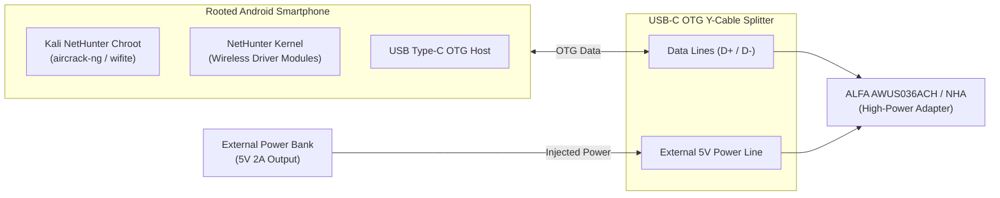

# Android Kali NetHunter × ALFA Network Integration & Power Guide

> **Quick Summary**: Kali NetHunter official documentation ([kali.org/docs/nethunter/wireless-cards/](https://www.kali.org/docs/nethunter/wireless-cards/)) certifies the **ALFA AWUS036ACH**, **AWUS036NEH**, and **AWUS036NHA** for mobile wireless auditing. When using high-power external adapters on Android smartphones, the **OTG Power Budget** is the single most critical factor for stability. This guide details proper Y-cable cabling, kernel modules, and penetration testing workflows.

## Power Budget: Overcoming Mobile OTG Current Limits

Standard Android USB-C / Micro-USB ports in OTG Host mode are restricted to **500mA (2.5W)**. High-power adapters like the ALFA AWUS036ACH (equipped with dual power amplifiers) draw up to **3.6W (720mA @ 5V)** during active packet transmission, triggering immediate smartphone brownouts or USB resets without external power.



---

## Step-by-Step Setup

### Step 1: Connect via USB-C OTG Y-Cable
1. Connect the data branch of the Y-cable to the smartphone.
2. Connect the power branch to an external 5V/2A power bank.
3. Connect the output port to your ALFA adapter.

### Step 2: Verify in NetHunter Terminal
```bash
# Check USB device detection
lsusb

# Check network interfaces
ip link show
```

### Step 3: Enable Monitor Mode and Run Wifite
```bash
# Terminate conflicting processes
airmon-ng check kill

# Start monitor mode on wlan1
airmon-ng start wlan1

# Launch automated audit
wifite -i wlan1mon
```
