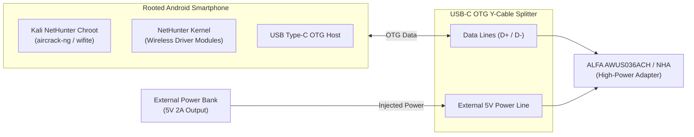

# Android Kali NetHunter × ALFA Network Integration Guide

> **Quick Summary**: Kali NetHunter official documentation ([kali.org/docs/nethunter/wireless-cards/](https://www.kali.org/docs/nethunter/wireless-cards/)) certifies the **ALFA AWUS036ACH**, **AWUS036NEH**, and **AWUS036NHA** for mobile wireless auditing. When using high-power external adapters on Android smartphones, the **OTG Power Budget** is the single most critical factor for stability. This guide details proper Y-cable cabling, kernel modules, and penetration testing workflows.

---

## 1. Power Budget: Overcoming Mobile OTG Current Limits

Standard Android USB-C / Micro-USB ports in OTG Host mode are restricted to **500mA (2.5W)**. High-power adapters like the ALFA AWUS036ACH (equipped with dual power amplifiers) draw up to **3.6W (720mA @ 5V)** during active packet transmission, triggering immediate smartphone brownouts or USB resets without external power.



---

## 2. Official Kali NetHunter Compatibility Matrix

| ALFA Model | Chipset | Bands | Driver Module | NetHunter Integration | Power Requirement |
|---|---|---|---|---|---|
| **AWUS036ACH** | Realtek RTL8812AU | 2.4 GHz + 5 GHz | `8812au.ko` | Requires kernel driver module | **Mandatory Y-Cable** external power |
| **AWUS036NEH** | Ralink RT3070 | 2.4 GHz | `rt2800usb.ko` | In-tree Linux driver (Zero setup) | Direct phone OTG power OK |
| **AWUS036NHA** | Atheros AR9271 | 2.4 GHz | `ath9k_htc.ko` | In-tree Linux driver (Zero setup) | Direct phone OTG power OK |
| **AWUS036ACM** | MediaTek MT7612U | 2.4 GHz + 5 GHz | `mt76x2u.ko` | Requires Kernel ≥ 4.19 backport | External power recommended |

---

## 3. Terminal Execution in NetHunter

```bash
# 1. Open NetHunter Terminal (Root mode) and verify USB ID
lsusb

# 2. Kill interfering background services
airmon-ng check kill

# 3. Enable monitor mode on wlan1
airmon-ng start wlan1

# 4. Launch automated wireless auditor
wifite -i wlan1mon
```

---

## 4. Custom Kernel Configuration (NetHunter Kernel Builder)

If compiling a custom Android kernel for NetHunter, ensure the following `.config` flags are enabled:

```ini
CONFIG_NET_RADIO=y
CONFIG_WIRELESS_EXT=y
CONFIG_WEXT_PRIV=y
CONFIG_CFG80211=m
CONFIG_MAC80211=m
CONFIG_CFG80211_WEXT=y
CONFIG_RTL8812AU=m
CONFIG_RT2800USB=m
CONFIG_ATH9K_HTC=m
```
