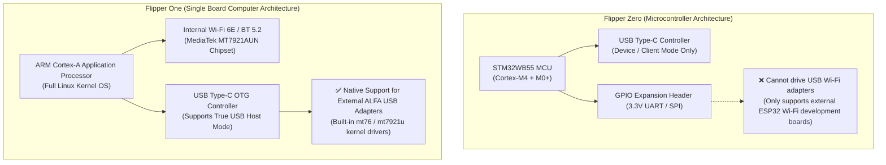

# Flipper One × ALFA Network Compatibility & Selection Guide

> **Quick Summary**: Flipper One is powered by an ARM Cortex-A application processor running full embedded Linux. Its integrated Wi-Fi 6E module is powered by the **MediaTek MT7921AUN** chipset (the exact same silicon inside the **ALFA AWUS036AXML**). This guide analyzes Flipper One's internal radio architecture versus external high-gain ALFA USB adapters, and clarifies why **Flipper Zero (which lacks USB Host mode) cannot support external Wi-Fi adapters**.

---

## 1. Flipper Zero vs. Flipper One: Architectural Differences

A common community misconception is attempting to plug ALFA USB adapters into Flipper Zero via USB-C OTG adapters. This is physically and architecturally impossible:



---

## 2. Integrated Radio vs. External ALFA Adapter Selection Matrix

| Comparison Dimension | Flipper One Internal Radio | External ALFA AWUS036AXML | External ALFA AWUS036ACM |
|---|---|---|---|
| **Chipset** | MediaTek MT7921AUN | MediaTek MT7921AUN | MediaTek MT7612U |
| **Protocols** | Wi-Fi 6E (802.11ax) | Wi-Fi 6E (802.11ax) | Wi-Fi 5 (802.11ac) |
| **Frequency Bands** | 2.4 GHz / 5 GHz / 6 GHz | 2.4 GHz / 5 GHz / 6 GHz | 2.4 GHz / 5 GHz |
| **Antenna Type** | Internal miniature PCB trace | 2× 5dBi Detachable RP-SMA | 2× 5dBi Detachable RP-SMA |
| **Tx Power (EIRP)** | Standard handheld limit (~15 dBm) | High-power amplifiers (~20-23 dBm) | High-power amplifiers (~20-23 dBm) |
| **Linux Driver** | `mt7921u` (In-kernel) | `mt7921u` (In-kernel) | `mt76x2u` (In-kernel) |
| **Recommendation** | Portable stealth scanning | 🏆 **Top Pick**: Long-range Wi-Fi 6E spectrum auditing | 🥈 **Best Value**: Ultra-stable 5 GHz packet injection |

---

## 3. Dual-Radio Architecture Configuration

By plugging an external ALFA AWUS036AXML into Flipper One, you establish a dual-radio setup:

```bash
# 1. Verify USB identification
lsusb
# Expected: Bus 001 Device 002: ID 0e8d:7961 MediaTek Inc. Wireless_Device

# 2. Inspect PHY capabilities
iw phy
# Bands: 2.4 GHz, 5 GHz, and 6 GHz HE channels

# 3. Configure dual-radio topology
# wlan0 (Internal): Maintains hotspot association for SSH / Web UI
# wlan1 (External ALFA): Dedicated monitor interface
sudo iw dev wlan1 interface add mon0 type monitor
sudo ip link set mon0 up
```

---

## 4. Current Development Status & Limitations

1. **6 GHz Packet Injection**: While 6 GHz (Wi-Fi 6E) scanning and association are natively supported in Linux kernels ≥5.18, some open-source injection tools are still finalizing 6 GHz management frame injection specifications.
2. **Power Draw**: When running active high-power injection with AWUS036AXML, battery consumption increases. A powered USB-C hub is recommended for multi-hour lab engagements.
