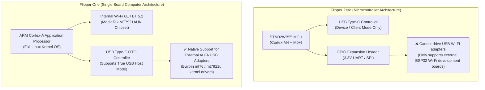

# Flipper One × ALFA Network Compatibility & Selection Guide

> **Quick Summary**: Flipper One is powered by an ARM Cortex-A application processor running full embedded Linux. Its integrated Wi-Fi 6E module is powered by the **MediaTek MT7921AUN** chipset (the exact same silicon inside the **ALFA AWUS036AXML**). This guide analyzes Flipper One's internal radio architecture versus external high-gain ALFA USB adapters, and clarifies why **Flipper Zero (which lacks USB Host mode) cannot support external Wi-Fi adapters**.

## Architectural Differences: Flipper Zero vs. Flipper One



---

## Dual-Radio Operation on Flipper One

By connecting an external ALFA AWUS036AXML via USB-C OTG, you can establish a dual-radio setup:
- **Internal MT7921AUN (`wlan0`)**: Maintains connection to a phone hotspot or local network for SSH/Web management.
- **External ALFA Adapter (`wlan1`)**: Dedicated high-power radio for monitor mode and packet capture.

```bash
# Verify USB connection
lsusb

# Enable monitor mode on external adapter
sudo iw dev wlan1 interface add mon0 type monitor
sudo ip link set mon0 up
```
