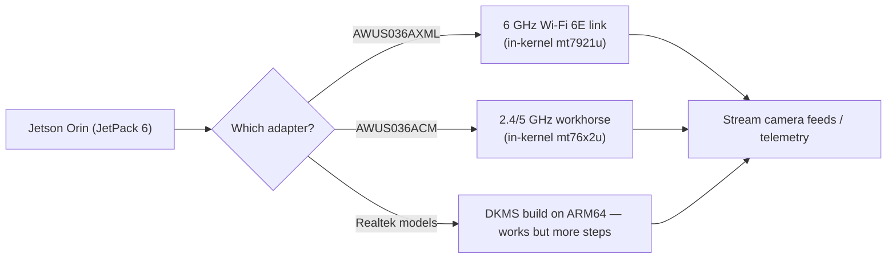

# ALFA Adapters on NVIDIA Jetson (Orin Nano / NX)

> **一句話定位（One-liner）**: Your Jetson is a vision computer, not a router — so its built-in Wi-Fi is usually weak and single-band. An ALFA adapter fixes that: **plug in the AWUS036AXML for 6 GHz Wi-Fi 6E streaming**, or any in-kernel ALFA for reliable robot telemetry and even monitor mode.

## Concept: why a Jetson needs an external adapter

Jetson Orin Nano/NX boards (and their carrier boards) ship with a modest integrated Wi-Fi radio that is fine for `apt update` and nothing else. Robotics and CV projects need more:

- **6 GHz (Wi-Fi 6E)**: the Orin carrier radios are 2.4/5 GHz only. The 6 GHz band is empty, low-latency spectrum — ideal for streaming camera feeds or point clouds without fighting the lab's 2.4 GHz noise.
- **Stable high-throughput link**: the AWUS036AXML (MT7921AUN) is the only adapter in the ALFA line with 6 GHz support, and its driver is in-kernel since 5.18.
- **Monitor mode** (for wireless research/lab work): works on the in-kernel chipsets via the normal `mac80211` path.

The catch is the **kernel**. Jetson runs NVIDIA's L4T kernel, not the stock Ubuntu one:

| JetPack | L4T kernel | `mt7921u` (AXM/AXML) | `mt76x2u` (ACM/ACHM) |
|---|---|---|---|
| JetPack 5.x | 5.10 | ❌ too old | ✅ |
| JetPack 6.x | 6.6 | ✅ | ✅ |

**Rule**: MT7921AUN adapters need **JetPack 6**; the classic AWUS036ACM works on both.



## Prerequisites

- [ ] Jetson Orin Nano or Orin NX with JetPack installed
- [ ] Internet (Ethernet recommended for the first setup)
- [ ] ALFA adapter — for 6 GHz, the [AWUS036AXML](/alfa-network/products/awus036axml/)

## Step 1: Check your JetPack / kernel

```bash
uname -r
dpkg -l | grep nvidia-l4t-core | head -1
```

**Expected output**:

```text
6.6.0-tegra            # JetPack 6 — mt7921u available
# or
5.10.104-tegra          # JetPack 5 — only MT7612U-class chipsets
```

## Step 2: In-kernel path (MediaTek — recommended)

Plug in the adapter, then:

```bash
lsusb | grep -i mediatek
iw dev
```

**Expected output**:

```text
Bus 001 Device 002: ID 0e8d:7961 MediaTek Corp. MT7921U
phy#0
	Interface wlan0
		ifindex 3
		type managed
```

On JetPack 6 with the AXML, verify 6 GHz channels are visible:

```bash
iwlist wlan0 freq | grep -E "6 GHz|Channel 1|Channel 233" | head
```

If nothing appears, set the regulatory domain: `sudo iw reg set TW` (your country), then `sudo ip link set wlan0 down && up`.

## Step 3: Connect and stream

```bash
nmcli device wifi connect "MySSID" password "my-passphrase"
```

**Expected output**: `Device 'wlan0' successfully activated with 'MySSID'.`

Then push a camera stream over the link (example with GStreamer on the 6 GHz band):

```bash
gst-launch-1.0 v4l2src device=/dev/video0 ! videoconvert ! \
    x264enc tune=zerolatency bitrate=8000 ! rtph264pay ! \
    udpsink host=192.168.1.50 port=5000
```

**Expected output**: continuous streaming at low latency — the exact scenario the 6 GHz band is for. (Replace the receiver IP with your ground station's.)

## Step 4: Realtek models (DKMS on ARM64)

The DKMS build works on aarch64, but compile times on a Nano are slower. Use the same repos as desktop Linux:

```bash
sudo apt install -y build-essential dkms git
cd /opt
sudo git clone https://github.com/aircrack-ng/rtl8812au.git
cd rtl8812au && sudo make dkms_install
```

**Expected output**: `DKMS: install completed.` (give it a few minutes on the Nano).

## Step 5: Monitor mode (research / lab)

```bash
sudo airmon-ng start wlan0
sudo aireplay-ng --test wlan0mon
```

**Expected output**: `wlan0mon` up; injection `30/30: 100%` on the in-kernel chipsets.

> ⚠️ Remember Jetson-specific power: the Orin Nano's USB ports can be power-limited. A **powered USB hub** is your friend with high-power adapters under load. Also keep the Jetson's `nvpmodel` power mode in mind — underclocked modes reduce USB stability.

## Troubleshooting

| Symptom | Cause | Fix |
|---|---|---|
| AXML invisible on JetPack 5 | Kernel 5.10 lacks `mt7921u` | Upgrade to JetPack 6 (L4T kernel 6.6) |
| 6 GHz channels missing | Regulatory domain unset | `sudo iw reg set <CC>`; bounce interface |
| Adapter drops under camera load | USB power limit | Powered hub; raise `nvpmodel` mode |
| DKMS build slow/fails | ARM64 compile + missing headers | Install headers for the L4T kernel: `sudo apt install linux-headers-$(uname -r)` |
| Monitor mode not available | Stub driver conflict (Realtek) | Use the aircrack-ng repos (Step 4) |

## References

- [AWUS036AXML product page](/alfa-network/products/awus036axml/) — the 6 GHz choice
- [AWUS036ACM product page](/alfa-network/products/awus036acm/) — the all-rounder
- [Ubuntu setup guide](/alfa-network/linux-setup-ubuntu/) — JetPack is Ubuntu under the hood
- [Kali setup guide](/alfa-network/linux-setup-kali/) — monitor mode details
- [Raspberry Pi guide](/alfa-network/hardware/raspberry-pi/) — the lighter embedded sibling
- [NVIDIA Jetson documentation](https://docs.nvidia.com/jetson/)
