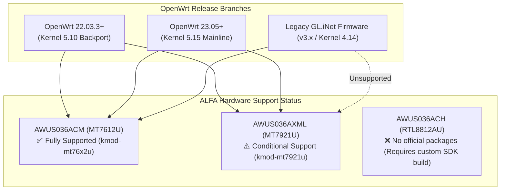

# OpenWrt Routers × ALFA Network Configuration & Limitations Guide

> **Quick Summary**: Adding an external ALFA USB adapter to OpenWrt routers (including GL.iNet travel routers, x86 soft routers, and Raspberry Pi gateways) creates a dedicated secondary WAN (WISP repeater), high-gain AP hotspot, or dedicated wireless sniffer node. The **ALFA AWUS036AXML** (MT7921U) is supported via package feeds in OpenWrt 22.03.3+ (kernel 5.10 backport) and 23.05+ (kernel 5.15), while **AWUS036ACM** (MT7612U) is supported across all branches. This guide covers setup and discloses **upstream GitHub Issue #839 (Active Monitor Lockup)**.

---

## 1. Kernel & Compatibility Matrix



| ALFA Model | Chipset | OpenWrt 22.03.3+ | OpenWrt 23.05+ | Required Kernel Packages |
|---|---|---|---|---|
| **AWUS036ACM** | MediaTek MT7612U | ✅ Fully Supported | ✅ Fully Supported | `kmod-mt76x2u` `mt76-firmware` |
| **AWUS036AXML** | MediaTek MT7921AUN | ✅ Supported (Known Bug) | ✅ Supported (Known Bug) | `kmod-mt7921u` |
| **AWUS036ACHM** | MediaTek MT7610U | ✅ Fully Supported | ✅ Fully Supported | `kmod-mt76x0u` |
| **AWUS036ACH** | Realtek RTL8812AU | ❌ Not in official feed | ❌ Not in official feed | Requires building custom out-of-tree package |

---

## 2. Package Installation & Wireless Setup

```bash
# 1. Update package database
opkg update

# 2. Install kernel modules for your ALFA adapter
# For AWUS036AXML (Wi-Fi 6/6E):
opkg install kmod-mt7921u kmod-mt76-core wireless-tools usbutils

# For AWUS036ACM (802.11ac):
opkg install kmod-mt76x2u kmod-mt76-core wireless-tools usbutils

# 3. Detect and generate configuration
wifi config >> /etc/config/wireless

# 4. Restart network stack
/etc/init.d/network restart
```

---

## 3. Crucial Upstream Limitations & Bug Disclosure

### ⚠️ Upstream Bug: AWUS036AXML Active Monitor Crash (Issue #839)
- **Symptom**: Enabling active monitor mode and continuous frame injection (e.g. `aireplay-ng --deauth`) on `mt7921u` under OpenWrt causes the driver to lock up within seconds (`mt7921u: failed to send tx packet`).
- **Root Cause**: Upstream `openwrt/mt76` Issue #839 (DMA concurrency locking error in 5.10/5.15 kernels).
- **Engineering Recommendation**:
  1. For **passive packet capture** (Kismet / tcpdump), AWUS036AXML works normally.
  2. For **high-rate packet injection / deauth testing**, use **ALFA AWUS036ACM** (`mt76x2u`).

### ⚠️ 6 GHz Configuration Status
Current LuCI Web UI (OpenWrt 23.05) lacks complete 6 GHz channel selectors. AWUS036AXML operates primarily as an ultra-high performance 2.4 GHz / 5 GHz radio under OpenWrt.
