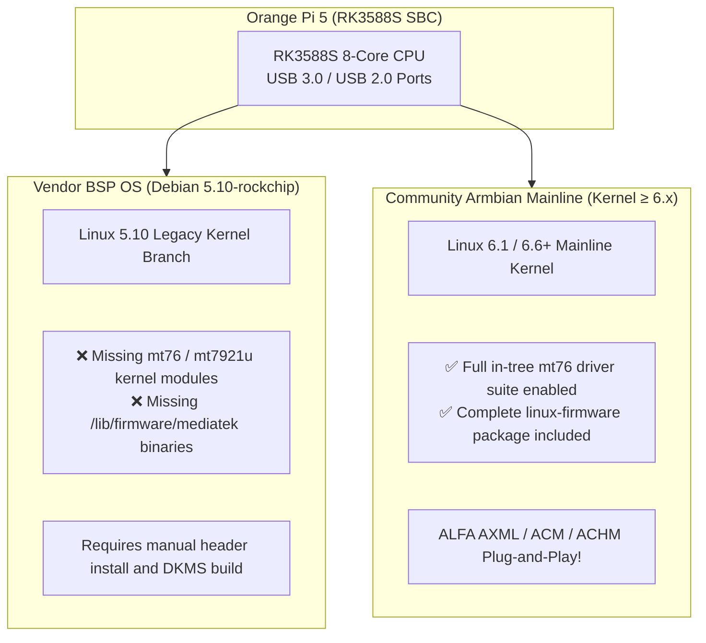

# Orange Pi & Rockchip RK3588 SBC × ALFA Network Integration Guide

> **Quick Summary**: Single-board computers powered by the Rockchip RK3588 SoC (such as Orange Pi 5 / 5B / 5 Plus, Radxa ROCK 5B) deliver exceptional compute power for edge gateways and wireless sensing. When connecting ALFA USB adapters, the **OS Kernel Architecture (Vendor BSP vs. Armbian Mainline)** determines whether the adapter works plug-and-play.

## Is This Guide for You?

- **Difficulty**: Intermediate.
- **Estimated Time**: 15–25 minutes.
- **Skills Used**: Terminal commands, image flashing, driver verification.
- **What You Will Achieve**:
  1. Understand why stock Vendor BSP (Debian 5.10) fails to recognize adapters, while Armbian Mainline works out of the box.
  2. Select the optimal ALFA adapter model and configure plug-and-play drivers on Armbian.
  3. Manage power budgets (5V/4A) to ensure stability under heavy RF transmission.

---

## Core Difference: Vendor BSP vs. Armbian Mainline

Many developers find ALFA adapters unacknowledged on stock Orange Pi Debian images. This is a software kernel packaging issue, not a hardware defect:



---

## Compatibility Matrix on RK3588

| ALFA Model | Chipset | Armbian (Kernel ≥6.x) | Stock Debian (Kernel 5.10) | Engineering Notes |
|---|---|---|---|---|
| **AWUS036AXML** | MT7921AUN (Wi-Fi 6E) | ✅ Plug & Play | ⚠️ Requires manual firmware install | 2.4G/5G/6G high-throughput |
| **AWUS036ACM** | MT7612U (802.11ac) | ✅ Plug & Play | ⚠️ Requires manual module load | Best pick for packet injection |
| **AWUS036ACHM** | MT7610U (802.11ac) | ✅ Plug & Play | ⚠️ Requires manual module load | Compact high-sensitivity monitoring |
| **AWUS036ACH** | RTL8812AU | ⚠️ Requires DKMS build | ⚠️ Requires DKMS build | Requires `linux-headers` package |

---

## Armbian Mainline Setup (Recommended)

1. Flash the latest **Armbian Linux (Kernel 6.x Mainline)** image onto your Orange Pi 5 microSD / NVMe.
2. Plug the ALFA AWUS036AXML into a **blue USB 3.0 Type-A port**.
3. Verify driver binding:

```bash
# Check dmesg logs
dmesg | grep -i "mt7921"
# Expected: mt7921u: firmware: mediatek/WIFI_MT7961_patch_mcu_1_2_tv.bin loaded

# Verify interface
iw dev
```

---

## Power & Thermal Guidelines

- **Power Supply**: RK3588 boards draw 10W~15W under full load. Adding an ALFA high-power adapter (2W~4W) requires a dedicated **5V/4A (20W) USB-C power supply**.
- **Port Allocation**: Connect the adapter directly to the primary USB 3.0 controller port, avoiding shared unpowered USB hubs.
