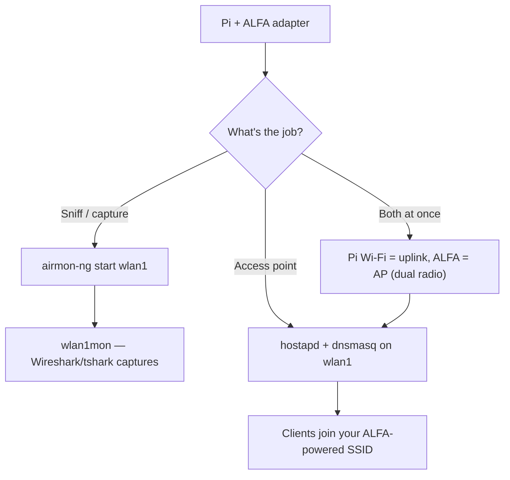

# ALFA Adapters on Raspberry Pi (3 / 4 / 5)

> **Quick Summary**: A Raspberry Pi + ALFA adapter is the classic budget lab station: **capture traffic** with an in-kernel-chipset ALFA, or turn the Pi into a **hostapd access point** with range that the Pi's built-in radio cannot dream of.

## Concept: why the Pi is the perfect ALFA host

The Pi's integrated Wi-Fi is single-antenna and weak — fine for SSH, useless for sniffing or for serving Wi-Fi to a room. An external ALFA adapter changes the calculus:

- **Monitor mode lab station**: in-kernel chipsets (MT7612U etc.) give you a headless capture rig for Wireshark coursework — plug it in, `airmon-ng start`, done.
- **Access point (hostapd)**: the AWUS036ACM/ACH with external antennas turns a Pi into a real AP with far better range than the built-in radio.
- **Dual-radio trick**: Pi built-in = client uplink, ALFA = AP downlink. One Pi, two networks.

Hardware notes per board:

| Board | USB | Notes |
|---|---|---|
| Pi 3 | USB 2.0 | Oldest supported; fine for AC433-class or in-kernel adapters |
| Pi 4 | USB 2.0 (shared bus) | Most popular choice — add a powered hub for high-power adapters |
| Pi 5 | USB 3.0 + PCIe | Fastest USB; best for AC1200/AX1800 throughput |

> ⚠️ **Power is the #1 Pi failure mode**. Pi 3/4 share one USB 2.0 bus; a 500 mW ALFA plus keyboard plus whatever else can brown-out the bus. Budget a **powered USB hub** for anything above the AWUS036ACS.



## Prerequisites

- [ ] Raspberry Pi 3/4/5 with Raspberry Pi OS (64-bit recommended)
- [ ] `sudo apt update && sudo apt upgrade` completed
- [ ] ALFA adapter — [in-kernel chipset](/alfa-network/linux-compatibility-matrix/) strongly recommended for monitor mode
- [ ] Powered USB hub if using a high-power adapter

## Step 1: Identify the adapter

Plug it in and list interfaces — the ALFA will be the *new* one:

```bash
lsusb
iw dev
```

**Expected output**: your adapter in `lsusb` and an interface like `wlan1` (the Pi's built-in radio is usually `wlan0`). If the ALFA is Realtek, install its DKMS driver first — see the [Ubuntu guide](/alfa-network/linux-setup-ubuntu/), the steps are identical on Pi OS.

## Step 2: Monitor mode lab station

```bash
sudo airmon-ng start wlan1
iwconfig wlan1mon
```

**Expected output**: `wlan1mon  IEEE 802.11  Mode:Monitor`.

Capture to file for later analysis:

```bash
sudo tcpdump -i wlan1mon -w lab-capture.pcap
```

**Expected output**: `listening on wlan1mon` — let it run, Ctrl-C to stop, then open `lab-capture.pcap` in Wireshark on your laptop.

## Step 3: Turn the Pi into an access point (hostapd)

Install the two pieces of software:

```bash
sudo apt install -y hostapd dnsmasq
```

Set the ALFA interface to a static address:

```bash
echo -e "interface wlan1\nstatic ip_address=192.168.4.1/24\nnohook wpa_supplicant" | \
    sudo tee -a /etc/dhcpcd.conf
```

Create the hostapd config (2.4 GHz, 20 dBm):

```bash
sudo tee /etc/hostapd/hostapd.conf > /dev/null <<'EOF'
interface=wlan1
driver=nl80211
ssid=alfa-lab
hw_mode=g
channel=6
wmm_enabled=1
auth_algs=1
wpa=2
wpa_passphrase=ChangeMe123
wpa_key_mgmt=WPA-PSK
rsn_pairwise=CCMP
EOF
```

Point hostapd at its config and start everything:

```bash
echo 'DAEMON_CONF="/etc/hostapd/hostapd.conf"' | sudo tee -a /etc/default/hostapd
sudo systemctl restart dhcpcd dnsmasq hostapd
sudo systemctl status hostapd --no-pager | head -10
```

**Expected output**: `Active: active (running)` and clients can now join **alfa-lab**.

## Step 4: The dual-radio trick (optional but cool)

Keep the Pi's own Wi-Fi as your SSH/management uplink and use the ALFA purely as the AP:

```bash
sudo systemctl stop wpa_supplicant@wlan1 2>/dev/null   # make sure ALFA is not fighting for a client link
sudo iw dev wlan1 set 4addr off
sudo systemctl restart hostapd
```

Now `wlan0` connects you to the internet, `wlan1` serves the lab. One Pi, two networks.

## Troubleshooting

| Symptom | Cause | Fix |
|---|---|---|
| Adapter works on the laptop, dies on the Pi | USB power limit | Powered USB hub; use the Pi's official PSU; reduce `txpower` |
| `airmon-ng` says "No such device" | Wrong interface name | `iw dev` first — Pi built-in is usually `wlan0`, ALFA `wlan1` |
| hostapd fails with `nl80211: Could not configure driver mode` | Driver lacks AP mode, or interface busy | Use an in-kernel chipset (mt76 = solid AP support); `sudo airmon-ng stop wlan1mon` first |
| Clients connect but no internet | DHCP/NAT not configured | Enable NAT: `sudo iptables -t nat -A POSTROUTING -o wlan0 -j MASQUERADE` + `sysctl net.ipv4.ip_forward=1` |
| Throughput capped on Pi 3/4 | Shared USB 2.0 bus | Inherent to the board; Pi 5 (USB 3.0) is the upgrade path |

## References

- [AWUS036ACM product page](/alfa-network/products/awus036acm/) — the Pi's best friend
- [Ubuntu setup guide](/alfa-network/linux-setup-ubuntu/) — driver installs (same steps on Pi OS)
- [Kali setup guide](/alfa-network/linux-setup-kali/) — monitor mode workflow
- [Jetson guide](/alfa-network/hardware/jetson/) — the bigger embedded sibling
- [hostapd documentation](https://w1.fi/hostapd/) — official AP daemon docs
