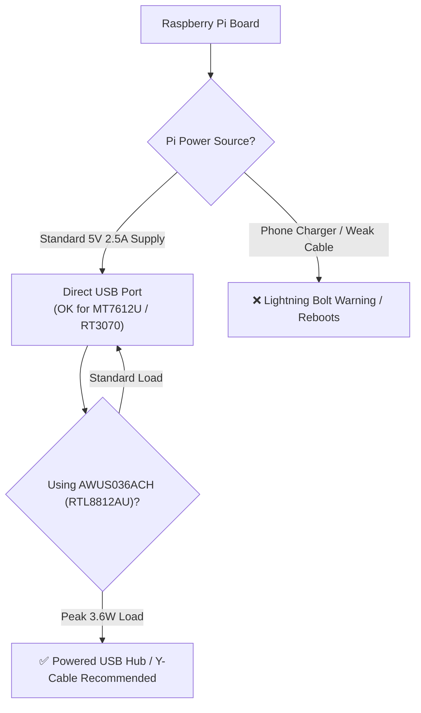

# ALFA Adapters on Raspberry Pi — Complete Setup Guide

> **Quick Summary**: The Raspberry Pi's onboard Wi-Fi is compact but limited by low-gain PCB antennas and fixed regulatory power limits. Adding an ALFA high-power USB adapter turns your Pi into an enterprise-grade wireless probe, field auditor, or long-range IoT gateway.

## Is This Guide for You?

- **Difficulty**: Beginner to Intermediate.
- **Estimated Time**: 15–20 minutes.
- **Skills Used**: Terminal commands, package management, basic networking.
- **What You Will Achieve**:
  1. Manage USB power budgets to prevent Pi voltage brownouts.
  2. Install in-kernel (MediaTek) and DKMS (Realtek) drivers on Raspberry Pi OS.
  3. Configure dual-radio routing (onboard Wi-Fi for SSH + ALFA for monitoring).

---

## Power Budget: The Most Critical Factor on Raspberry Pi

The single most common issue with ALFA adapters on Raspberry Pi is **power starvation**. High-power adapters draw 500mA to 900mA during active transmission.



### Power Recommendations by Pi Model:
- **Raspberry Pi 5**: 5V/5A USB-C supply delivers up to 1.6A across USB ports—can drive any ALFA adapter directly.
- **Raspberry Pi 4B**: 5V/3A official power supply recommended.
- **Raspberry Pi 3B+ / Zero 2 W**: Use an external powered USB hub for high-power adapters like the AWUS036ACH.

---

## Adapter Selection Matrix for Raspberry Pi

| Model | Chipset | Band | Raspberry Pi OS Driver | Recommended Use Case |
|---|---|---|---|---|
| **AWUS036ACM** | MediaTek MT7612U | 2.4G + 5G | ✅ In-tree (`mt76x2u`) | **Top Pick**: Zero-configuration packet injection |
| **AWUS036AXML** | MediaTek MT7921AUN | 2.4G + 5G + 6G | ✅ In-tree (`mt7921u`, Kernel ≥5.18) | **Top Pick**: Wi-Fi 6/6E high-speed links |
| **AWUS036ACH** | Realtek RTL8812AU | 2.4G + 5G | ⚠️ DKMS build required | High-gain dual-antenna long-range audits |
| **AWUS036NHA** | Atheros AR9271 | 2.4G | ✅ In-tree (`ath9k_htc`) | Classic 2.4 GHz packet injection |

---

## Step-by-Step Setup

### Step 1: Plug in and Verify USB Device

```bash
lsusb
```

### Step 2: Driver Setup

#### For MediaTek Adapters (AWUS036ACM / AWUS036AXML):
Raspberry Pi OS (Bookworm / Bullseye) includes drivers out of the box. No manual compilation required:
```bash
sudo apt update && sudo apt install -y wireless-tools iw
```

#### For Realtek Adapters (AWUS036ACH / AWUS036ACS):
Install kernel headers and DKMS driver:
```bash
sudo apt update
sudo apt install -y raspberrypi-kernel-headers build-essential dkms git
git clone -b v5.6.4.2 https://github.com/aircrack-ng/rtl8812au.git
cd rtl8812au
sudo ./dkms-install.sh
sudo reboot
```

### Step 3: Enable Monitor Mode

```bash
sudo airmon-ng check kill
sudo airmon-ng start wlan1
```

---

## Troubleshooting

### Q1: Raspberry Pi displays a yellow lightning bolt icon or reboots?
- **Solution**: Replace the power supply with the official 5V/3A (Pi 4) or 5V/5A (Pi 5) adapter, or connect the ALFA adapter through a powered USB hub.
