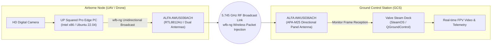

# Steam Deck & UP Squared Pro × ALFA Network Integration Guide

> **Quick Summary**: In 2026 Unmanned Aerial System (UAS) field research, teams deployed the **UP Squared Pro** as the airborne real-time vision computer and the **Valve Steam Deck (SteamOS)** as the handheld Ground Control Station (GCS). Both ends utilized **ALFA AWUS036ACH** adapters over `wfb-ng` (Wi-Fi Broadcast Next Generation) on 5.745 GHz to establish a long-range, low-latency unidirectional broadcast link. This guide covers setup, SteamOS immutable filesystem handling, and partition recovery.

## Is This Guide for You?

- **Difficulty**: Advanced (Linux terminal, kernel headers, SteamOS immutable filesystem).
- **Estimated Time**: 25–40 minutes.
- **Skills Used**: DKMS compilation, SteamOS system unlock, wfb-ng broadcast configuration.
- **What You Will Achieve**:
  1. Understand the architecture of unidirectional Wi-Fi broadcast links (`wfb-ng`).
  2. Temporarily unlock the SteamOS read-only root filesystem and compile the injection-capable RTL8812AU DKMS driver.
  3. Create an automated driver rebuild script to protect against SteamOS A/B partition updates.

---

## UAS Wireless Link Architecture



---

## Why Field Research Specifically Certified ALFA AWUS036ACH

In `wfb-ng` long-range FPV links, the **Realtek RTL8812AU driver** supports customized frame injection parameters, disables ACK retransmissions, and enforces operation on specific 5 GHz channels (e.g. 5.745 GHz / Channel 149). The ALFA AWUS036ACH incorporates dual hardware power amplifiers (PA/LNA) and dual RP-SMA ports, representing the most thoroughly documented hardware combination for `wfb-ng`.

> **Strict Scope Disclaimer**: Field research data specifically validates the **AWUS036ACH (RTL8812AU)**. Other models (such as AXML / ACM) have not been formally benchmarked under `wfb-ng` and are not pre-certified in this document.

---

## Steam Deck (SteamOS) Driver Installation

SteamOS uses an immutable (read-only) root filesystem by default. Disabling the lock is necessary before building DKMS kernel modules:

```bash
# 1. Switch to Steam Deck Desktop Mode and launch Konsole

# 2. Set administrator password if not set
passwd

# 3. Temporarily disable SteamOS read-only rootfs
sudo steamos-readonly disable

# 4. Initialize Pacman keyring
sudo pacman-key --init
sudo pacman-key --populate archlinux holo
sudo pacman -Sy --needed base-devel linux-neptune-headers git dkms

# 5. Clone and build the injection-capable RTL8812AU driver
git clone -b v5.6.4.2 https://github.com/aircrack-ng/rtl8812au.git
cd rtl8812au
sudo ./dkms-install.sh

# 6. Re-enable read-only filesystem protection
sudo steamos-readonly enable
```

---

## SteamOS System Update Recovery Script

- **A/B Partitioning Caveat**: SteamOS major updates overwrite the system partition, wiping kernel modules in `/usr/lib/modules/`.
- **Recommended Practice**: Store an automated rebuild script at `/home/deck/scripts/rebuild_alfa.sh` to quickly restore driver functionality after system updates.
