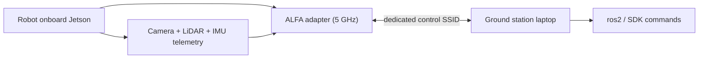

# ALFA Adapters on Unitree Robots (Go2 / B2 / A1)

> **一句話定位（One-liner）**: Unitree's robot dogs (Go2, B2, A1) carry an NVIDIA Jetson and ship with a **weak built-in Wi-Fi antenna**. An ALFA adapter with external antennas turns the robot's wireless control link from "follows you around the room" into "commands it from the far end of the field".

## Concept: the wireless control link problem

A robot dog is a nervous system on legs: the onboard Jetson streams video, LiDAR and IMU telemetry to your controller, and receives gait/task commands back. That link needs **low latency, high reliability, and range**. The stock antenna on a robot's compute module is exactly what you would expect from a consumer laptop — marginal at 30 m, and 2.4 GHz gets eaten alive by the lab's Wi-Fi, Bluetooth and the robot's own motor EMI.

The fix is the same as for the [Jetson](/alfa-network/hardware/jetson/): replace the radio path with an ALFA adapter. The recipe that works in practice:

1. **Band**: prefer **5 GHz** — 2.4 GHz on a robot is a misery of interference from motors and other gear.
2. **Antennas**: the adapter's external antennas beat any internal antenna on the robot chassis, and you can position them above metal panels where they are not shadowed.
3. **Adapter**: in-kernel chipsets for zero-fuss reliability ([AWUS036ACM](/alfa-network/products/awus036acm/) on the cheap, [AWUS036AXM](/alfa-network/products/awus036axm/) for Wi-Fi 6 + Bluetooth, [AWUS036AXML](/alfa-network/products/awus036axml/) if you want the 6 GHz band).



## Prerequisites

- [ ] Unitree robot (Go2 / B2 / A1) with the onboard computer accessible over SSH (usually `192.168.123.161` out of the box)
- [ ] A ground-station laptop running Ubuntu (see the [Ubuntu guide](/alfa-network/linux-setup-ubuntu/))
- [ ] ALFA adapter + a **powered USB hub** if the robot's USB power is weak

## Step 1: Access the robot and check the kernel

```bash
ssh unitree@<robot-ip>
uname -r
```

**Expected output**: an L4T/NVIDIA kernel (e.g. `5.10.65-tegra` or `6.6.0-tegra`). As on the [Jetson guide](/alfa-network/hardware/jetson/), the MT7921AUN adapters need kernel 5.18+ (JetPack 6); the MT7612U works on any recent kernel.

## Step 2: Plug in the ALFA adapter

On the robot's onboard computer:

```bash
lsusb | grep -iE "mediatek|realtek"
iw dev
```

**Expected output**: your adapter visible in `lsusb`, plus a new interface (usually `wlan1`). For Realtek chipsets, install the DKMS driver as described in the [Ubuntu guide](/alfa-network/linux-setup-ubuntu/) — or simply pick an in-kernel model and skip the whole step.

## Step 3: Set up a dedicated 5 GHz control SSID

A dedicated AP (either on your ground station or a router) keeps the control link isolated from lab traffic. Connect the robot to it:

```bash
sudo nmcli device wifi connect "robot-link" password "your-passphrase"
iw dev wlan1 link
```

**Expected output**: `Connected to robot-link` and a link line showing the 5 GHz channel and rate. Verify the channel is 5 GHz:

```bash
iw dev wlan1 info | grep channel
```

**Expected output**: `channel 36 (5180 MHz)` (or another 5 GHz channel) — if it says 2.4 GHz, switch the AP to 5 GHz.

## Step 4: Lock the band and maximize the link

Force 5 GHz-only on the robot side so it never falls back to the noisy band:

```bash
sudo nmcli connection modify robot-link 802-11-wireless.band bg
```

> ⚠️ Wait — that command forces **2.4 GHz**. For 5 GHz-only, use `802-11-wireless.band a`:

```bash
sudo nmcli connection modify robot-link 802-11-wireless.band a
sudo nmcli connection up robot-link
```

**Expected output**: reconnects on the 5 GHz band. Check with the `iw dev wlan1 info | grep channel` command again.

Raise TX power to the legal maximum for your region:

```bash
sudo iw reg set TW   # your country code
sudo iwconfig wlan1 txpower 30
```

**Expected output**: no error — `iwconfig` shows `Tx-Power=30 dBm` (subject to regulatory caps).

## Step 5: Verify with a telemetry ping test

Push data over the link and measure round-trip at distance (ICMP is a poor latency proxy; use a UDP burst):

```bash
# On the robot:
iperf3 -s &
# On the ground station:
iperf3 -c <robot-ip> -u -b 100M -t 10
```

**Expected output**: a throughput number (Mbits/sec) and 0–1 % loss. Loss climbing above ~1 % at your operating distance means the antenna placement or channel needs work — try another 5 GHz channel (`sudo iw dev wlan1 set channel 149` after reconfigure) or reposition the adapter above the chassis.

## Troubleshooting

| Symptom | Cause | Fix |
|---|---|---|
| Link dies when motors spin up | Motor EMI + weak antennas | Move adapter above metal; switch to 5 GHz; check channel congestion |
| Adapter invisible on the robot | Robot USB port power-limited | Powered USB hub; try a different port |
| MT7921AUN adapter not detected | Kernel < 5.18 on older JetPack | Upgrade JetPack on the robot, or use MT7612U-class adapter |
| Fallback to 2.4 GHz at distance | Band steering / AP config | Force `802-11-wireless.band a` on the robot (Step 4) |
| High latency spikes | Channel congestion | Pick a clear 5 GHz channel; consider 6 GHz (AXML) if your AP supports it |

## References

- [Jetson guide](/alfa-network/hardware/jetson/) — same kernel considerations, deeper detail
- [AWUS036AXM product page](/alfa-network/products/awus036axm/) — Wi-Fi 6 + Bluetooth for robot links
- [Ubuntu setup guide](/alfa-network/linux-setup-ubuntu/) — driver installs
- [Unitree official docs](https://support.unitree.com/) — robot SDK and network reference
