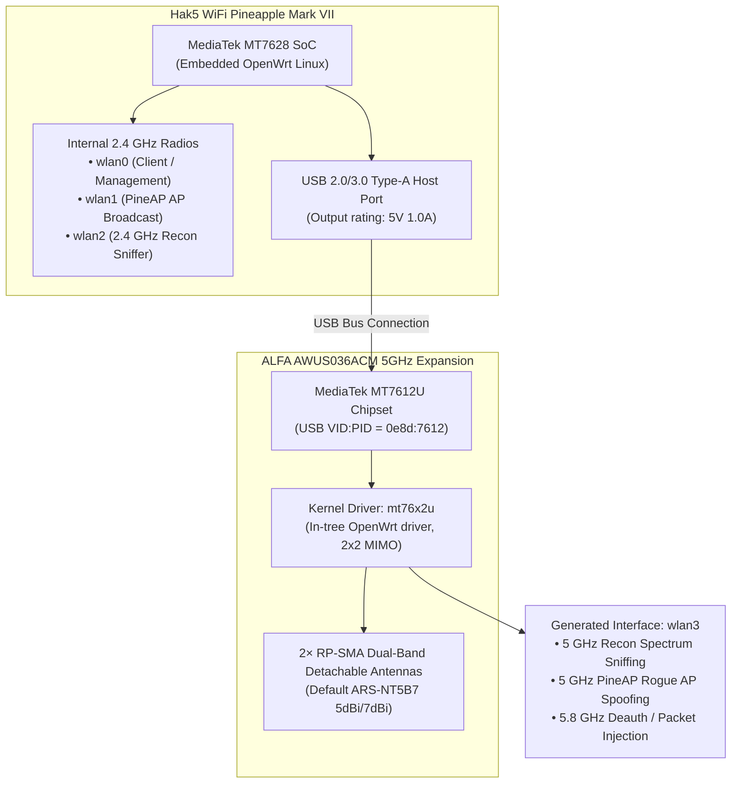

# Hak5 WiFi Pineapple × ALFA Network Integration Guide

> **Quick Summary**: Hak5 official documentation ([docs.hak5.org](https://docs.hak5.org/wifi-pineapple/faq/compatible-802.11ac-adapters/)) explicitly designates the **MediaTek MT7612U** chipset as the only 802.11ac external adapter guaranteed to work reliably in all penetration testing scenarios. The **ALFA AWUS036ACM** shares the exact same MT7612U chipset architecture as the Hak5 MK7AC OEM module, but provides higher antenna gain via dual RP-SMA ports and enhanced thermal dissipation for prolonged 5 GHz auditing and PineAP rogue AP campaigns.

---

## 1. Hardware Topology & Architecture

The WiFi Pineapple Mark VII features two internal 2.4 GHz radios (`wlan0` for AP Client/Management, `wlan1`/`wlan2` for PineAP broadcasting and Recon scanning). To audit modern enterprise 5 GHz (802.11a/n/ac) networks, an external USB radio module is required.



### Why Hak5 Officially Specifies MT7612U
Under embedded OpenWrt kernels, Realtek chipsets (such as RTL8812AU / RTL8814AU) rely on out-of-tree drivers that frequently trigger kernel panics or spontaneous reboots during high-throughput packet injection and multi-SSID beacon floods. The MediaTek `mt76x2u` driver is compiled directly into the OpenWrt kernel, offering superior DMA buffer reclamation and thermal stability.

---

## 2. Hardware Comparison Matrix

| Specification | Hak5 MK7AC OEM Adapter | ALFA AWUS036ACM | Engineering Advantage |
|---|---|---|---|
| **Chipset** | MediaTek MT7612U | MediaTek MT7612U | Identical driver core (`mt76x2u`) |
| **USB VID:PID** | `0e8d:7612` | `0e8d:7612` | 100% native plug-and-play identification |
| **Supported Bands** | 2.4 GHz (300Mbps) + 5 GHz (867Mbps) | 2.4 GHz (300Mbps) + 5 GHz (867Mbps) | Full 802.11a/b/g/n/ac support |
| **Antenna Interface** | Internal micro-PCB / fixed stub | 2× Standard RP-SMA Female | **ALFA advantage**: Interchangeable directional panel antennas |
| **Thermal Design** | Sealed plastic enclosure | Vented chassis + internal heat shielding | **ALFA advantage**: Prevents thermal throttling during multi-hour floods |
| **Power Draw** | 5V / 500mA ~ 800mA | 5V / 600mA ~ 900mA | Requires robust host power supply |

---

## 3. Step-by-Step Configuration

### Step 1: Hardware Connection & Power Budget
1. Plug the ALFA AWUS036ACM into the **USB Host** port of the WiFi Pineapple Mark VII.
2. **Critical Power Requirement**: The WiFi Pineapple Mark VII consumes 3W~5W, and the AWUS036ACM draws up to 4.5W (900mA @ 5V) during peak 5 GHz transmissions.
   - ❌ **Avoid**: Unpowered laptop USB ports (500mA limit) or weak 5V/1A adapters.
   - ✅ **Recommended**: Dedicated 5V/3A (15W) AC adapter or high-output QC/PD power bank.

### Step 2: SSH Terminal Verification
Connect to the WiFi Pineapple via SSH (`172.16.42.1`):

```bash
# 1. Verify USB device detection
lsusb
# Expected: Bus 001 Device 003: ID 0e8d:7612 MediaTek Inc. MT7612U

# 2. Check kernel driver binding
dmesg | grep -E "mt76|wlan"
# Expected: mt76x2u 1-1:1.0: firmware: mt7662u.bin loaded
# Expected: ieee80211phy3: mt76x2u registered as wlan3

# 3. Confirm wireless interface status
iw dev
```

### Step 3: Web UI 5 GHz Recon & PineAP Setup
1. Open your browser and navigate to `http://172.16.42.1:1471`.
2. Navigate to **Recon**: Select `wlan3 (5GHz)` from the interface dropdown, check **2.4 GHz + 5 GHz**, and click **Start Scan**.
3. Navigate to **PineAP**: Assign `wlan3` as the 5 GHz target interface for dual-band rogue AP broadcasting.

---

## 4. Antenna Recommendations

- **Omnidirectional 360° Audits**: 2× **ALFA ARS-NT5B7** 5dBi/7dBi dual-band antennas.
- **Long-Range Directional Audits**: 2× **ALFA APA-M25** 8dBi/10dBi dual-band directional panel antennas (60° horizontal beamwidth).

---

## 5. Troubleshooting

### Q1: Pineapple reboots immediately when AWUS036ACM is plugged in
- **Root Cause**: USB inrush current causing voltage drop.
- **Fix**: Connect the AWUS036ACM prior to powering on the Pineapple, and use a 5V/3A power supply.

### Q2: Interface conflicts with previous USB adapters (`wlan2` collision)
- **Root Cause**: Stale `/etc/config/wireless` configuration.
- **Fix**: Run `rm -f /etc/config/wireless && wifi config && /etc/init.d/network restart`.
