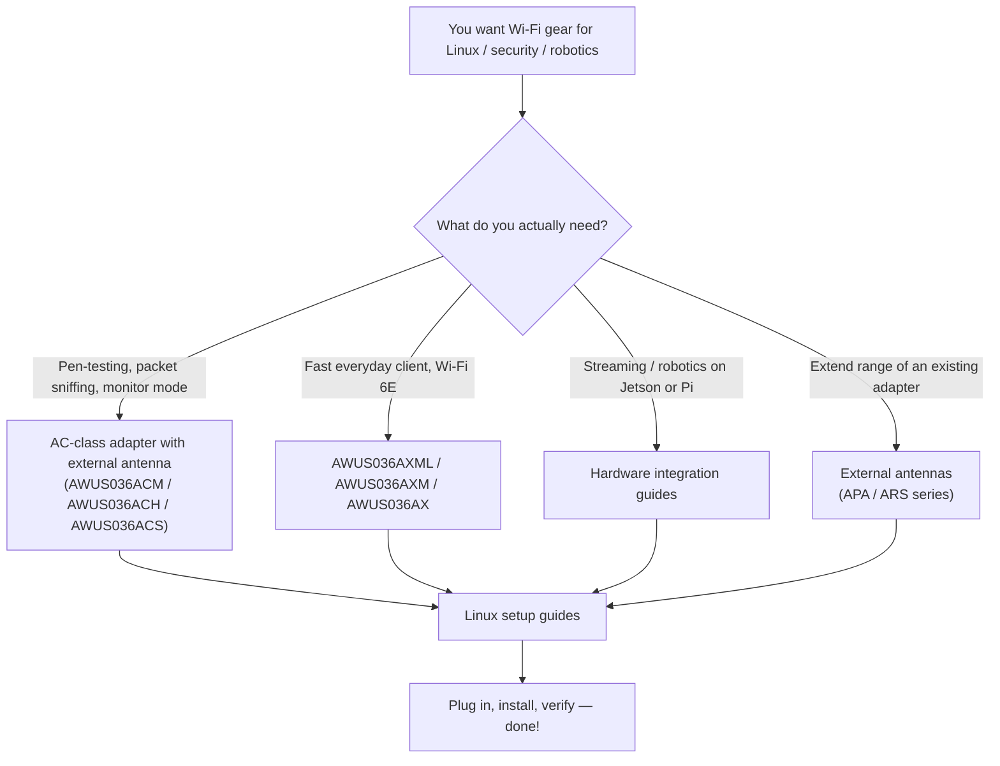

---

id: alfa-index
title: ALFA Network
sidebar_position: 1
description: ALFA Network Wi-Fi adapters, antennas, Linux drivers, Kali/NetHunter setup guides, hardware integrations and compatibility matrix.
tags: [alfa, wifi, kali, monitor-mode, adapter, antenna]
keywords: [ALFA Network, AWUS036ACM, AWUS036AXML, Wi-Fi adapter, monitor mode, Kali Linux]
slug: /alfa-network/
---

# ALFA Network

> **Quick Summary**: ALFA Network makes the external Wi-Fi adapters and antennas that penetration testers, drone pilots and robotics labs reach for — because they combine **high-gain radios**, **external antenna connectors**, and (the part students love most) **serious Linux support**.

If you have ever watched a Kali Linux tutorial where someone plugs a black stick into a USB port, flips the interface into monitor mode and starts sniffing packets, the stick was almost certainly an ALFA. The brand has been the default choice in the security community for over a decade — from the legendary **AWUS036ACH** to the brand-new **Wi-Fi 6E AWUS036AXML**.

This wiki is your step-by-step companion: every adapter and antenna we sell, every chipset driver, every "why doesn't my adapter show up" answer, and hardware integration guides for Jetson, Raspberry Pi and Unitree robots.

## What's inside this section

| Page | What you get |
|---|---|
| [Wi-Fi adapter comparison](/alfa-network/wifi-adapter-comparison/) | Every USB adapter side by side: chipset, speed class, bands, monitor-mode support — plus "which one for you" by use case |
| [Linux compatibility matrix](/alfa-network/linux-compatibility-matrix/) | Which adapter works out-of-the-box on Kali Linux, Ubuntu and NetHunter/Android |
| [Ubuntu setup guide](/alfa-network/linux-setup-ubuntu/) | Step-by-step: in-kernel chipsets (plug & play) and DKMS builds for Realtek chips |
| [Kali Linux setup guide](/alfa-network/linux-setup-kali/) | dkms build, monitor mode, packet injection — the full pen-test workflow |
| [NetHunter (Android) setup guide](/alfa-network/linux-setup-nethunter/) | Turn an Android phone + OTG into a mobile auditing rig |
| [Troubleshooting index](/alfa-network/troubleshooting/) | Symptom → diagnosis → root cause → fix for every common ALFA problem |
| [Drivers](/alfa-network/drivers/mt7612u/) | Chipset-focused guides: MT7612U, MT7610U, MT7921AUN, RTL8812AU, RTL8811AU, RTL8832BU, RTL8821CU |
| [Hardware integrations](/alfa-network/hardware/jetson/) | NVIDIA Jetson, Raspberry Pi, Unitree robots |
| [Products](/alfa-network/products/awus036acm/) | Full spec sheets and per-product guides for every adapter and antenna |

## How to choose an adapter (5-minute crash course)

Choosing an adapter is really choosing a **chipset**, because the chipset decides:

1. **Which driver you need** — and whether it is in the Linux kernel (plug & play) or requires a DKMS build.
2. **Whether monitor mode + packet injection work** — the core requirement for Kali / Wireshark / Aircrack-ng work.
3. **How fast and how far** the adapter is.

Here is the simplified map — details in the [comparison page](/alfa-network/wifi-adapter-comparison/):

| Chipset | Adapters | In-kernel driver? | Monitor mode? | Best for |
|---|---|---|---|---|
| **MT7612U** | AWUS036ACM | ✅ (since kernel 4.19) | ✅ excellent | The classic all-rounder for Kali |
| **MT7610U** | AWUS036ACHM | ✅ (since kernel 4.19) | ✅ good | Budget dual-band monitor mode |
| **MT7921AUN** | AWUS036AXM / AWUS036AXML | ✅ (since kernel 5.18) | ✅ good | Wi-Fi 6 / 6E speed + BT combo |
| **RTL8812AU** | AWUS036ACH | ❌ DKMS | ✅ excellent | High-power classic, huge community |
| **RTL8811AU** | AWUS036ACS | ❌ DKMS | ✅ good | Tiny pocket monitor adapter |
| **RTL8832BU** | AWUS036AX / AWUS036AXER | ❌ DKMS | ✅ good | Wi-Fi 6 with WPA3 |
| **RTL8821CU** | AWUS036EACS | ❌ unstable | ❌ unreliable | **Windows only** — WiFi + BT combo |

> **You might be wondering** — *"What is DKMS?"* It is a system that rebuilds a third-party driver automatically every time your Linux kernel updates. Realtek chips like the RTL8812AU are not in the kernel, so DKMS keeps them alive across updates. We explain it step by step in the [Ubuntu guide](/alfa-network/linux-setup-ubuntu/).

## Getting started

If this is your first ALFA adapter, the recommended path is:

1. Read the [comparison](/alfa-network/wifi-adapter-comparison/) and pick your adapter.
2. Check your OS in the [compatibility matrix](/alfa-network/linux-compatibility-matrix/).
3. Follow the [Ubuntu](/alfa-network/linux-setup-ubuntu/) or [Kali](/alfa-network/linux-setup-kali/) guide.
4. Something odd? Head to the [troubleshooting index](/alfa-network/troubleshooting/).

Happy sniffing — and remember: only ever test on networks you own or have written permission to test.
