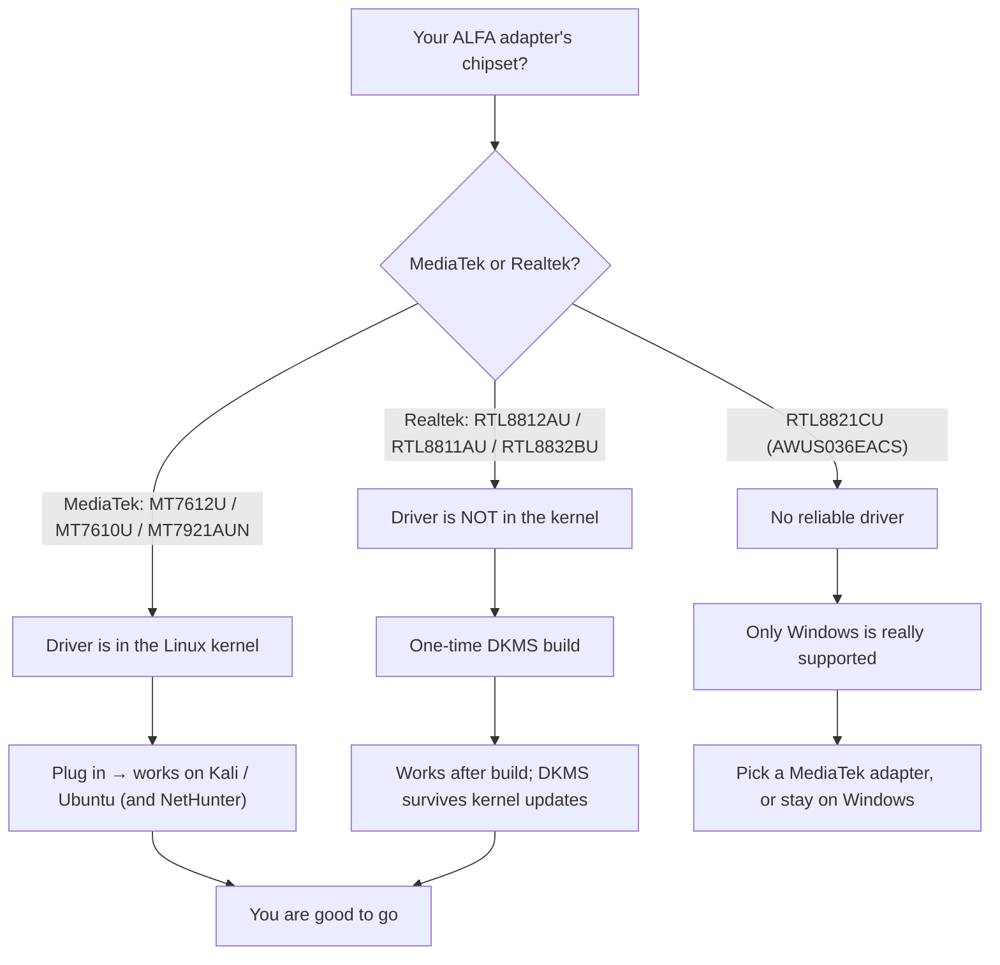

# ALFA Linux Compatibility Matrix

> **Bottom Line Up Front**:  On modern Linux, the **MediaTek-based adapters** (AWUS036ACM, AWUS036ACHM, AWUS036AXM, AWUS036AXML) work out of the box because their drivers ship inside the kernel. The **Realtek-based adapters** (AWUS036ACH, AWUS036ACS, AWUS036AX, AWUS036AXER) need a DKMS driver build — a 5-minute, one-time job. The **AWUS036EACS is the exception: do not expect it to work well on any Linux**.




*💡 Click image to view in high-resolution full-screen lightbox.*
## The matrix

Legend: ✅ works out of the box · 🔧 works after a DKMS install · ⚠️ partial / flaky · ❌ not recommended

| Adapter | Chipset | Driver | In-kernel? | Kali Linux | Ubuntu | NetHunter / Android |
|---|---|---|---|---|---|---|
| AWUS036ACM | MT7612U | `mt76x2u` | ✅ since 4.19 | ✅ | ✅ | ✅ |
| AWUS036ACHM | MT7610U | `mt76x0u` | ✅ since 4.19 | ✅ | ✅ | ✅ |
| AWUS036AXM | MT7921AUN | `mt7921u` | ✅ since 5.18 | ✅ | ✅ | ✅ |
| AWUS036AXML | MT7921AUN | `mt7921u` | ✅ since 5.18 | ✅ | ✅ | ✅ |
| AWUS036ACH | RTL8812AU | `rtl8812au-dkms` | ❌ | 🔧 | 🔧 | 🔧 |
| AWUS036ACS | RTL8811AU | `rtl8811au` (DKMS) | ❌ | 🔧 | 🔧 | 🔧 |
| AWUS036AX | RTL8832BU | `rtl88x2bu` (DKMS) | ❌ | 🔧 | 🔧 | ⚠️ |
| AWUS036AXER | RTL8832BU | `rtl88x2bu` (DKMS) | ❌ | 🔧 | 🔧 | ⚠️ |
| AWUS036EACS | RTL8821CU | — (no reliable driver) | ❌ | ❌ | ❌ | ❌ |

## What "in-kernel" means for you

When a chipset's driver lives in the Linux kernel, your OS ships it pre-installed. Plug the adapter in and `dmesg` will show it being claimed by the driver — no compilation, no DKMS, no kernel-update breakage. This is the single biggest reliability difference between the MediaTek and Realtek adapters on this page.

For the Realtek models, the [Kali guide](/alfa-network/linux-setup-kali/) and [Ubuntu guide](/alfa-network/linux-setup-ubuntu/) walk you through the DKMS build. DKMS rebuilds the driver automatically after every kernel update, so "it stopped working after an update" should never happen — if it does, check the [troubleshooting index](/alfa-network/troubleshooting/).

## Per-OS notes

### Kali Linux
Everything except the EACS works, with a caveat: the kernel in Kali (rolling release) can be newer than some DKMS drivers support. If a DKMS build fails on a fresh Kali, use the **aircrack-ng** maintained driver repos (`aircrack-ng/rtl8812au`, `aircrack-ng/rtl88x2bu`) which track new kernels aggressively. Full walkthrough: [Kali setup guide](/alfa-network/linux-setup-kali/).

### Ubuntu (LTS)
Ubuntu LTS kernels are older and rock-stable, so DKMS builds basically never break. The in-kernel models work with zero setup on 20.04+ (MT7921AUN needs **22.04+** because `mt7921u` landed in kernel 5.18). Full walkthrough: [Ubuntu setup guide](/alfa-network/linux-setup-ubuntu/).

### NetHunter / Android
NetHunter on a rooted phone with OTG is the most demanding environment: Android kernels vary wildly by phone, so only the **in-kernel chipsets** are dependable (MT7612U, MT7610U, MT7921AUN). Realtek DKMS drivers need a matching toolchain inside the NetHunter chroot and often fail on stock phone kernels — proceed with caution and see the [NetHunter guide](/alfa-network/linux-setup-nethunter/).

## How to check your kernel

Not sure which kernel you are on? Run:

```bash
uname -r
```

**Expected output** (examples):

```text
6.8.0-51-generic        # Ubuntu 24.04
6.1.0-kali9-amd64       # Kali rolling
5.15.0-91-generic       # Ubuntu 22.04 — mt7921u NOT present, needs 22.04+ kernel
```

If your kernel is **5.18 or newer** on a MediaTek model, you are fine. If it is older, update your OS first — the driver will not appear out of thin air.

Next: follow the [Ubuntu](/alfa-network/linux-setup-ubuntu/) or [Kali](/alfa-network/linux-setup-kali/) guide for your OS, or jump to a [chipset driver page](/alfa-network/drivers/mt7612u/) for the deep dive.
