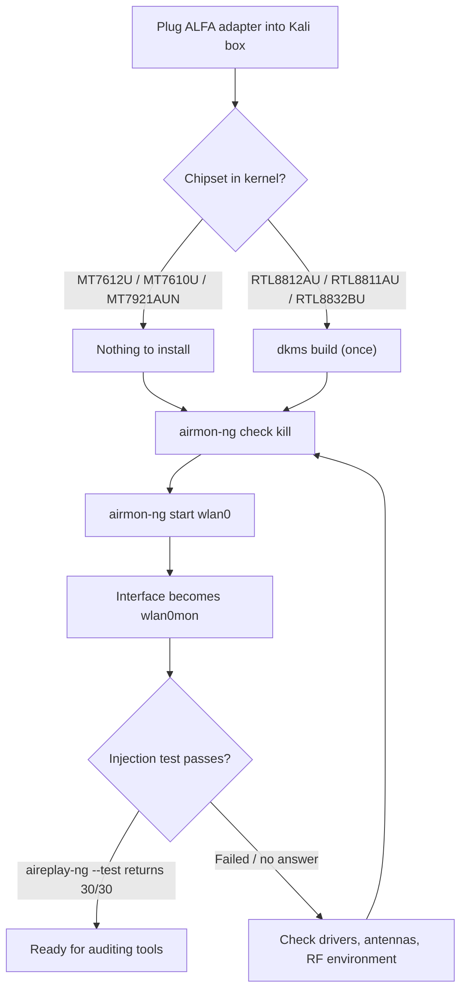

# ALFA Adapters on Kali Linux — Monitor Mode & Packet Injection

> **學習目標（Learning goal）**: By the end of this guide you will have your ALFA adapter in **monitor mode** and **proven that packet injection works** — the two capabilities every Wi-Fi auditing tool (Aircrack-ng, Wifite, Wireshark, Bettercap) depends on.
> **適用對象**: Beginner–intermediate, Kali users ｜ **前置需求**: Kali Linux installed (any recent version), internet access, your ALFA adapter.

## Concept: why Kali is different

Ubuntu treats Wi-Fi adapters as *polite clients*: they only capture their own traffic. Kali's whole toolchain — Aircrack-ng, Reaver, Wifite — assumes the adapter can do two extra things:

1. **Monitor mode** — capture *every* frame on a channel, not just your connection.
2. **Packet injection** — transmit raw crafted frames (deauth, probe requests, handshake replays).

Not every chipset can do both. The good news: all ALFA adapters except the **AWUS036EACS** can, and the in-kernel MediaTek chipsets do it without any driver installation.



## Prerequisites

- [ ] Kali Linux installed (tested on Kali rolling, kernel 6.x)
- [ ] `sudo` access and an internet connection
- [ ] Your ALFA adapter — check the [compatibility matrix](/alfa-network/linux-compatibility-matrix/) first
- [ ] (Realtek models only) build tools: `sudo apt install -y build-essential dkms git`

## Step 1: Check what the kernel sees

Plug in the adapter and confirm it is detected:

```bash
lsusb | grep -iE "realtek|mediatek"
iw dev
```

**Expected output**: your adapter listed in `lsusb`, and at least one `Interface wlan0` (or `wlan1`) in `iw dev`.

## Step 2: Install the driver (Realtek chipsets only)

If your chipset is RTL8812AU / RTL8811AU / RTL8832BU, build the aircrack-ng-maintained driver with DKMS. If your chipset is MediaTek (MT7612U / MT7610U / MT7921AUN), **skip to Step 3** — the driver is already in your kernel.

### RTL8812AU (AWUS036ACH)

```bash
sudo apt update
sudo apt install -y build-essential dkms git
cd /opt
sudo git clone https://github.com/aircrack-ng/rtl8812au.git
cd rtl8812au
sudo make dkms_install
```

**Expected output**: ends with `DKMS: install completed.`

> Why the aircrack-ng fork? Kali's kernel rolls fast, and the aircrack-ng maintainers update these drivers within days of every kernel release — essential on a rolling distro. The [RTL8812AU driver page](/alfa-network/drivers/rtl8812au/) has the deep dive.

### RTL8811AU (AWUS036ACS)

```bash
cd /opt
sudo git clone https://github.com/aircrack-ng/rtl8811au.git
cd rtl8811au
sudo make dkms_install
```

### RTL8832BU (AWUS036AX / AWUS036AXER)

```bash
cd /opt
sudo git clone https://github.com/aircrack-ng/rtl88x2bu.git
cd rtl88x2bu
sudo make dkms_install
```

Re-plug the adapter (or `sudo modprobe <module>`) and confirm an interface appears: `iw dev`.

## Step 3: Kill interfering processes

Kali's NetworkManager fights for control of Wi-Fi interfaces. Stop it before switching to monitor mode:

```bash
sudo airmon-ng check kill
```

**Expected output**:

```text
Killing these processes:

    PID Name
   1234 wpa_supplicant
   2345 NetworkManager
```

> ⚠️ This drops your current Wi-Fi connection (you killed NetworkManager!). If you are working over Wi-Fi, you will lose your link — use an Ethernet cable or work locally. You can restore it later with `sudo systemctl restart NetworkManager`.

## Step 4: Start monitor mode

```bash
sudo airmon-ng start wlan0
```

(Replace `wlan0` with your interface name from Step 1.)

**Expected output**:

```text
PHY	Interface	Driver		Chipset
phy0	wlan0		mt76x2u		MediaTek Inc. MT7612U
		(mac80211 monitor mode vif enabled for [phy0]wlan0 on [phy0]wlan0mon)
		(mac80211 station mode vif disabled for [phy0]wlan0)
```

Your interface is now **wlan0mon**. Verify:

```bash
iwconfig
```

**Expected output**: `wlan0mon  IEEE 802.11  Mode:Monitor  ...`

## Step 5: Prove packet injection works

Injection is the skill-check of every Wi-Fi adapter. Run the Aircrack-ng self-test against nothing (it broadcasts):

```bash
sudo aireplay-ng --test wlan0mon
```

**Expected output**:

```text
12:34:56  Trying broadcast probe requests...
12:34:56  Injection is working!
12:34:56  Found 1 AP
12:34:56  30/30:  100%
```

**`30/30: 100%`** — that is the magic line. It means the adapter injected 30 probe requests and heard all 30, proving both TX and RX work on monitor mode. If you see `Failed` or a low percentage, the adapter is not actually injecting — see the common errors table below.

## Step 6: Point your tools at it

A quick end-to-end sanity check — capture and count frames for 10 seconds:

```bash
sudo timeout 10 tcpdump -i wlan0mon -c 100
```

**Expected output**: `100 packets captured` (or however many arrived within 10 s — seeing *any* 802.11 frames proves capture works).

When done, return the adapter to normal mode:

```bash
sudo airmon-ng stop wlan0mon
sudo systemctl restart NetworkManager
```

## Common errors (FAQ)

| Error / symptom | Cause | Fix |
|---|---|---|
| `airmon-ng start` says `No such device` | Interface name is `wlan1` or the driver isn't loaded | Run `iw dev` to find the real name; `sudo modprobe <module>` for Realtek |
| `aireplay-ng --test` → `No such device` | You are still on `wlan0`, not `wlan0mon` | Re-check `iwconfig`; restart monitor mode from Step 4 |
| `Injection is working!` but `0/30` replies | Adapter TX works but RX filter broken (common on some Realtek drivers) | Try channel lock: `sudo iw wlan0mon set channel 6`; retest; upgrade the DKMS driver |
| DKMS build fails with "No rule to make target" | Kali kernel too new for the repo snapshot | `cd /opt/rtl8812au && sudo git pull && sudo make dkms_install` |
| Monitor mode dies after a few minutes | USB power saving / thermal throttle | Use a powered USB hub or USB 3.0 port; `sudo iwconfig wlan0mon txpower 20` |
| `airmon-ng check kill` killed my internet | Expected — NetworkManager was stopped | `sudo systemctl restart NetworkManager` after the session |
| Adapter works in managed mode but `monitor` not listed in `iw` | Driver built without monitor support | Rebuild with aircrack-ng repos (they enable monitor + VIF) |

> **You might be wondering** — *"Is it legal to capture this stuff?"* Monitor mode and injection are technical capabilities, not a license. In most jurisdictions, capturing or injecting on networks you do not own or lack permission to test is illegal. Every course lab assumes you test on **your own AP or a lab network**. Keep it there.

## References

- [Ubuntu version of this guide](/alfa-network/linux-setup-ubuntu/) — client-mode setup
- [NetHunter guide](/alfa-network/linux-setup-nethunter/) — same workflow on Android
- [Chipset driver pages](/alfa-network/drivers/rtl8812au/) — per-chipset details and troubleshooting
- [Troubleshooting index](/alfa-network/troubleshooting/)
- [Aircrack-ng docs](https://www.aircrack-ng.org/doku.php) — official tool documentation
