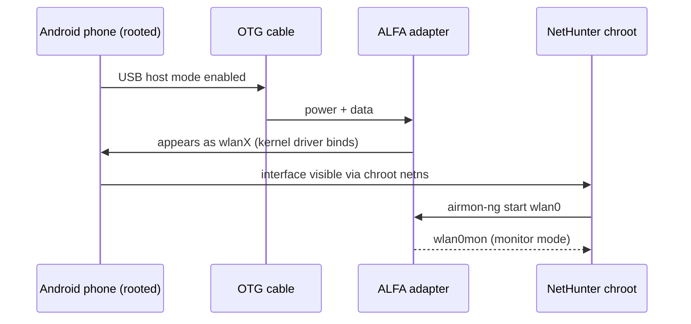

# ALFA Adapters on NetHunter (Android) — OTG Setup Guide

> **Learning Objectives**:  By the end of this guide you will have your ALFA adapter connected to an Android phone running **Kali NetHunter**, visible inside the NetHunter chroot, and ready for monitor-mode tools — all powered by a USB **OTG** cable.
> **Target Audience**: Intermediate (rooting knowledge required)  | **Prerequisites**: Rooted Android phone, NetHunter installed, OTG cable, an ALFA adapter with an **in-kernel chipset** (see below).

## Concept: why Android is the hardest environment

NetHunter is Kali Linux running inside a **chroot** on your Android device. The phone's kernel still does the real work — and phone kernels are *not* the Ubuntu kernel:

1. **In-kernel drivers**: a chipset supported by mainline Linux (MT7612U, MT7610U, MT7921AUN) usually works, because NetHunter's kernel images include the mainline `mt76` driver family.
2. **DKMS drivers**: compiling Realtek DKMS drivers inside an Android chroot is painful — phone kernels rarely ship the headers and toolchain the build needs. The RTL8812AU *can* work on some devices, but treat it as a project, not a setup step.

**Rule of thumb**: for NetHunter, prefer the **AWUS036ACM (MT7612U)**. It is the community's default NetHunter adapter for a reason.



## Prerequisites

- [ ] Rooted Android phone with **Kali NetHunter** installed (the official NetHunter image, or the **NetHunter Store** app on a rooted device)
- [ ] OTG cable (USB-C or micro-USB depending on your phone) — ideally with external power for high-power adapters
- [ ] ALFA adapter with an in-kernel chipset: **AWUS036ACM / AWUS036ACHM / AWUS036AXM / AWUS036AXML**
- [ ] A phone with a kernel new enough for your chipset (kernel 5.18+ for the MT7921AUN models)

## Step 1: Check your kernel

Some chipsets need a recent kernel. Open a terminal in the NetHunter app (or adb shell) and run:

```bash
uname -r
```

**Expected output**: something like `4.19.157-perf+` (older phones) or `5.15.xx-gki` (newer). For the MT7921AUN adapters you need **5.18 or newer**; the MT7612U works fine on 4.19.

> **You might be wondering** — *"Do I need a specific NetHunter kernel?"* Yes — the NetHunter team builds kernels for a specific list of supported devices. Check the [official device list](https://www.kali.org/docs/nethunter/) first: an unsupported phone means no monitor-mode-capable kernel, and the adapter will never leave managed mode no matter what you do.

## Step 2: Connect via OTG

Plug the OTG cable into the phone, then the adapter into the OTG cable. On most phones a notification appears ("USB device connected"). Then confirm the adapter is seen by the kernel:

```bash
lsusb
```

**Expected output** (MediaTek models):

```text
Bus 001 Device 002: ID 0e8d:7612 MediaTek Inc. MT7612U 802.11a/b/g/n/ac 2T2R Wireless Adapter
```

If `lsusb` shows nothing, the OTG cable is not supplying power or the phone is not in USB host mode — try a powered OTG hub (important for the AWUS036AXM/AXML, which draw more power).

## Step 3: Verify the interface inside NetHunter

Launch the **NetHunter** app → open **Kali Chroot** → *Kali terminal*:

```bash
iw dev
```

**Expected output**:

```text
phy#0
	Interface wlan0
		ifindex 3
		type managed
```

The interface is visible inside the chroot — this is the moment most OTG setups fail, so if you see `wlan0` here, you are 90 % done.

## Step 4: Monitor mode

Inside the Kali terminal (you need root — NetHunter runs as root by default):

```bash
airmon-ng check kill
airmon-ng start wlan0
iwconfig
```

**Expected output**: `wlan0mon` appears with `Mode:Monitor`.

## Step 5: Verify injection (optional but recommended)

```bash
aireplay-ng --test wlan0mon
```

**Expected output**: `30/30: 100%` and `Injection is working!`

## What about Realtek chipsets?

The **RTL8812AU (AWUS036ACH)** deserves an honest paragraph: it *can* work on NetHunter devices whose kernel includes a pre-built `8812au` module (some community kernels do), but **do not plan your course project around it**. DKMS compilation inside the Android chroot fails on most phones because the phone kernel headers are absent. If your only adapter is Realtek, test on a laptop first — the [Kali guide](/alfa-network/linux-setup-kali/) works there — and treat the phone as a bonus.

## Common errors (FAQ)

| Error / symptom | Cause | Fix |
|---|---|---|
| `lsusb` shows nothing | OTG not in host mode / power issue | Use a powered OTG hub; try another OTG cable; check the phone's "USB" notification |
| `iw dev` empty inside chroot | Interface not yet created / wrong netns | Re-plug the adapter; check `lsusb` first; reboot phone and retry |
| `airmon-ng` says `command not found` | NetHunter chroot incomplete | Reinstall the chroot via the NetHunter app; `apt update && apt install aircrack-ng` |
| Adapter detected but stuck in `managed` | Phone kernel lacks monitor support for that chipset | Check the [NetHunter supported devices](https://www.kali.org/docs/nethunter/) list; switch to an in-kernel chipset adapter |
| MT7921AUN adapter not detected at all | Phone kernel older than 5.18 | Use a newer NetHunter kernel image or a phone with a GKI 5.18+ kernel |
| WLAN dies under load | USB power limits on phone | Powered OTG hub; disable phone battery optimization for NetHunter |

## References

- [Kali Linux desktop guide](/alfa-network/linux-setup-kali/) — full monitor + injection workflow
- [Ubuntu guide](/alfa-network/linux-setup-ubuntu/) — client-mode setup
- [Compatibility matrix](/alfa-network/linux-compatibility-matrix/) — chipset vs OS table
- [Kali NetHunter documentation](https://www.kali.org/docs/nethunter/) — official install & device support
