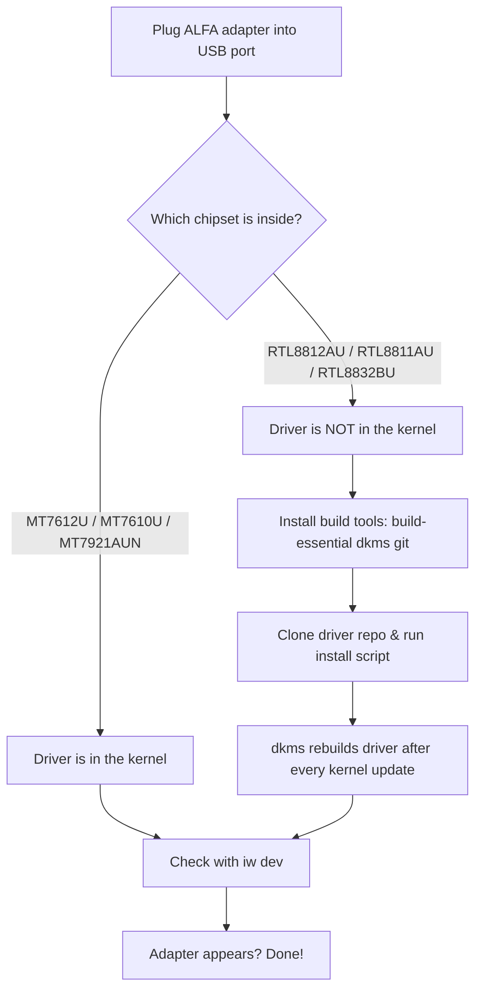

# ALFA Adapters on Ubuntu — Complete Setup Guide

> **學習目標（Learning goal）**: By the end of this guide you will have your ALFA adapter visible in Ubuntu (`iw dev`), connected to Wi-Fi, and — for the supported chipsets — able to switch into monitor mode.
> **適用對象**: Beginner–intermediate ｜ **前置需求**: Ubuntu 20.04+ (22.04+ for Wi-Fi 6E models), an internet connection (you need it to install packages!), and your ALFA adapter.

## Concept: two kinds of drivers

Before touching the terminal, understand *why* the setup differs between adapters. There are two worlds:

1. **In-kernel chipsets (MediaTek)** — the driver is already compiled into Ubuntu. Plug in → works. This covers the **MT7612U** (AWUS036ACM), **MT7610U** (AWUS036ACHM), and **MT7921AUN** (AWUS036AXM / AWUS036AXML, needs Ubuntu 22.04+ / kernel 5.18+).
2. **DKMS chipsets (Realtek)** — the driver is not in the kernel, so you compile it once, and **DKMS** keeps it rebuilt after every kernel update. This covers the **RTL8812AU** (AWUS036ACH), **RTL8811AU** (AWUS036ACS), and **RTL8832BU** (AWUS036AX / AWUS036AXER).



## Prerequisites

- [ ] Ubuntu 20.04 or newer (check with `lsb_release -a`)
- [ ] Working internet (Wi-Fi or Ethernet) to download packages
- [ ] Your ALFA adapter and a USB-A or USB-C cable (AXML uses USB-C)
- [ ] `sudo` access

## Step 1: Identify your chipset

Plug the adapter in, then ask Ubuntu what it sees:

```bash
lsusb
```

**Expected output** (look for the MediaTek / Realtek line):

```text
Bus 001 Device 004: ID 0e8d:7612 MediaTek Inc. MT7612U 802.11a/b/g/n/ac 2T2R Wireless Adapter
Bus 001 Device 005: ID 0bda:8812 Realtek Semiconductor Corp. RTL8812AU 802.11a/b/g/n/ac 2T2R Wireless Adapter
```

- `0e8d` = MediaTek (in-kernel path)
- `0bda` = Realtek (DKMS path)
- Not sure? Cross-check the chipset table in the [compatibility matrix](/alfa-network/linux-compatibility-matrix/).

## Step 2: The in-kernel path (MediaTek — plug and play)

If your adapter uses a MediaTek chipset, nothing to install. Verify:

```bash
iw dev
```

**Expected output**:

```text
phy#0
	Interface wlan0
		ifindex 3
		addr 00:c0:ca:xx:xx:xx
		type managed
```

See `wlan0`? Congratulations — the driver is live. Connect via the desktop Wi-Fi menu or NetworkManager:

```bash
nmcli device wifi connect "MySSID" password "my-passphrase"
```

**Expected output**: `Device 'wlan0' successfully activated with 'MySSID'.`

Skip ahead to [Step 4: verify](#step-4-verify-everything).

## Step 3: The DKMS path (Realtek — one-time build)

For the RTL8812AU (AWUS036ACH), RTL8811AU (AWUS036ACS) and RTL8832BU (AWUS036AX / AXER), build the driver once. All three follow the same pattern — install tools, clone the repo, run the installer.

### 3.1 Install the build tools

```bash
sudo apt update
sudo apt install -y build-essential dkms git
```

**Expected output**: ends with `Setting up dkms ...` and no errors. DKMS is the piece that will recompile the driver after kernel updates.

### 3.2 RTL8812AU (AWUS036ACH)

The most battle-tested repo is maintained by the aircrack-ng project:

```bash
cd /opt
sudo git clone https://github.com/aircrack-ng/rtl8812au.git
cd rtl8812au
sudo make dkms_install
```

**Expected output**:

```text
DKMS: install completed.
```

The module is now `8812au` and DKMS will rebuild it on every kernel update — you can forget it exists.

### 3.3 RTL8811AU (AWUS036ACS)

```bash
cd /opt
sudo git clone https://github.com/aircrack-ng/rtl8811au.git
cd rtl8811au
sudo make dkms_install
```

**Expected output**: `DKMS: install completed.` — module name `8811au`.

### 3.4 RTL8832BU (AWUS036AX / AWUS036AXER)

```bash
cd /opt
sudo git clone https://github.com/aircrack-ng/rtl88x2bu.git
cd rtl88x2bu
sudo make dkms_install
```

**Expected output**: `DKMS: install completed.` — module name `88x2bu`.

### 3.5 Re-plug and check

Unplug and re-plug the adapter (or run `sudo modprobe <module>`), then verify:

```bash
iw dev
```

**Expected output**: an `Interface wlan1` (or `wlan0` if it is your only adapter) line appears.

> **You might be wondering** — *"Which module name corresponds to my adapter?"* Match your chipset: `8812au` → AWUS036ACH, `8811au` → AWUS036ACS, `88x2bu` → AWUS036AX / AXER. The [driver pages](/alfa-network/drivers/rtl8812au/) have deeper per-chipset details.

## Step 4: Verify everything

A three-command health check:

```bash
ip link show | grep -E "^[0-9]+: wl"        # interface exists?
iw dev                                       # interface + phy info
iw reg get | head -20                        # regulatory domain (affects power/channels)
```

**Expected output**:

```text
3: wlan1: <BROADCAST,MULTICAST,UP,LOWER_UP> mtu 1500 qdisc mq state UP
phy#1
	Interface wlan1
		ifindex 3
		addr 00:c0:ca:xx:xx:xx
		type managed
```

All three commands producing output = your ALFA adapter is fully operational.

## Advanced: monitor mode (supported chipsets)

Monitor mode lets the adapter capture every packet on a channel instead of only its own connection. On the in-kernel chipsets this is a two-command job:

```bash
sudo ip link set wlan1 down
sudo iw wlan1 set monitor none
sudo ip link set wlan1 up
iw dev
```

**Expected output**: `type monitor` instead of `type managed`.

> ⚠️ **Important**: `type managed` (the default) means the driver filters everything not addressed to you. `type monitor` disables that filter — a huge amount of traffic suddenly becomes visible. Only run this on networks you own or have explicit permission to test. See the [Kali guide](/alfa-network/linux-setup-kali/) for the full packet-injection workflow.

## Common errors (FAQ)

| Error / symptom | Cause | Fix |
|---|---|---|
| `lsusb` shows the adapter but no `wlanX` interface | DKMS module not loaded (Realtek) | `sudo modprobe 8812au` (match your chipset), then check `dmesg \| tail` |
| `make dkms_install` fails with "Kernel preparation unnecessary" | Missing kernel headers | `sudo apt install linux-headers-$(uname -r)` and retry |
| Adapter disappears after `apt upgrade` | Kernel updated, DKMS rebuild failed silently | `sudo dkms autoinstall` then reboot |
| `iw dev` shows nothing after reboot (Realtek) | Module not in auto-load list | `echo 8812au \| sudo tee /etc/modules-load.d/alfa.conf` |
| Wi-Fi 6E adapter (AXML) not detected on 20.04 | Kernel too old for `mt7921u` | Upgrade to Ubuntu 22.04+ (kernel 5.18+) |

## References

- [Kali Linux version of this guide](/alfa-network/linux-setup-kali/) — monitor mode + packet injection
- [Chipset driver pages](/alfa-network/drivers/mt7612u/) — deep dives per chipset
- [Troubleshooting index](/alfa-network/troubleshooting/) — anything else that goes wrong
- [Compatibility matrix](/alfa-network/linux-compatibility-matrix/) — full OS coverage table
- aircrack-ng driver repos: [rtl8812au](https://github.com/aircrack-ng/rtl8812au), [rtl8811au](https://github.com/aircrack-ng/rtl8811au), [rtl88x2bu](https://github.com/aircrack-ng/rtl88x2bu)
