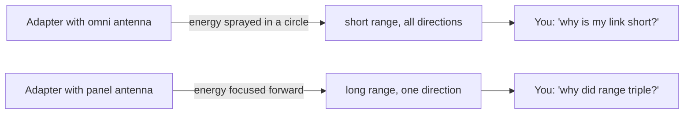
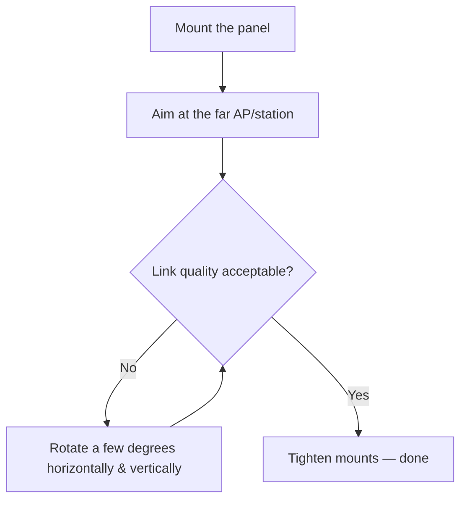

# ALFA APA-M04 — 2.4 GHz Panel Directional Antenna

> **一句話定位（One-liner）**: The **APA-M04** is a flat **7 dBi directional panel antenna for the 2.4 GHz band**, terminated in a **PR-SMA** connector. It focuses your radio's energy in one direction — think "laser pointer" instead of "light bulb" — for point-to-point links, repeater hops and long-range client connections.

## 規格總覽 (Spec overview)

| Item | Spec |
|---|---|
| Type | Directional panel antenna |
| Band | 2.4 GHz (802.11b/g/n) |
| Gain | 7 dBi |
| Connector | PR-SMA (female) |
| Polarization | Linear, vertical |
| Beamwidth | Narrow (directional — see the concept section) |
| Mounting | Wall / mast mount, panel form factor |
| Compatibility | All ALFA adapters with RP-SMA antennas (via PR-SMA/RP-SMA pairing) |

## Overview

Panel antennas are the workhorses of fixed outdoor Wi-Fi links. The APA-M04 is small, flat and weather-tolerant, and its **7 dBi gain is honest**: enough to meaningfully extend a 2.4 GHz link without turning the antenna into a dish you need a tripod for.

Where it shines:

- **Point-to-point links** between two buildings (with a matching panel on the other end).
- **Focusing a lab AP's coverage** down a corridor or across a courtyard.
- **2.4 GHz-only gear** — IoT nodes, older access points, 2.4 GHz-only adapters like a retro repeater setup.

Where it does not: do not expect it to fix a 5 GHz adapter's range — it is 2.4 GHz only, and for 5 GHz you want the [APA-M25](/alfa-network/products/apa-m25/) or the tri-band [APA-M25-6E](/alfa-network/products/apa-m25-6e/).

## How antennas work in 30 seconds



An **omni** antenna radiates evenly around its axis (a donut). A **panel** antenna squeezes that donut into a cone — same total energy, but concentrated. Higher dBi = narrower cone = longer range, at the cost of needing accurate aiming. The APA-M04's 7 dBi is the sweet spot for short fixed links where you still want some aiming forgiveness.

## Install & connect

### Step 1: Check your connector

The APA-M04 is **PR-SMA (female)**. The adapters' antennas are **RP-SMA (male)**. PR-SMA and RP-SMA are designed to pair — the inner pin polarity matches. If you own a generic WiFi antenna with a different connector (e.g. N-type), you need an adapter pigtail — do not force anything; mismatched connectors damage pins.

### Step 2: Screw it on

- Remove the adapter's stock antenna(s).
- Screw the APA-M04's connector finger-tight, then a **quarter turn** with light pressure — snug, never cranked. Overtightening strips the delicate center pin.

### Step 3: Point it



### Step 4: Verify

```bash
iw dev wlan0 link
```

**Expected output**: `signal: -55 dBm` (or better) — the aiming loop is: adjust → re-check `signal` → repeat until the value stops improving. Every 6 dB of signal is a doubling of range, so small angle changes matter.

## Advanced usage

- **Vertical vs horizontal polarization**: keep the panel's long axis and the far end's antenna in the same orientation. A 90° mismatch can cost 20+ dB — more than the antenna's gain.
- **Two panels, one link**: pair two APA-M04s (one per end) for the classic fixed 2.4 GHz point-to-point link.
- **Mounting height**: every meter of height clears more Fresnel-zone obstruction. Get the panel above roof lines, not just above the desk.

## Compatibility

| With | Result |
|---|---|
| All ALFA USB adapters (RP-SMA antenna ports) | ✅ Screws straight on |
| 2.4 GHz-only adapters / APs | ✅ Ideal |
| 5 GHz-only links | ❌ Wrong band — use the [APA-M25](/alfa-network/products/apa-m25/) |
| Adapters with integrated antennas (AXER, EACS) | ❌ No RP-SMA port to attach to |

## Troubleshooting

| Symptom | Diagnosis | Fix |
|---|---|---|
| Range worse than the stock antenna | Connector not fully seated, or panel pointing the wrong way | Re-seat the connector; re-aim using `iw dev wlan0 link` signal readings |
| Signal good, speed bad | 2.4 GHz congestion, not antenna | Move to a clear channel (`sudo iw dev wlan0 set channel 1/6/11`) |
| Nothing after swapping antennas | Adapter's RP-SMA pin broken by overtightening | Inspect the center pin; try the stock antenna as a control |
| Link fine at noon, dead at night | Fresnel zone / weather path | Raise the mount; accept atmospheric variance on long links |

## Related resources

- [APA-M25](/alfa-network/products/apa-m25/) — dual-band 2.4/5 GHz panel, same idea + 5 GHz
- [APA-M25-6E](/alfa-network/products/apa-m25-6e/) — tri-band panel including 6 GHz (Wi-Fi 6E)
- [Adapter comparison](/alfa-network/wifi-adapter-comparison/) — pick a radio to pair this antenna with
- [Ubuntu setup guide](/alfa-network/linux-setup-ubuntu/) — get the adapter talking first
