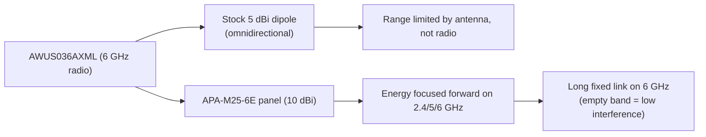

# ALFA APA-M25-6E — Tri-Band Panel Antenna (Wi-Fi 6E Ready)

> **Quick Summary**: The **APA-M25-6E** is a **10 dBi directional panel antenna** that covers **2.4, 5 and 6 GHz** — the Wi-Fi 6E version of the classic APA-M25. If your adapter has a 6 GHz radio (the [AWUS036AXML](/alfa-network/products/awus036axml/)), this is the antenna that lets it actually reach across a campus.

## Specifications Overview (Spec overview)

| Item | Spec |
|---|---|
| Type | Directional panel antenna |
| Bands | 2.4 GHz / 5 GHz / **6 GHz (Wi-Fi 6E)** |
| Gain | 10 dBi |
| Connector | PR-SMA (female) — pairs with the adapters' RP-SMA |
| Polarization | Linear, vertical |
| Design | Compact panel, wall/mast mount |
| Use case | Fixed point-to-point links, 6 GHz backhauls, long-range client links |

## Overview

The APA-M25 was the standard dual-band panel. The **6E** variant adds the **6 GHz band** — the same 10 dBi panel design, retuned so the top of the spectrum is not an afterthought. Why does that matter? The 6 GHz band (channels 1–233 above 5 GHz) is the least congested spectrum a Wi-Fi link can use today, but only if your *antenna* actually passes it. Old "dual-band" panels fall off hard above 5.8 GHz; the 6E version is built for it.

Where it shines:

- **Fixed 6 GHz backhaul links** between buildings (Wi-Fi 6E APs are arriving in every campus network).
- **Long-range client links** for the AWUS036AXML — its two stock 5 dBi dipoles become the bottleneck on a 500 m link; the panel removes it.
- **Future-proofing**: one panel that stays useful whether your project ends up on 2.4, 5 or 6 GHz.

## How a tri-band panel works



Gain works exactly as on the [APA-M04](/alfa-network/products/apa-m04/): a panel trades 360° coverage for a focused cone. 10 dBi is roughly a 3× linear range improvement over a 5 dBi dipole in the direction it faces — with the aiming discipline that comes with it.

## Install & connect

### Step 1: Connector check

The APA-M25-6E is **PR-SMA female**, matching the **RP-SMA male** antenna ports on ALFA adapters. Pair it with any ALFA adapter that has external antennas — the [AWUS036AXML](/alfa-network/products/awus036axml/) being the natural partner for 6 GHz work.

### Step 2: Mount and aim

1. Mount the panel high — above roof lines clears the Fresnel zone for long links.
2. Replace the adapter's stock antenna with the panel.
3. Use the adapter's own signal reading to aim (see below).

### Step 3: Verify on each band

Check what the link reports before and after aiming:

```bash
iw dev wlan0 link
iw dev wlan0 info | grep channel
```

**Expected output**:

```text
signal: -48 dBm
channel 37 (6115 MHz)
```

The `6115 MHz` line proves you are on the **6 GHz band** — the whole point of this antenna. Aim the panel until `signal` stops improving.

## Advanced usage

- **6 GHz link pairs**: for a full 6 GHz point-to-point link you need 6 GHz-capable gear on both ends (AP + client). The panel is the client-side piece.
- **Polarization discipline**: keep both ends' polarization vertical (or both horizontal). A 90° mismatch wastes more gain than the antenna provides.
- **Lab experiments**: use the panel with monitor mode to focus a capture field down one direction — great for wireless-communication coursework.

## Compatibility

| With | Result |
|---|---|
| AWUS036AXML (6 GHz radio, RP-SMA) | ✅ Perfect match — unlocks 6 GHz range |
| Any ALFA adapter with RP-SMA antenna ports | ✅ Works (2.4/5 GHz) |
| 6 GHz-only gear (Wi-Fi 6E APs) | ✅ Designed for it |
| Adapters with integrated antennas (AXER, EACS) | ❌ No connector to attach to |

## Troubleshooting

| Symptom | Diagnosis | Fix |
|---|---|---|
| No 6 GHz channels in `iwlist wlan0 freq` | Regulatory domain or driver/band mismatch — not the antenna | `sudo iw reg set <CC>`; verify the adapter is the AXML |
| Link signal good but slow | Panel aimed at wrong lobe / polarization mismatch | Re-aim; flip the panel 90° and compare signal |
| Signal worse than stock dipole | Panel pointing 180° off | Pan slowly through 360° while watching `signal` |
| Connector feels loose | PR-SMA/RP-SMA mismatch with third-party gear | Only pair PR-SMA with RP-SMA; use a proper pigtail otherwise |

## Related resources

- [APA-M25](/alfa-network/products/apa-m25/) — the dual-band (2.4/5 GHz) version of this panel
- [APA-M04](/alfa-network/products/apa-m04/) — 2.4 GHz-only 7 dBi panel
- [AWUS036AXML product page](/alfa-network/products/awus036axml/) — the adapter this antenna was made for
- [mt7921aun driver page](/alfa-network/drivers/mt7921aun/) — 6 GHz driver details
