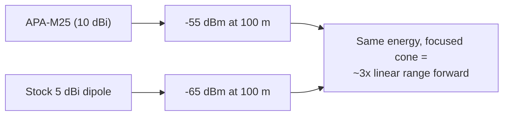

# ALFA APA-M25 — Dual-Band Panel Antenna (2.4/5 GHz)

> **一句話定位（One-liner）**: The **APA-M25** is ALFA's classic **10 dBi dual-band directional panel** for **2.4 and 5 GHz**, terminated in **RP-SMA**. It is the "point it at the AP and win" upgrade for any ALFA adapter with external antennas — the panel the campus repeater projects are built on.

## 規格總覽 (Spec overview)

| Item | Spec |
|---|---|
| Type | Directional panel antenna |
| Bands | 2.4 GHz + 5 GHz |
| Gain | 10 dBi |
| Connector | **RP-SMA (male)** — note the difference from the PR-SMA panels |
| Polarization | Linear, vertical |
| Design | Compact flat panel, wall/mast mount |
| Use case | Fixed point-to-point links, long-range client links, coverage focusing |

## Overview

The APA-M25 is the panel most people picture when they think "ALFA directional antenna": a flat, weather-tolerant rectangle that turns any external-antenna ALFA adapter into a long-range link tool. Its **10 dBi on both 2.4 and 5 GHz** is the practical ceiling for a panel you can aim by eye — beyond this, antennas get big, narrow and unforgiving.

Two things to note up front:

1. **RP-SMA (male) connector** — it plugs straight into the adapter's **RP-SMA (female)** antenna port without any adapter, because the pin polarity matches the socket on the adapter side. (The [APA-M25-6E](/alfa-network/products/apa-m25-6e/) and [APA-M04](/alfa-network/products/apa-m04/) use PR-SMA, which *also* pairs correctly with RP-SMA ports — both families are designed to mate with ALFA adapter ports.)
2. **No 6 GHz** — this is a 2.4/5 GHz panel. For Wi-Fi 6E, get the 6E variant.

Where it shines: student projects, building-to-building links, and lab coverage shaping — anywhere you need focused range without a mast.

## How to think about 10 dBi



Every ~6 dB of antenna gain doubles the effective range. 5 dB over the stock dipoles buys roughly a **1.7–1.8× range multiplier** in the direction the panel faces — the difference between "stuck in the lab" and "link across the courtyard."

## Install & connect

### Step 1: Screw it on

1. Unscrew the adapter's stock antennas.
2. Screw the APA-M25 into the adapter's RP-SMA port — finger-tight plus a gentle quarter turn.
3. Never crank it: the center pin in the adapter is delicate and the panel is heavier than a dipole, so **support the cable** with a strain-relief zip tie where possible.

### Step 2: Mount it high

Height is gain: get the panel above parapets, roof lines and people. Every meter of clearance removes Fresnel-zone obstruction that 10 dBi cannot compensate for.

### Step 3: Aim and verify

```bash
iw dev wlan0 link
```

**Expected output**: a `signal:` value in dBm. Sweep the panel a few degrees at a time, horizontally and vertically; keep the best reading. Repeat until the value plateaus.

## Advanced usage

- **Dual-panel links**: one APA-M25 at each end = a fixed point-to-point link that works in both directions with the same gain.
- **Channel choice on 2.4 GHz**: panels focus energy but not interference — on 2.4 GHz, first pick a clear channel (`1/6/11`), then aim.
- **Monitor-mode aiming**: use `airmon-ng start` + `tcpdump -i wlan0mon -c 50` as an aiming tool: the panel that hears the most beacons is pointed right.

## Compatibility

| With | Result |
|---|---|
| Any ALFA adapter with RP-SMA antenna ports (ACM, ACH, ACS, AX, AXM, AXML...) | ✅ Direct screw-on |
| 5 GHz links | ✅ Full 5 GHz support |
| 6 GHz (Wi-Fi 6E) links | ❌ Use the [APA-M25-6E](/alfa-network/products/apa-m25-6e/) |
| Integrated-antenna adapters (AXER, EACS) | ❌ No port to attach to |

## Troubleshooting

| Symptom | Diagnosis | Fix |
|---|---|---|
| Signal worse than stock antennas | Panel aimed wrong or connector loose | Re-seat; sweep-aim using `iw dev wlan0 link` |
| Good signal, intermittent link | Cable/connector strain from panel weight | Support the cable; check the connector is snug |
| Only 2.4 GHz networks visible | Adapter/reg-domain issue, not antenna | `sudo iw reg set <CC>`; test with the stock antenna to isolate |
| Panel "works" but no 5 GHz range | Link end (AP) may be low-power on 5 GHz | Check AP side; 5 GHz needs clear Fresnel too |

## Related resources

- [APA-M25-6E](/alfa-network/products/apa-m25-6e/) — the Wi-Fi 6E-ready version
- [APA-M04](/alfa-network/products/apa-m04/) — 2.4 GHz-only 7 dBi panel
- [ARS-25-57A](/alfa-network/products/ars-25-57a/) — the compact paddle alternative
- [Adapter comparison](/alfa-network/wifi-adapter-comparison/) — pair with the right radio
- [Troubleshooting index](/alfa-network/troubleshooting/)
