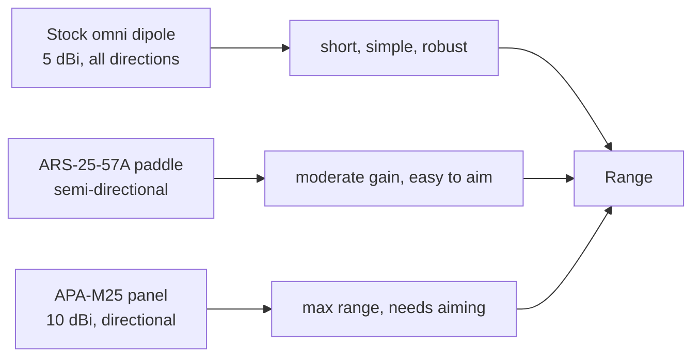

# ALFA ARS-25-57A — Dual-Band Paddle Antenna (5/7 dBi)

> **一句話定位（One-liner）**: The **ARS-25-57A** is a compact, semi-directional **paddle** antenna for **2.4 and 5 GHz** — **5 dBi on 2.4 GHz, 7 dBi on 5 GHz**. It is the travel-friendly middle ground between a stock dipole and a full panel: more gain than the stick antenna, less bulk than the wall panel.

## 規格總覽 (Spec overview)

| Item | Spec |
|---|---|
| Type | Directional paddle antenna |
| Bands | 2.4 GHz + 5 GHz |
| Gain | 2.4 GHz: 5 dBi ｜ 5 GHz: 7 dBi |
| Connector | RP-SMA (male) |
| Polarization | Linear |
| Design | Flat paddle, hinged, lightweight |
| Use case | Portable rigs, travel, labs that need a bit more range |

## Overview

A "paddle" sits between an omni dipole and a flat panel: it is a small flat blade with mild directionality and real gain — **5 dBi on 2.4 GHz and a useful 7 dBi on 5 GHz**. That band-dependent gain is sensible: 5 GHz needs the help more than 2.4 GHz, and 7 dBi on the 5 GHz band is where the ARS-25-57A earns its keep.

Where it shines:

- **Portable/pentest kits** — hinges flat, survives a backpack, screws onto any RP-SMA ALFA adapter.
- **Laptop lab stations** — more range than the stock dipole at the same weight.
- **Semi-directional aiming** — point it at the target AP for a bit of focus without the panel's full aiming discipline.

Where it does not: for a *fixed* building-to-building link, the [APA-M25](/alfa-network/products/apa-m25/) (10 dBi panel) beats it; for full travel minimalism, use the stock antennas.

## Concept: why a paddle, why 5/7 dBi



The paddle is the compromise node in that chain: it gives a real gain number (which the stock dipole's "5 dBi" omni figure arguably under-delivers in practice) while staying forgiving to aim. The 5/7 dBi split means the band that struggles most — 5 GHz — gets the larger share.

## Install & connect

### Step 1: Attach

Screw the ARS-25-57A's RP-SMA connector onto any ALFA adapter's RP-SMA antenna port. Finger-tight + a light eighth-to-quarter turn is enough.

### Step 2: Deploy

Flip the paddle open so its flat face points toward the AP/station you are linking. Tilt and rotate while watching the adapter's signal reading.

### Step 3: Verify

```bash
iw dev wlan0 link
```

**Expected output**: a `signal:` in dBm. Swing the paddle a few degrees at a time; keep the orientation that yields the least-negative number. Repeat on the 5 GHz band if your link uses it.

## Advanced usage

- **Monitor-mode aiming**: start `tcpdump -i wlan0mon` and re-orient the paddle until the highest beacon count arrives from your target direction.
- **Two-antenna adapters**: on the AWUS036ACM/ACH you can run one paddle + keep one on 5 GHz — but for multi-band links, both antennas should target the same band for coherent MIMO.
- **Portable field kit**: hinge the paddle flat for transit; the RP-SMA is replaceable if you ever snap the connector in the field.

## Compatibility

| With | Result |
|---|---|
| Any ALFA adapter with RP-SMA antenna ports | ✅ Screws straight on |
| 2.4 and 5 GHz links | ✅ Both bands, 5/7 dBi respectively |
| Travel / backpack rigs | ✅ Ideal size and weight |
| Fixed long links (>200 m) | ⚠️ Consider the [APA-M25](/alfa-network/products/apa-m25/) panel |

## Troubleshooting

| Symptom | Diagnosis | Fix |
|---|---|---|
| No gain over stock antenna | Paddle pointing away / not fully seated | Re-aim at the AP; reseat the connector |
| Works on 2.4 GHz, weak on 5 GHz | 5 GHz needs more aiming precision | Tilt precisely; 7 dBi 5 GHz lobe is narrow |
| Connector wobbles | Loose RP-SMA | Retighten gently; do not overtighten |
| Folds back on it own | Hinge friction worn | Minor — orientation with the adapter's own weight is normal |

## Related resources

- [APA-M25](/alfa-network/products/apa-m25/) — the full-size panel for fixed links
- [APA-M04](/alfa-network/products/apa-m04/) — 2.4 GHz-only panel
- [ARS-NT5B7](/alfa-network/products/ars-nt5b7/) — industrial WiFi 7 tri-band dipole
- [Adapter comparison](/alfa-network/wifi-adapter-comparison/)
- [Troubleshooting index](/alfa-network/troubleshooting/)
