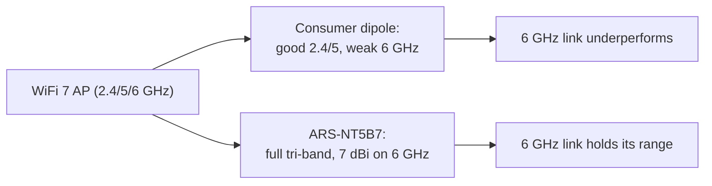

# ALFA ARS-NT5B7 — WiFi 7 Tri-Band Industrial Dipole Antenna

> **一句話定位（One-liner）**: The **ARS-NT5B7** is the **WiFi 7-ready tri-band dipole** covering **2.4, 5 and 6 GHz** with up to **7 dBi**, engineered for the **industrial -40 to +85 °C** range. It is the antenna you bolt onto an embedded gateway or robot when the stock plastic dipole is not going to survive the job.

## 規格總覽 (Spec overview)

| Item | Spec |
|---|---|
| Type | Dipole antenna (omnidirectional-ish) |
| Bands | 2.4 / 5 / **6 GHz (Wi-Fi 6E/7)** |
| Gain | Up to 7 dBi (best on 6 GHz) |
| Operating temperature | **-40 °C to +85 °C** (industrial) |
| Connector | Industry-standard (IPEX / RP-SMA / N depending on variant — check your SKU) |
| Design | Ruggedized dipole, weather-tolerant materials |
| Use case | Embedded gateways, industrial IoT, robots, outdoor radios, WiFi 7 |

## Overview

Most ALFA antennas are consumer-grade. The ARS-NT5B7 is the exception built for **harsh environments**: it is a tri-band dipole that reaches into the **6 GHz** band (so WiFi 6E and upcoming **WiFi 7** gear can use it), rated to keep working from **-40 °C** freezers to **+85 °C** enclosures. If your project involves a robot, an outdoor gateway, or anything that lives outside a climate-controlled lab, this is the antenna to spec.

The **7 dBi figure on 6 GHz** is the headline: the 6 GHz band neutralizes its range advantage if the antenna is weak, and this dipole is not weak up top.

Where it shines:

- **Embedded & industrial** — thermal tolerance that consumer dipoles lack.
- **WiFi 7 / 6E gateways** — tri-band coverage, not just 2.4/5.
- **Robotics** — a dipole tolerates the vibration and temperature swings a field robot throws at it.

Where it does not: it is still a dipole (omnidirectional-ish), not a directional panel. For a focused long link, keep a [panel](/alfa-network/products/apa-m25-6e/) in mind.

## Concept: tri-band and the WiFi 7 question



WiFi 7 (802.11be) runs on all three bands simultaneously via MLO (multi-link operation). A "WiFi 7" system is only as good as its weakest link — and if the antenna collapses on 6 GHz, the whole multi-link setup degrades. The ARS-NT5B7 is designed so the newest band is the *strongest* one.

## Install & connect

### Step 1: Match the connector

The ARS-NT5B7 ships in connector variants (commonly IPEX/U.FL for on-board modules, or RP-SMA for external radio ports). Match it to your radio before anything else — do not force a mismatched connector.

### Step 2: Mount with clearance

- Mount the dipole **upright and away from metal** — a dipole touching a metal wall becomes half its intended antenna.
- For IPEX variants, route the cable with gentle bends (IPEX is fragile at the solder joint; use strain relief).

### Step 3: Verify across bands

```bash
iw dev wlan0 link
iw dev wlan0 info | grep channel
```

**Expected output**: link up with a signal value; on 6E/7 gear the channel line shows a **6 GHz frequency** (e.g. `channel 37 (6115 MHz)`). Check the signal on each band your gateway uses — all three should hold reasonable numbers.

## Advanced usage

- **Industrial gateways**: pair with a 6 GHz-capable radio module and field-test at the enclosure's actual operating temperature.
- **Multi-link (MLO) setups on WiFi 7**: the tri-band dipole lets all three links coexist on one antenna — no per-band antenna farm needed.
- **Robot field links**: combine with a [Unitree](/alfa-network/hardware/unitree/) or [Jetson](/alfa-network/hardware/jetson/) integration and route the IPEX pigtail to the robot's radio.

## Compatibility

| With | Result |
|---|---|
| On-board WLAN modules (IPEX variant) | ✅ Direct fit |
| ALFA adapters with RP-SMA ports (RP-SMA variant) | ✅ Screws on |
| 6 GHz / WiFi 6E / WiFi 7 radios | ✅ Full tri-band |
| Hot/cold/factory environments | ✅ Rated -40 to +85 °C |
| Focused long-distance links | ⚠️ A [panel](/alfa-network/products/apa-m25-6e/) beats a dipole here |

## Troubleshooting

| Symptom | Diagnosis | Fix |
|---|---|---|
| Weak 6 GHz, fine on 2.4/5 | Wrong SKU (2.4/5-only variant) or obstruction | Confirm SKU is tri-band; reposition away from metal |
| IPEX connector disconnects | Fragile solder joint / no strain relief | Re-seat gently; add strain relief to the cable |
| Signal drops when mounted | Dipole touching chassis metal | Re-mount with clearance (see Step 2) |
| Works in lab, not in field | Thermal/EMI environment differs | Verify within the real enclosure; check the -40/85 °C rating applies to your use |

## Related resources

- [APA-M25-6E](/alfa-network/products/apa-m25-6e/) — tri-band directional panel
- [ARS-25-57A](/alfa-network/products/ars-25-57a/) — portable dual-band paddle
- [AWUS036AXML product page](/alfa-network/products/awus036axml/) — the 6 GHz USB adapter
- [Unitree guide](/alfa-network/hardware/unitree/) / [Jetson guide](/alfa-network/hardware/jetson/) — industrial/robotics hosts
