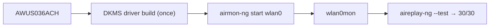

# ALFA AWUS036ACH — High Power AC1200

> **一句話定位（One-liner）**: The **AWUS036ACH** is ALFA's most famous adapter — a **high-power RTL8812AU AC1200 dual-band** USB 3.0 dongle with two 5 dBi external antennas. If you have ever seen a black ALFA in a Kali tutorial, it is probably this one. Monitor mode and packet injection are its party tricks; a DKMS driver build is the one-time entry fee.

## 規格總覽 (Spec overview)

| Item | Spec |
|---|---|
| Chipset | Realtek RTL8812AU |
| Wi-Fi class | AC1200 (300 + 867 Mbps) |
| Interface | USB 3.0 |
| Bands | 2.4 + 5 GHz |
| Antenna | 2 × external 5 dBi, RP-SMA |
| TX power | High power (500 mW class) |
| Linux driver | `rtl8812au-dkms` (community, not in-kernel) |
| Monitor mode | ✅ excellent |
| Packet injection | ✅ excellent |

## Overview

The AWUS036ACH is the adapter that built the "hacker adapter" reputation for ALFA. It pairs the workhorse **RTL8812AU** radio with a genuinely **high-power (500 mW) front-end** and two replaceable 5 dBi antennas, wrapped in the yellow/black ALFA shell you recognize instantly. The distinction that matters for coursework: unlike lower-cost clones, its driver has years of aircrack-ng community hardening behind it, so **monitor mode and packet injection just work** once the driver is in place.

Its only real "cost" is that the RTL8812AU is **not in the Linux kernel** — the one-time DKMS build is the difference between this and the plug-and-play [AWUS036ACM](/alfa-network/products/awus036acm/).

## Install & drivers

The full walkthrough is on the [RTL8812AU driver page](/alfa-network/drivers/rtl8812au/) — here is the 30-second version:

```bash
sudo apt install -y build-essential dkms git
cd /opt && sudo git clone https://github.com/aircrack-ng/rtl8812au.git
cd rtl8812au && sudo make dkms_install
sudo modprobe 8812au
```

**Expected output**: `DKMS: install completed.` then an `Interface wlan0` after `iw dev`.



## Advanced usage

### Monitor mode + injection

```bash
sudo airmon-ng check kill
sudo airmon-ng start wlan0
sudo aireplay-ng --test wlan0mon
```

**Expected output**: `Injection is working!` and `30/30: 100%`.

### Replace the antennas for more range

The RP-SMA ports accept any [ALFA antenna](/alfa-network/products/apa-m25/) — upgrading to a panel or a higher-gain dipole boosts what the 500 mW radio can reach.

## Compatibility

| Platform | Support | Notes |
|---|---|---|
| Kali Linux | ✅ | DKMS build; aircrack-ng repo tracks new kernels |
| Ubuntu | ✅ | DKMS; rock-solid on LTS |
| NetHunter / Android | 🔧 | Works on some kernels; not guaranteed |
| Windows | ✅ | Official driver; plug-and-play |
| macOS | ⚠️ | Driver needed; Apple Silicon limited |

## Troubleshooting

| Symptom | Cause | Fix |
|---|---|---|
| DKMS build fails | New kernel vs stale repo | `cd /opt/rtl8812au && sudo git pull && sudo make dkms_install` |
| Adapter only in managed mode | Kernel stub grabbed it | Blacklist `rtl8812au` (see [driver page](/alfa-network/drivers/rtl8812au/)) |
| Injection 0/30 | Empty channel | `sudo iw wlan0mon set channel 6`; test near an AP |
| Vanishes after reboot | Module not auto-loaded | Add `8812au` to `/etc/modules-load.d/alfa.conf` |

## Related resources

- [RTL8812AU driver page](/alfa-network/drivers/rtl8812au/) — full setup + deep troubleshooting
- [Kali setup guide](/alfa-network/linux-setup-kali/)
- [AWUS036ACM](/alfa-network/products/awus036acm/) — the in-kernel alternative (recommended for beginners)
- [Adapter comparison](/alfa-network/wifi-adapter-comparison/)
- [Compatibility matrix](/alfa-network/linux-compatibility-matrix/)
