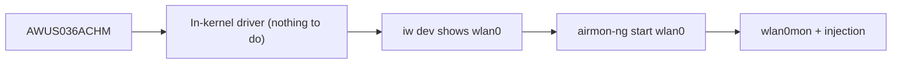

# ALFA AWUS036ACHM — Budget Dual-Band AC433

> **一句話定位（One-liner）**: The **AWUS036ACHM** is the budget dual-band ALFA — a **MT7610U AC433** adapter with two 5 dBi antennas and, crucially, an **in-kernel driver** (`mt76x0u` since Linux 4.19). It is the cheapest way into dual-band monitor mode on Linux, full stop.

## 規格總覽 (Spec overview)

| Item | Spec |
|---|---|
| Chipset | MediaTek MT7610U |
| Wi-Fi class | AC433 (150 + 433 Mbps) |
| Interface | USB 2.0 |
| Bands | 2.4 + 5 GHz |
| Antenna | 2 × external 5 dBi, RP-SMA |
| Linux driver | `mt76x0u` — **in-kernel since 4.19** |
| Monitor mode | ✅ good |
| Packet injection | ✅ good |

## Overview

The ACHM is the "little brother" of the [AWUS036ACM](/alfa-network/products/awus036acm/). It uses the **1×1 MT7610U** radio, so its AC433 speed ceiling is about half the ACM's AC1200 — but for the two things university students actually need it for, it competes hard:

1. **It is in the kernel.** No DKMS, no compilation, no "broke after an upgrade." Plug it in on Ubuntu or Kali and `wlan0` exists.
2. **Monitor mode + injection work** through the standard `mac80211` path, thanks to the MediaTek mainline driver.

If your coursework is "capture and analyze Wi-Fi management frames" or "demonstrate packet injection," the ACHM does it at the lowest price in the ALFA line. Buy the [ACM](/alfa-network/products/awus036acm/) instead only if you want double the 5 GHz throughput for heavy captures.

## Install & drivers

Because the driver is in the kernel, **there is nothing to install** — see the [MT7610U driver page](/alfa-network/drivers/mt7610u/). Verify with:

```bash
lsusb | grep -i mediatek
iw dev
```

**Expected output**:

```text
Bus 001 Device 005: ID 0e8d:7610 MediaTek Inc. MT7610U
phy#0
	Interface wlan0
		ifindex 3
		type managed
```



## Advanced usage

### Monitor mode (no install needed)

```bash
sudo airmon-ng start wlan0
sudo aireplay-ng --test wlan0mon
```

**Expected output**: `wlan0mon` created; injection `30/30: 100%`.

### Antenna upgrade

The RP-SMA ports accept [ALFA antennas](/alfa-network/products/apa-m25/) if you outgrow the stock dipoles — with the caveat that a 1×1 radio cannot use two antennas for MIMO, so run a single high-gain antenna for range.

## Compatibility

| Platform | Support | Notes |
|---|---|---|
| Kali Linux | ✅ | In-kernel `mt76x0u` |
| Ubuntu | ✅ | Plug & play on 20.04+ |
| NetHunter / Android | ✅ | In-kernel chipset |
| Windows | ✅ | Official driver |
| Raspberry Pi / Jetson | ✅ | In-kernel |

## Troubleshooting

| Symptom | Cause | Fix |
|---|---|---|
| Not in `lsusb` | Power / cable | Different port / powered hub — [troubleshooting](/alfa-network/troubleshooting/) |
| No interface | Driver not loaded (rare) | `sudo modprobe mt76x0u` |
| Throughput ~half of ACM | 1×1 hardware limit | Not a bug — AC433 class |
| Injection fails | Empty channel | `sudo iw wlan0mon set channel 6` |

## Related resources

- [MT7610U driver page](/alfa-network/drivers/mt7610u/)
- [Ubuntu setup guide](/alfa-network/linux-setup-ubuntu/) and [Kali setup guide](/alfa-network/linux-setup-kali/)
- [AWUS036ACM](/alfa-network/products/awus036acm/) — the faster sibling
- [Adapter comparison](/alfa-network/wifi-adapter-comparison/)
