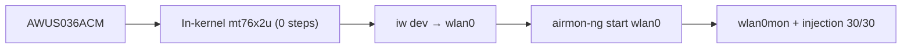

# ALFA AWUS036ACM — The Classic All-Rounder (MT7612U)

> **一句話定位（One-liner）**: The **AWUS036ACM** is the community's default recommendation: a **high-power MT7612U AC1200** dual-band adapter whose driver is **built into the Linux kernel**. No DKMS, no compilation — plug it in on Kali or Ubuntu and monitor mode just works. It is the boring-adapter answer to "which ALFA should I buy?", and boring means reliable.

## 規格總覽 (Spec overview)

| Item | Spec |
|---|---|
| Chipset | MediaTek MT7612U |
| Wi-Fi class | AC1200 (300 + 867 Mbps) |
| Interface | USB 3.0 |
| Bands | 2.4 + 5 GHz |
| Antenna | 2 × external 5 dBi, RP-SMA |
| TX power | High power (500 mW class) |
| Linux driver | `mt76x2u` — **in-kernel since 4.19** |
| Monitor mode | ✅ excellent |
| Packet injection | ✅ excellent |

## Overview

The AWUS036ACM takes everything the [AWUS036ACH](/alfa-network/products/awus036ach/) is famous for — 2×2 AC1200, high power, dual-band, two external antennas — and removes the one thing that annoyed students about it: the **DKMS driver build**. The ACM's MT7612U is a full citizen of the Linux kernel, so:

- Plug in → `wlan0` appears. Zero commands.
- No DKMS → nothing breaks when your kernel updates.
- Monitor mode + injection → work through the stock `mac80211` tooling.

That combination is why it is the answer to "I'm a student, I want one adapter for my security course, I don't want a fight with my OS" — and why this whole wiki uses it as the reference adapter in the [Ubuntu](/alfa-network/linux-setup-ubuntu/) and [Kali](/alfa-network/linux-setup-kali/) guides.

## Install & drivers

Nothing to install — see the [MT7612U driver page](/alfa-network/drivers/mt7612u/) for full details. Quick verify:

```bash
lsusb | grep -i mediatek
iw dev
```

**Expected output**:

```text
Bus 001 Device 004: ID 0e8d:7612 MediaTek Inc. MT7612U 802.11a/b/g/n/ac 2T2R Wireless Adapter
phy#0
	Interface wlan0
		ifindex 3
		addr 00:c0:ca:xx:xx:xx
		type managed
```

(The `00:c0:ca` prefix is ALFA's MAC OUI — a handy lab-identification trick.)



## Advanced usage

### Monitor mode + injection

```bash
sudo airmon-ng start wlan0
sudo aireplay-ng --test wlan0mon
```

**Expected output**: `Injection is working!` and `30/30: 100%`.

### Antenna upgrades

Two RP-SMA ports mean you can run a [panel](/alfa-network/products/apa-m25/) for focused long links, or twin high-gain dipoles for omni coverage — and the 2×2 radio will actually use both streams.

### Wireshark capture rig

Combine with the [Raspberry Pi guide](/alfa-network/hardware/raspberry-pi/) to build a headless always-on capture station.

## Compatibility

| Platform | Support | Notes |
|---|---|---|
| Kali Linux | ✅ | In-kernel, zero-setup |
| Ubuntu | ✅ | Plug & play on 20.04+ |
| NetHunter / Android | ✅ | The standard NetHunter adapter |
| Windows | ✅ | Official driver |
| Raspberry Pi / Jetson | ✅ | In-kernel, solid AP + monitor support |

## Troubleshooting

| Symptom | Cause | Fix |
|---|---|---|
| Not in `lsusb` | Power / cable | Different port / powered hub — [troubleshooting](/alfa-network/troubleshooting/) |
| No interface | Driver not loaded (rare) | `sudo modprobe mt76x2u`; check `dmesg \| grep mt76` |
| Injection 0/30 | Empty channel / dead RF zone | `sudo iw wlan0mon set channel 6`; test near an AP |
| WLAN dies on suspend/resume | Known laptop USB quirk | Unplug/replug after resume |

## Related resources

- [MT7612U driver page](/alfa-network/drivers/mt7612u/)
- [Kali setup guide](/alfa-network/linux-setup-kali/)
- [Ubuntu setup guide](/alfa-network/linux-setup-ubuntu/)
- [NetHunter setup guide](/alfa-network/linux-setup-nethunter/)
- [AWUS036AXM](/alfa-network/products/awus036axm/) — the Wi-Fi 6 + Bluetooth upgrade
- [Adapter comparison](/alfa-network/wifi-adapter-comparison/)
