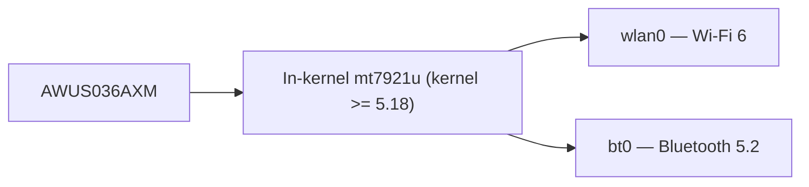

# ALFA AWUS036AXM — Wi-Fi 6 AX3000 + Bluetooth 5.2

> **Quick Summary**: The **AWUS036AXM** is ALFA's flagship Wi-Fi 6 dongle — an **MT7921AUN AX3000** dual-band adapter with **Bluetooth 5.2**, USB 3.2, two antennas and, crucially, an **in-kernel driver** (`mt7921u` since Linux 5.18). One stick replaces both your Wi-Fi and your Bluetooth.

## Specifications Overview (Spec overview)

| Item | Spec |
|---|---|
| Chipset | MediaTek MT7921AUN |
| Wi-Fi class | AX3000 (574 + 2402 Mbps) |
| Interface | USB 3.2 |
| Bands | 2.4 + 5 GHz |
| Antenna | 2 × external 5 dBi, RP-SMA |
| Bluetooth | **BT 5.2** (same dongle) |
| MIMO | 2×2 |
| Linux driver | `mt7921u` — **in-kernel since 5.18** |
| Monitor mode | ✅ good |

## Overview

The AXM is the modern successor to the beloved [AWUS036ACM](/alfa-network/products/awus036acm/) — MediaTek radio, in-kernel driver, no DKMS pain — but with a whole generation of upgrades: **AX3000** speeds (2.4 Gbps on 5 GHz), **Bluetooth 5.2** riding on the same USB device, and a newer radio that handles crowded environments better.

For Linux users the appeal is the same as the ACM: **it just works**. Driver in the kernel (need 5.18+, so Ubuntu 22.04+ or recent Kali), monitor mode available via the standard `mac80211` path, and the bonus that your WiFi and Bluetooth share one port.

The one caveat: because `mt7921u` needs a 5.18+ kernel, older OS installs will not see it at all — check the [compatibility matrix](/alfa-network/linux-compatibility-matrix/).

## Install & drivers

In-kernel since 5.18 — nothing to compile. See the [MT7921AUN driver page](/alfa-network/drivers/mt7921aun/) for full detail. Verify:

```bash
lsusb | grep -i mediatek
iw dev
bluetoothctl list
```

**Expected output**: the MT7921U line in `lsusb`, an interface in `iw dev`, and a Bluetooth controller in `bluetoothctl list` (BT may need `sudo modprobe btusb`).



## Advanced usage

### Max-speed connect + BT pairing

```bash
nmcli device wifi connect "MySSID" password "my-passphrase"
bluetoothctl
power on
scan on
pair <MAC>
```

**Expected output**: Wi-Fi activated; `Pairing successful` for your BT device.

### Monitor mode

```bash
sudo airmon-ng start wlan0
sudo aireplay-ng --test wlan0mon
```

**Expected output**: `wlan0mon` + injection `30/30: 100%`.

## Compatibility

| Platform | Support | Notes |
|---|---|---|
| Kali Linux | ✅ | In-kernel (5.18+) |
| Ubuntu | ✅ | 22.04+ (kernel 5.18+) |
| NetHunter / Android | ✅ | In-kernel, newer kernel required |
| Windows | ✅ | Official driver, WiFi + BT |
| Raspberry Pi / Jetson (JetPack 6) | ✅ | In-kernel |

## Troubleshooting

| Symptom | Cause | Fix |
|---|---|---|
| Not detected on Ubuntu 20.04 | Kernel < 5.18 | Upgrade OS / kernel |
| No `wlan0` but device seen | Firmware missing | `sudo apt install linux-firmware`; re-plug |
| Bluetooth absent | `btusb` not loaded | `sudo modprobe btusb` |
| Injection 0/30 | Empty channel | `sudo iw wlan0mon set channel 6` |

## Related resources

- [MT7921AUN driver page](/alfa-network/drivers/mt7921aun/)
- [AWUS036AXML](/alfa-network/products/awus036axml/) — the Wi-Fi 6E, USB-C sibling
- [AWUS036AX](/alfa-network/products/awus036ax/) — cheaper AX1800 alternative
- [Ubuntu setup guide](/alfa-network/linux-setup-ubuntu/) / [Kali setup guide](/alfa-network/linux-setup-kali/)
- [Adapter comparison](/alfa-network/wifi-adapter-comparison/)
