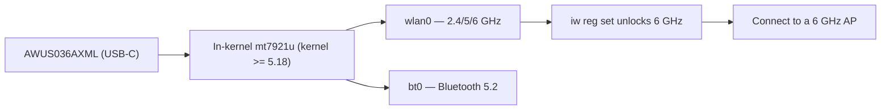

# ALFA AWUS036AXML — Wi-Fi 6E USB-C (6 GHz)

> **一句話定位（One-liner）**: The **AWUS036AXML** is the only **Wi-Fi 6E** adapter in the ALFA line — an **MT7921AUN AXE3000 tri-band** (2.4/5/**6 GHz**) adapter with **USB-C**, dual 5 dBi antennas and **Bluetooth 5.2**, all on an **in-kernel driver** (`mt7921u` since 5.18). This is how a student gets onto the empty 6 GHz band from a modern laptop.

## 規格總覽 (Spec overview)

| Item | Spec |
|---|---|
| Chipset | MediaTek MT7921AUN |
| Wi-Fi class | AXE3000 (574 + 1201 + **2402 Mbps**) |
| Bands | 2.4 + 5 + **6 GHz** |
| Interface | **USB-C** |
| Antenna | 2 × external 5 dBi, RP-SMA |
| Bluetooth | BT 5.2 |
| MIMO | 2×2 |
| Linux driver | `mt7921u` — **in-kernel since 5.18** |
| Monitor mode | ✅ good (incl. 6 GHz on modern kernels) |

## Overview

The AXE3000 **AXML** is ALFA's statement piece for the 6 GHz era. The **6 GHz band** (channels above 5 GHz) is currently the least congested spectrum available — no legacy devices, no overlapping lab APs — and this adapter is how you reach it on Linux. Two details make it special:

1. **It is in the kernel.** The `mt7921u` driver has been mainline since 5.18, so on Ubuntu 22.04+ or recent Kali you plug it into the **USB-C port** and you are on the 6 GHz band. No DKMS.
2. **USB-C + Bluetooth 5.2.** Modern ultrabooks have USB-C but often weak Wi-Fi; one AXML replaces both Wi-Fi and BT with a proper radio and real antennas.

The natural companions: a [Wi-Fi 6E access point](/alfa-network/products/apa-m25-6e/) on the far end, and the [6 GHz regulatory setup](/alfa-network/drivers/mt7921aun/) to unlock the channels in your region.

## Install & drivers

Nothing to compile — kernel 5.18+ required. See the [MT7921AUN driver page](/alfa-network/drivers/mt7921aun/) for the full 6 GHz setup. Verify:

```bash
lsusb | grep -i mediatek
iw dev
iwlist wlan0 freq | grep -E "6 GHz|Channel 1|Channel 233" | head
```

**Expected output**: the MT7921U line; an interface; and on the AXML, **6 GHz channel entries** in the frequency list. No 6 GHz entries? Set the regulatory domain:

```bash
sudo iw reg set TW    # your country code
sudo ip link set wlan0 down && sleep 1 && sudo ip link set wlan0 up
```



## Advanced usage

### Join a 6 GHz network

```bash
iw dev wlan0 info | grep channel   # confirm you are on 6 GHz
nmcli device wifi connect "My6eSSID" password "my-passphrase"
```

**Expected output**: connected with a channel line like `channel 37 (6115 MHz)` — proof you are on the 6 GHz band, where latency and congestion are dramatically lower than 2.4/5 GHz.

### Monitor mode (incl. 6 GHz)

```bash
sudo airmon-ng start wlan0
sudo aireplay-ng --test wlan0mon
```

**Expected output**: `wlan0mon` + injection `30/30: 100%`. On 6 GHz with a 6 GHz AP and a modern kernel, monitor capture works too — if you see nothing on 6 GHz, test on 5 GHz to isolate driver vs environment.

### Reach further with a tri-band panel

The AXML's stock dipoles are fine, but a [tri-band panel](/alfa-network/products/apa-m25-6e/) turns the empty 6 GHz band into a genuine long-range fixed link.

## Compatibility

| Platform | Support | Notes |
|---|---|---|
| Kali Linux | ✅ | In-kernel (5.18+) |
| Ubuntu | ✅ | 22.04+ |
| NetHunter / Android | ✅ | Needs 5.18+ kernel on the phone |
| Windows | ✅ | Official driver, Wi-Fi 6E + BT |
| Jetson (JetPack 6) | ✅ | 6 GHz streaming — see the [Jetson guide](/alfa-network/hardware/jetson/) |

## Troubleshooting

| Symptom | Cause | Fix |
|---|---|---|
| Not detected at all | Kernel < 5.18, or USB-C cable is charge-only | Upgrade kernel; use a data cable |
| 6 GHz channels missing | Regulatory domain unset | `sudo iw reg set <CC>`; bounce interface |
| Monitor works on 5 GHz, not 6 GHz | Early-kernel 6 GHz quirks / no 6 GHz AP | Update kernel; verify a 6 GHz AP is in range |
| Bluetooth absent | `btusb` not loaded | `sudo modprobe btusb` |

## Related resources

- [MT7921AUN driver page](/alfa-network/drivers/mt7921aun/)
- [AWUS036AXM](/alfa-network/products/awus036axm/) — the Wi-Fi 6 (no 6 GHz) sibling
- [APA-M25-6E](/alfa-network/products/apa-m25-6e/) — the tri-band panel for this adapter
- [Jetson guide](/alfa-network/hardware/jetson/) — 6 GHz streaming use case
- [Adapter comparison](/alfa-network/wifi-adapter-comparison/)
