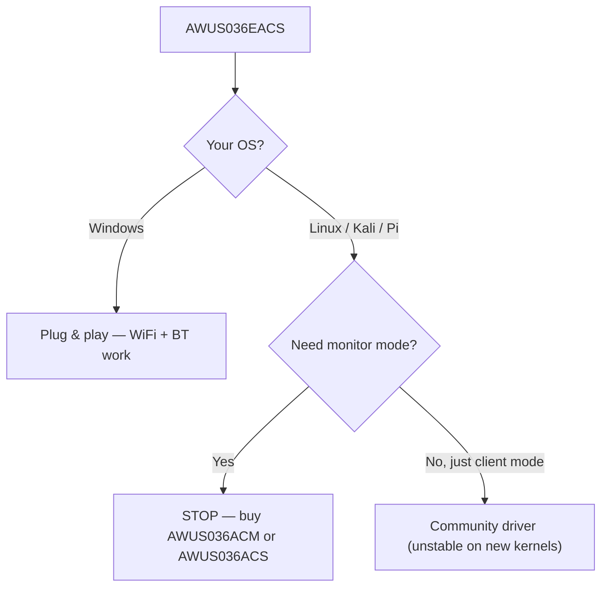

# ALFA AWUS036EACS — Nano WiFi + Bluetooth Combo

> **Quick Summary**: The **AWUS036EACS** is ALFA's **nano WiFi + Bluetooth combo** — an **RTL8821CU AC600** dual-band dongle with integrated **BT 4.2** that is **plug-and-play on Windows**. Honest warning up front: its Linux driver story is weak, and it is **not** a monitor-mode adapter. Buy it for a Windows desktop, not for Kali.

## Specifications Overview (Spec overview)

| Item | Spec |
|---|---|
| Chipset | Realtek RTL8821CU |
| Wi-Fi class | AC600 (150 + 433 Mbps) |
| Interface | USB 2.0 |
| Bands | WiFi: 2.4 + 5 GHz ｜ BT: 2.4 GHz |
| Bluetooth | BT 4.2 |
| Antenna | Integrated 2 dBi (no external RP-SMA) |
| Security | WEP / WPA / WPA2 |
| Linux driver | None reliable (see [RTL8821CU driver page](/alfa-network/drivers/rtl8821cu/)) |
| Monitor mode | ❌ unreliable |

## Overview

The EACS is the odd one out in the ALFA security lineup, and it is important to know that going in. It is designed for a **different buyer**: a Windows desktop or embedded industrial PC that needs **WiFi + Bluetooth in one tiny, unobtrusive stick**. AC600 speeds and 2 dBi integrated antenna make it a "good enough internet + BT keyboard/mouse" upgrade, not a signal-analysis instrument.

The sharp edge is **Linux**: the RTL8821CU has no mainline driver and the community driver is unstable on modern kernels — monitor mode and packet injection are not dependable. We keep this product for the Windows/combo use case and recommend the [AWUS036ACM](/alfa-network/products/awus036acm/) or [AWUS036ACS](/alfa-network/products/awus036acs/) to anyone whose coursework touches Kali.

## Install & drivers (Windows)

On Windows there is nothing to do — the driver is bundled:

1. Plug the adapter into a USB port.
2. Windows installs the RTL8821CU driver automatically. WiFi and Bluetooth both appear in Device Manager.

Verify:

```powershell
Get-PnpDevice -PresentOnly | Where-Object { $_.Class -eq "Net" }
```

**Expected output**: an `802.11ac NIC` network adapter and a Bluetooth radio listed.

## Linux? Read this first

If you are on Linux, the [RTL8821CU driver page](/alfa-network/drivers/rtl8821cu/) is the honest full story. Short version: a community driver exists (`brektrou/rtl8821CU`) and *may* build on older kernels, but expect instability and **no reliable monitor mode**. For Linux/Kali work, pick a different ALFA.



## Compatibility

| Platform | Support | Notes |
|---|---|---|
| Windows | ✅ | Plug & play, WiFi + BT |
| Kali Linux | ❌ | Monitor mode / injection unreliable |
| Ubuntu | ❌ | No stable driver |
| NetHunter / Android | ❌ | Not confirmed |
| Raspberry Pi | ❌ | Driver fails on ARM64 |
| macOS | ⚠️ | Limited; Apple Silicon unsupported |

## Troubleshooting

| Symptom | Cause | Fix |
|---|---|---|
| BT devices not found (Windows) | Driver / service conflict | Check Device Manager; reinstall driver from ALFA support |
| Doesn't work on Linux at all | No reliable driver | Stop here — use a [Linux-friendly ALFA](/alfa-network/wifi-adapter-comparison/) instead |
| Monitor mode "works" but injection fails | RTL8821CU driver limitation | Do not rely on it — switch adapters for capture work |
| Short range | Integrated 2 dBi antenna | By design; use it near the AP, not far from it |

## Related resources

- [RTL8821CU driver page](/alfa-network/drivers/rtl8821cu/) — the detailed Linux story
- [AWUS036ACM](/alfa-network/products/awus036acm/) — the recommended Linux/Kali alternative
- [AWUS036ACS](/alfa-network/products/awus036acs/) — pocket monitor-mode alternative
- [Adapter comparison](/alfa-network/wifi-adapter-comparison/)
- [Compatibility matrix](/alfa-network/linux-compatibility-matrix/)
