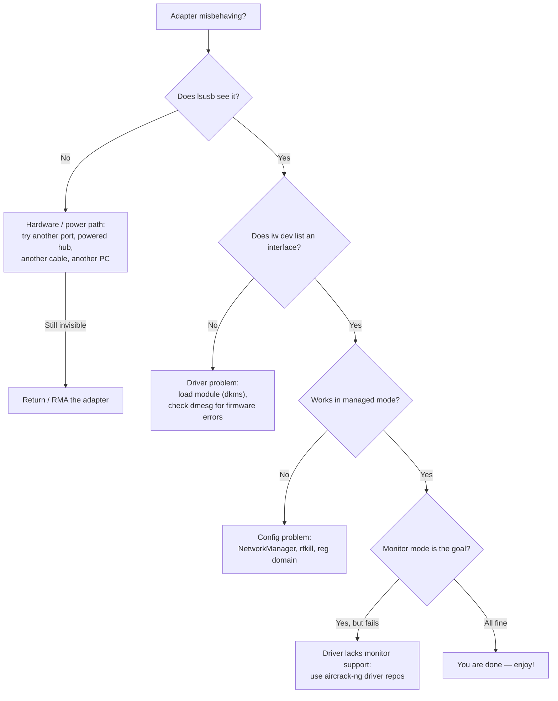

# ALFA Adapters — Troubleshooting Index

> **排查鐵律（Diagnosis iron rule）**: **Hardware first → driver second → configuration last.** More than 80 % of "my ALFA is broken" reports turn out to be a power issue, a missing DKMS rebuild, or a kernel-update side effect — not a dead adapter. Follow the tree below before you blame the hardware.




## Problem classification index

| Category | Typical issues |
|---|---|
| **Detection** | Adapter not in `lsusb`, no interface, disappears after reboot |
| **Driver** | DKMS build fails, module not loaded, firmware errors in `dmesg` |
| **Connection** | Won't associate, drops constantly, slow link |
| **Monitor mode** | `airmon-ng` fails, injection test fails, no frames captured |
| **Power** | Adapter dies under load, works on one PC but not another |
| **Regulatory** | Wrong channel set, TX power capped, "5 GHz channels missing" |

**Every chipset has its own deep-dive page** — bookmark yours:

| Chipset | Adapters | Driver page |
|---|---|---|
| MT7612U | AWUS036ACM | [mt7612u](/alfa-network/drivers/mt7612u/) |
| MT7610U | AWUS036ACHM | [mt7610u](/alfa-network/drivers/mt7610u/) |
| MT7921AUN | AWUS036AXM / AWUS036AXML | [mt7921aun](/alfa-network/drivers/mt7921aun/) |
| RTL8812AU | AWUS036ACH | [rtl8812au](/alfa-network/drivers/rtl8812au/) |
| RTL8811AU | AWUS036ACS | [rtl8811au](/alfa-network/drivers/rtl8811au/) |
| RTL8832BU | AWUS036AX / AWUS036AXER | [rtl8832bu](/alfa-network/drivers/rtl8832bu/) |
| RTL8821CU | AWUS036EACS | [rtl8821cu](/alfa-network/drivers/rtl8821cu/) |

---

## Issue 1: Adapter not detected at all (`lsusb` empty)

### Symptom
Plugged in, LED may or may not light, and `lsusb` shows no Realtek/MediaTek line.

### Diagnosis
```bash
lsusb
dmesg | tail -30
```
Look for `device descriptor read/64, error -71` or `device not accepting address` in `dmesg` — classic power-handshake failures.

### Root cause
Almost always **USB power or cable** — especially on the high-power models (AWUS036AXM/AXML, AWUS036AX) connected to a front-panel port or an unpowered hub.

### Fix
1. Try a **rear USB port** (or the USB-C port via an adapter).
2. Try a **different cable** — some cheap USB-C cables are charge-only.
3. Use a **powered USB hub**.
4. On a laptop, unplug other high-power USB devices.
5. If still invisible on *two different computers*, the adapter is faulty — contact support.

---

## Issue 2: `lsusb` sees it, but no `wlanX` interface

### Symptom
`lsusb` shows the adapter; `iw dev` / `ip link` show nothing.

### Diagnosis
```bash
dmesg | grep -iE "wlan|firmware|error"
lsmod | grep -iE "mt76|8812|8811|88x2|8821"
```

### Root cause
Two common causes:
- **Realtek chipsets**: the DKMS module was never loaded (or failed to build after a kernel update).
- **MediaTek Wi-Fi 6E**: the kernel is older than 5.18 (`mt7921u` missing) or firmware blobs are absent.

### Fix
- Realtek: `sudo modprobe 8812au` (match your chipset), and add it to `/etc/modules-load.d/alfa.conf` so it auto-loads on boot. If `modprobe` says `Module not found`, rebuild: `sudo dkms autoinstall`.
- MediaTek: `sudo apt install linux-firmware` and reboot. Kernel too old? Upgrade the OS — see the [compatibility matrix](/alfa-network/linux-compatibility-matrix/).

---

## Issue 3: DKMS build fails after a kernel update

### Symptom
"Adapter stopped working" right after `apt upgrade`; `dmesg` shows `8812au: version magic ... should be ...`.

### Diagnosis
```bash
dkms status
```
If your module shows `Error!` or a broken kernel-version entry, that is the problem.

### Root cause
The driver's DKMS recipe could not rebuild against the new kernel — usually missing headers, or the repo is too old for a brand-new kernel.

### Fix
1. Install headers: `sudo apt install linux-headers-$(uname -r)`
2. Force rebuild: `sudo dkms autoinstall`
3. Still failing? Update the driver repo and reinstall:
   ```bash
   cd /opt/rtl8812au && sudo git pull && sudo make dkms_install
   ```
4. Reboot and check `dkms status` again — it should list your module as `installed`.

---

## Issue 4: Monitor mode starts but injection test fails

### Symptom
`airmon-ng start` succeeds, `wlan0mon` exists, but `aireplay-ng --test` reports `0/30` or `Failed`.

### Diagnosis
```bash
sudo aireplay-ng --test wlan0mon
sudo iw dev wlan0mon info   # confirm it really is type monitor
```

### Root cause
Driver built without proper monitor/injection support, **or** you are on a channel no AP is using (injection needs an AP beacon to reply to), **or** the RF environment is empty (isolated lab).

### Fix
1. Lock a channel with active APs: `sudo iw dev wlan0mon set channel 6`
2. Retest. Still 0/30? Rebuild with the aircrack-ng driver repos, which ship monitor + VIF enabled by default:
   - [rtl8812au](/alfa-network/drivers/rtl8812au/), [rtl8811au](/alfa-network/drivers/rtl8811au/), [rtl88x2bu](/alfa-network/drivers/rtl8832bu/)
3. In a dead RF zone, create your own AP with a phone hotspot on the same channel.

---

## Issue 5: Wi-Fi drops or is slow

### Symptom
Link connects then drops every few minutes; throughput far below the class rating.

### Diagnosis
```bash
iw dev wlan0 link          # signal + tx rate
iw reg get | head -20      # regulatory domain
```

### Root cause
- **Regulatory domain**: if `iw reg get` shows `country 00` (unset), TX power is capped at the default 20 dBm limit.
- **Power saving**: aggressive USB power management throttles the radio.
- **Overheating**: sustained TX on high-power adapters.

### Fix
1. Set your region: `sudo iw reg set TW` (or your country code).
2. Set TX power: `sudo iwconfig wlan0 txpower 30` (max legal for your domain).
3. Disable power save: `sudo iwconfig wlan0 power off`.
4. Prefer a USB 3.0 port for AC1200+ adapters — USB 2.0 caps throughput.

---

## Issue 6: 5 GHz channels missing

### Symptom
Only 2.4 GHz networks visible; `iwlist wlan0 freq` shows no 5 GHz entries.

### Root cause
The regulatory domain is unset or restricted (often `country 00` on fresh installs), so the driver refuses 5 GHz channels.

### Fix
```bash
sudo iw reg set TW    # replace with your country code
sudo ip link set wlan0 down && sudo ip link set wlan0 up
```

---

## Still not solved?

Before you give up, collect this exact information and contact us (or the [driver project](/alfa-network/drivers/mt7612u/)) — it is what a maintainer needs to help you:

```bash
uname -r
lsusb
dkms status
dmesg | tail -50
iw dev
```

Attach all of the above plus: your adapter model, the OS/kernel, and the exact command whose output surprised you. One more thing worth checking — the [hardware integration guides](/alfa-network/hardware/jetson/) if you are running a Jetson, Raspberry Pi or Unitree robot; embedded boards have their own power and driver quirks.
