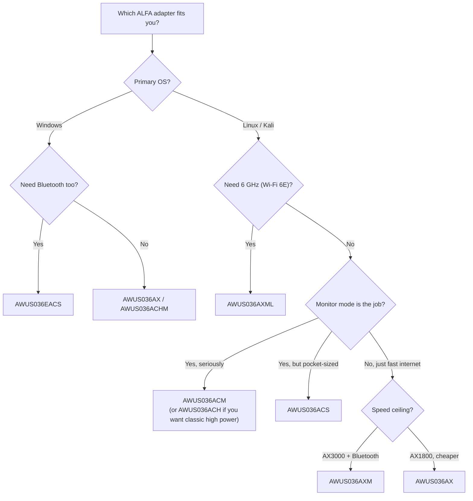

# ALFA Wi-Fi Adapter Comparison

> **Bottom Line Up Front**:  If you are a university student using Kali Linux for coursework or lab exercises, buy the **AWUS036ACM** — its MediaTek MT7612U chipset is built into the Linux kernel, monitor mode just works, and it costs less than the flagship models. If your project *requires* Wi-Fi 6E speeds, the **AWUS036AXML** is the only tri-band option. If you are a Windows user who mainly needs a compact WiFi + Bluetooth combo, the **AWUS036EACS** is your (only) adapter.

## The full spec comparison table

All nine adapters, one table. "Monitor mode" means flipping the interface into RFMON so you can capture every packet on a channel — the fundamental requirement for Wireshark, Aircrack-ng, Wifite and similar tools.

| Model | Chipset | Wi-Fi class | Interface | Bands | Max speed | Monitor mode (Linux) | Antenna |
|---|---|---|---|---|---|---|---|
| [AWUS036ACH](/alfa-network/products/awus036ach/) | RTL8812AU | AC1200 | USB 3.0 | 2.4 + 5 GHz | 300 + 867 Mbps | ✅ excellent (DKMS) | 2 × external 5 dBi, RP-SMA |
| [AWUS036ACHM](/alfa-network/products/awus036achm/) | MT7610U | AC433 | USB 2.0 | 2.4 + 5 GHz | 150 + 433 Mbps | ✅ good (in-kernel) | 2 × external 5 dBi, RP-SMA |
| [AWUS036ACM](/alfa-network/products/awus036acm/) | MT7612U | AC1200 | USB 3.0 | 2.4 + 5 GHz | 300 + 867 Mbps | ✅ excellent (in-kernel) | 2 × external 5 dBi, RP-SMA |
| [AWUS036ACS](/alfa-network/products/awus036acs/) | RTL8811AU | AC433 | USB 2.0 | 2.4 + 5 GHz | 150 + 433 Mbps | ✅ good (DKMS) | 2 × external 5 dBi, RP-SMA (55 mm body) |
| [AWUS036AX](/alfa-network/products/awus036ax/) | RTL8832BU | AX1800 | USB 3.2 | 2.4 + 5 GHz | 574 + 1201 Mbps | ✅ good (DKMS) | 2 × external 6 dBi, RP-SMA |
| [AWUS036AXER](/alfa-network/products/awus036axer/) | RTL8832BU | AX1800 | USB 3.2 | 2.4 + 5 GHz | 574 + 1201 Mbps | ✅ good (DKMS) | Internal (10.5 g nano body) |
| [AWUS036AXM](/alfa-network/products/awus036axm/) | MT7921AUN | AX3000 | USB 3.2 | 2.4 + 5 GHz | 574 + 2402 Mbps | ✅ good (in-kernel) | 2 × external 5 dBi, RP-SMA + BT 5.2 |
| [AWUS036AXML](/alfa-network/products/awus036axml/) | MT7921AUN | AXE3000 | USB-C | 2.4 + 5 + 6 GHz | 574 + 1201 + 2402 Mbps | ✅ good (in-kernel) | 2 × external 5 dBi, RP-SMA + BT 5.2 |
| [AWUS036EACS](/alfa-network/products/awus036eacs/) | RTL8821CU | AC600 | USB 2.0 | 2.4 + 5 GHz | 150 + 433 Mbps | ❌ unreliable | Integrated 2 dBi + BT 4.2 |

### Reading the speed numbers

The "+" splits the two bands: **2.4 GHz + 5 GHz** (or + 6 GHz for the AXE models). A "300 + 867" adapter is **AC1200** class: 300 Mbps is the 2.4 GHz ceiling (2 spatial streams × 150 Mbps), 867 Mbps is the 5 GHz ceiling (2 × 433 Mbps). Real-world throughput is typically 50–70 % of the link rate — physics, walls and USB bus overhead eat the rest.

## Which one for you?

### If you want Kali / monitor mode / packet injection → AWUS036ACM

The MT7612U chipset is **in-kernel since Linux 4.19**, which means: plug it in on any recent Kali or Ubuntu, and `ip link` already shows `wlan0`. Monitor mode works through the standard `iw` commands and packet injection is reliable. It also pushes a real 500 mW TX power with two 5 dBi antennas — genuinely useful range for lab exercises. The full workflow is on the [Kali setup guide](/alfa-network/linux-setup-kali/).

### If you want Wi-Fi 6E (6 GHz) → AWUS036AXML

The AXML is the only adapter in the lineup with the **6 GHz band** (AXE3000). It uses the MediaTek **MT7921AUN**, whose `mt7921u` driver has been mainline since kernel 5.18 — so again, no DKMS pain. It is also the only USB-C model, which makes it a perfect partner for a modern ultrabook or a tablet. See the [Wi-Fi 6E setup notes](/alfa-network/linux-setup-ubuntu/).

### If you want a pure client adapter (fast, stable, no pen-testing) → AWUS036AXM or AWUS036AX

The AXM is the fastest of the two (AX3000, 2.4 Gbps on 5 GHz) and adds **Bluetooth 5.2** — one dongle for WiFi + BT. The AX gives you Wi-Fi 6 + WPA3 with a more classic ALFA look and slightly lower price. Both do monitor mode if you ever need it, but neither is the top pick for dedicated sniffing.

### If you travel with a laptop / want a pocket adapter → AWUS036ACS or AWUS036AXER

The ACS (55 mm body) and the AXER (10.5 g, internal antenna) disappear in a backpack. The ACS is the budget monitor-mode companion; the AXER is the Wi-Fi 6 nano for everyday use.

### If you are a Windows user who needs WiFi + Bluetooth → AWUS036EACS

Honest note: the EACS is **not recommended for Linux**. Its RTL8821CU chipset has no maintained open-source driver, and monitor mode is unreliable. On Windows it is plug-and-play and does WiFi AC600 + BT 4.2 in one tiny stick — great for a desktop PC that needs both.

## If you cannot decide — buy the ACM

The AWUS036ACM is the community consensus pick: in-kernel driver, proven monitor mode + injection, dual-band, high power, and well within a student budget. You will find it referenced all over the [troubleshooting](/alfa-network/troubleshooting/) and [driver](/alfa-network/drivers/mt7612u/) pages as the "boring, reliable option" — and in this world, boring means *it just works*.

Next: check your OS in the [compatibility matrix](/alfa-network/linux-compatibility-matrix/), or dive straight into the [Ubuntu](/alfa-network/linux-setup-ubuntu/) / [Kali](/alfa-network/linux-setup-kali/) setup guides.
