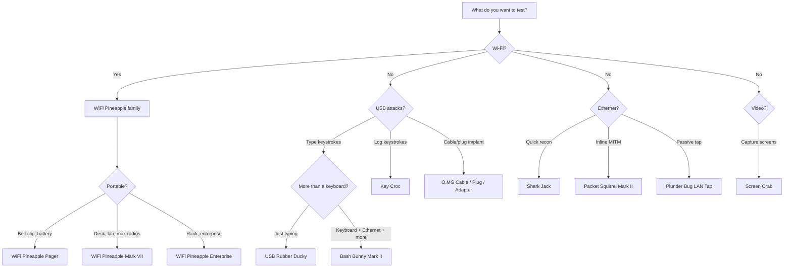

# Hak5 FAQ — Questions Every Beginner Asks

> **Bottom Line Up Front**: There is no single 'best' Hak5 tool—only the right tool for your specific objective. Clarify your testing target first (Wi-Fi, USB HID, or inline Ethernet) before choosing.

---

## 1. Legality & ethics

### Is Hak5 gear legal to own?
**Yes.** These are general-purpose computing devices — a Raspberry Pi with a Wi-Fi dongle can do most of what a WiFi Pineapple does. Owning them is legal virtually everywhere.

### Is it legal to *use*?
Only on **systems you own or have written permission to test**. Unauthorised access is a crime in every jurisdiction (unauthorized computer access carries severe criminal penalties in most jurisdictions). Hak5's own warranty language says the same: these tools are "for authorized auditing and security analysis purposes only."

### Can I use Hak5 gear for CTFs or university labs?
Yes — CTF platforms and university security courses routinely use them. When in doubt, **ask the lab organiser or professor** what you are authorised to test, and keep everything inside the provided sandbox.

---

## 2. Choosing a device

### USB Rubber Ducky vs Bash Bunny — what's the difference?
The [USB Rubber Ducky](/hak5/products/usb-rubber-ducky/) is a *specialist*: it types keystrokes, extremely fast and reliably. The [Bash Bunny](/hak5/products/bash-bunny-mark-ii/) is a *generalist*: it can type **and** pretend to be an Ethernet adapter, a serial port, and a flash drive — while running full Linux tools — all from one USB plug. Buy the Ducky to learn keystroke injection; buy the Bunny when you want multi-vector attacks and payload switching.

### WiFi Pineapple Mark VII vs Pager vs Enterprise?
| | Mark VII | Pager | Enterprise |
|---|---|---|---|
| Form factor | Portable AP (USB-C power) | Handheld, battery, 2.4" screen | 1U rack, AC power |
| Bands | 2.4 GHz native, 5 GHz via MK7AC | 2.4 / 5 / 6 GHz tri-band | 2.4 / 5 GHz, 5 radios |
| Payloads | Modules (PineAP Marketplace) | DuckyScript + Bash + Python | Modules, long-term deployments |
| Best for | Learning & classic PineAP | Field ops, automation, alerts | Serious multi-target airspace audits |

Full comparisons live on each product page: [Mark VII](/hak5/products/wifi-pineapple-mark-vii/), [Pager](/hak5/products/wifi-pineapple-pager/), [Enterprise](/hak5/products/wifi-pineapple-enterprise/).

### Shark Jack vs Shark Jack Cable?
Same brain, different power. The classic [Shark Jack](/hak5/products/shark-jack/) runs on a built-in battery for 10–15 minutes — perfect for keychain carry. The [Shark Jack Cable](/hak5/products/shark-jack-cable/) is powered by USB-C and adds a serial console, so it can run for hours and you get a live shell.

### What is Cloud C² and do I need it?
Cloud C² (https://cloudc2.io) is Hak5's free, self-hosted **command-and-control server**. It lets you manage devices — WiFi Pineapples, Key Crocs, Packet Squirrels, Screen Crabs — from a browser: stream keystrokes, watch screenshots, deploy payloads remotely. You don't need it for your first week; the web UI or SSH on each device is enough. It becomes essential when devices are physically unreachable.

---

## 3. DuckyScript — the payload language

### What is DuckyScript?
Hak5's scripting language for keystroke injection and device control. Versions you'll meet:

| Version | Used by | Notes |
|---|---|---|
| 1.0 (2011) | Classic USB Rubber Ducky | `STRING`, `DELAY`, `ENTER` — that's it |
| 2.0 (2020) | Key Croc | Interpreted: runs straight from `payload.txt`, uses `QUACK` instead of `STRING` |
| 3.0 (2022) | New USB Rubber Ducky, Bash Bunny, O.MG, Pager | Full language: if/else, loops, functions, `ATTACKMODE`, keystroke reflection |

### Where do I write payloads?
[PayloadStudio](https://payloadstudio.hak5.org) — a free browser IDE. It compiles DuckyScript to `inject.bin` (for the Rubber Ducky) and syntax-checks interpreted payloads for the Key Croc and O.MG. It is the **only officially supported encoder**; third-party "encoders" from old tutorials are unsupported and produce inconsistent results.

### Why doesn't my payload type into the target?
Usually one of: (1) missing `DELAY` at the start (the target OS hasn't loaded its USB stack yet), (2) the wrong keyboard layout was selected in PayloadStudio, or (3) the payload ran before the target application had focus. The [USB Rubber Ducky guide](/hak5/products/usb-rubber-ducky/) shows the fix for each.

---

## 4. Firmware & updates

### How often should I update firmware?
Whenever a release adds a feature you need. Unlike phones, there is no security-crucial auto-update — Hak5 firmware ships tested and stable. The [Firmware & Downloads](/hak5/firmware-downloads/) page shows the official update path per device. **Never flash third-party firmware**: on some devices (notably the USB Rubber Ducky) it renders the device permanently unrecoverable and voids the warranty.

### Do I need the O.MG Programmer for O.MG devices?
**Yes.** O.MG devices ship deactivated; the universal [O.MG Programmer](/hak5/products/omg-programmer/) performs activation, firmware upgrades, self-destruct recovery, and forensic backups. One Programmer covers every O.MG device (Cable, Plug, Adapter, UnBlocker).

---

## 5. Practical questions

### Can the WiFi Pineapple attack 5 GHz / WPA2 / WPA3 networks?
The [Mark VII](/hak5/products/wifi-pineapple-mark-vii/) is 2.4 GHz out of the box — add the **MK7AC adapter (MT7612U chipset)** for 5 GHz monitor and injection. The [Pager](/hak5/products/wifi-pineapple-pager/) includes 5 GHz and 6 GHz natively. The Pineapple creates **evil-twin / rogue APs** (including WPA2-Enterprise with the Enterprise model); it does not "crack" WPA2 keys — that's what `aircrack-ng` style offline attacks (which you can run on your laptop) are for.

### Can the Key Croc be detected?
Any determined defender can find hardware implants. The [Key Croc](/hak5/products/key-croc/) ships with the LED off during keylogging and clones the keyboard's hardware IDs to look like a normal adapter — but a physical audit (or the [Malicious Cable Detector](/hak5/products/malicious-cable-detector/)!) will spot it.

### Will the Malicious Cable Detector detect an O.MG Cable?
**Yes — that's its entire purpose.** It uses side-channel power analysis (200,000 samples per second) to detect implanted chips — including fully dormant O.MG devices — that are invisible on the data lines. Ironically, it's built by the same team that makes the O.MG cables.

### Which devices pair well with ALFA adapters?
The [WiFi Pineapple Mark VII](/hak5/products/wifi-pineapple-mark-vii/) officially supports MT7612U-based ALFA adapters (e.g. the AWUS036ACM) for 5 GHz monitoring — see the [ALFA Network section](/alfa-network/) for the full adapter lineup and driver guides.

---

## Still have questions?

Check the [Troubleshooting index](/hak5/troubleshooting-index/) for operational problems, or read the [Quickstart](/hak5/quickstart/) if you haven't powered your device on yet. The [Hak5 overview](/hak5/) links to every product page.
