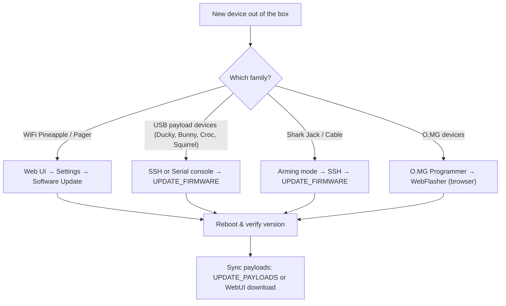

# Hak5 Firmware & Downloads — The Complete Index

> **學習目標**：讀完你將能自己找到並更新任何 Hak5 裝置的韌體、下載 PayloadStudio 編寫 Payload、並從官方 Payload 倉庫同步現成腳本。
> **適用對象**：初學者 ｜ **前置需求**：一台 Hak5 裝置（任一型號）

Before we give you a giant table of links, you should understand the two kinds of "software" a Hak5 device runs, because beginners mix them up all the time:

- **Firmware** — the operating system that makes the hardware work (Linux/OpenWrt underneath). You update it rarely, and only when a feature or fix you need ships.
- **Payloads** — the scripts that tell the device *what to do* (type these keys, run this scan, capture that traffic). You swap these constantly. They are not firmware.

**PayloadStudio** (payloadstudio.hak5.org) is the official browser-based IDE for writing and compiling payloads. It is the *only* officially supported DuckyScript encoder — old tutorials telling you to download a Java or JavaScript "encoder" are outdated. PayloadStudio runs entirely in your browser and supports Community (free) and Pro editions.



---

## Official firmware & tools table

| What you need | Where to get it | Notes |
|---|---|---|
| **All official documentation** | https://docs.hak5.org | Searchable; every product has its own docs tree |
| **PayloadStudio** | https://payloadstudio.hak5.org | Browser IDE for all DuckyScript devices — no install |
| **WiFi Pineapple (all models) firmware** | Web UI → *Settings → Software Update* | The Pineapple updates itself over the network; no manual download needed |
| **USB Rubber Ducky / Bash Bunny / Key Croc / Shark Jack / Packet Squirrel** | SSH or serial → `UPDATE_FIRMWARE` helper | See the SSH section below |
| **O.MG device firmware** | O.MG Programmer + WebFlasher | https://o.mg.lol/setup/ — Chrome or Edge (WebSerial) |
| **Screen Crab / Malicious Cable Detector** | config-driven, no firmware flashing | Screenshot/update via MicroSD config files |
| **Cloud C²** | https://cloudc2.io | Free self-hosted command & control for Pineapple, Croc, Squirrel, Screen Crab |

---

## Community payload repositories

Hak5 maintains official GitHub repos of community payloads. These are the fastest way to see real, working scripts before you write your own.

| Device | Payload repo | What's inside |
|---|---|---|
| USB Rubber Ducky | https://github.com/hak5/usbrubberducky-payloads | Classic + DuckyScript 3.0 payloads (extensions, templates) |
| Bash Bunny | https://github.com/hak5/bashbunny-payloads | switch1/2/3 payload folders |
| Key Croc | https://github.com/hak5/keycroc-payloads | Interpreted DuckyScript (no compilation) + language files |
| Shark Jack | https://github.com/hak5/shark-payloads | Recon, exfil, access payloads |
| Packet Squirrel | https://github.com/hak5/packetsquirrel-payloads | Sniff, proxy, DNS payloads |
| WiFi Pineapple | https://github.com/hak5/wifi-pineapple-modules | Modules for the PineAP marketplace |
| **PayloadHub** | https://payloads.hak5.org | Searchable, community-rated payload index across all devices |

> **Don't blindly trust payloads from the internet.** Any script you run on a Hak5 device executes with root privileges on a Linux box — or types keystrokes into a target. Read every payload you download. That is exactly what a professional does before deployment.

---

## Method A: Update firmware over SSH (USB payload devices)

Devices like the Bash Bunny, Shark Jack, and Key Croc ship with helper commands you run from a shell. Connect first (each device's product page shows the exact address — for example, the Shark Jack listens at `172.16.24.1` in arming mode):

```bash
# Example — Shark Jack in arming mode, connected via Ethernet
ip addr add 172.16.24.2/24 dev eth0    # your machine joins the Shark's network
ssh root@172.16.24.1                    # password: hak5shark
```

Expected output:

```text
The authenticity of host '172.16.24.1' can't be established.
...
root@172.16.24.1's password:
Welcome to Shark Jack (kernel 4.x.y)
```

Then, from the device shell, run the update helpers:

```bash
UPDATE_FIRMWARE     # check for and install firmware updates
UPDATE_PAYLOADS     # synchronise the local payload library with the remote repo
```

Expected output (firmware check):

```text
[*] Checking for firmware updates...
[+] Firmware is up to date
```

> **Why helpers and not `apt upgrade`?** Hak5 deliberately locks the update path to tested releases. A broken firmware flash on some devices (the USB Rubber Ducky in particular) can make the device **irrecoverable** — Hak5's warranty explicitly excludes firmware-flash damage. Only use the official update mechanisms.

## Method B: Update a WiFi Pineapple from the web UI

1. Connect to the Pineapple's AP (e.g. `PineAP` network) and open the management UI — the [WiFi Pineapple Mark VII guide](/hak5/products/wifi-pineapple-mark-vii/) shows the exact address.
2. Go to **Settings → Software Update**.
3. Click **Check for updates**, then **Update**.
4. The device reboots; verify the version in the footer of the UI.

## Method C: O.MG devices (WebFlasher)

1. Insert the O.MG device into a computer running **Chrome or Edge** (WebSerial required).
2. Open the O.MG setup page (https://o.mg.lol/setup/) and select your device model.
3. Follow the 3-step WebFlasher wizard — it activates the device, installs the latest firmware, and (optionally) performs a forensic backup first.
4. Alternatively, the Python flasher from the O.MG firmware repo works on any OS.

---

## Common errors

| Error message / symptom | Cause | Fix |
|---|---|---|
| `ssh: Connection refused` | Device not in arming mode | Flip the switch / press the arming button; verify your static IP is on the device's subnet |
| `UPDATE_FIRMWARE: command not found` | Shell helper only exists on firmware ≥ 1.2.0 | Update manually from the WebUI, or check the docs for your exact model |
| Pineapple "Check for updates" fails | No upstream connection (the AP has no Internet) | Connect an Ethernet uplink or configure the client mode first |
| WebFlasher says "No device found" | Browser lacks WebSerial / device not in bootloader mode | Use Chrome or Edge, and keep the O.MG device unplugged until the wizard asks for it |
| Payload runs but does nothing | You copied a compiled `.bin` to a device that expects source, or vice versa | Rubber Ducky needs compiled `inject.bin`; Key Croc runs interpreted `payload.txt` directly |

---

## After updating: verify

```bash
# From the device shell — check the running version
cat /etc/version          # Shark Jack / Packet Squirrel
uname -a                  # any Linux-based Hak5 device
ls /root/payload/library  # payload library after UPDATE_PAYLOADS
```

Expected output:

```text
4.0.0
Linux sharkjack 4.19.0 ... # your exact kernel/version
payload1  payload2  payload3
```

Still stuck? See the [Troubleshooting index](/hak5/troubleshooting-index/) or jump back to the [Hak5 overview](/hak5/).
