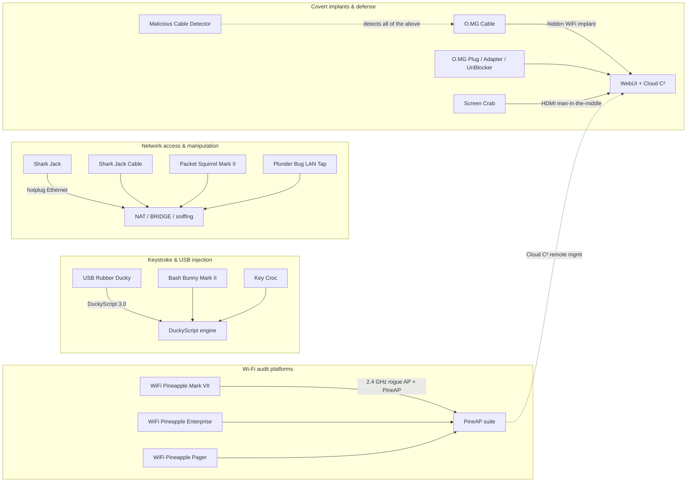

# Hak5 — Offensive Security Hardware, Explained

> **Quick Summary**: Hak5 is the world's most renowned offensive security hardware brand—from the keystroke-injecting USB Rubber Ducky to the rogue-AP WiFi Pineapple. This section provides an university-level curriculum walking you through every hardware tool, initial setup, payload authoring, and troubleshooting.

Hak5 started in 2005 as a podcast about hacking and technology, and grew into the company that practically *defined* the "plug-and-pwn" category of security hardware. Their philosophy is simple: **computers trust USB and Ethernet devices implicitly — so those trust boundaries are exactly where you test them.** If you are studying cybersecurity, doing CTFs, or preparing for a red-team career, these are the tools you will see in every lab, every conference talk, and every job posting.

This section of the wiki is your complete study guide: every product we carry, with official specifications, beginner-friendly quickstarts, DuckyScript examples, and a troubleshooting index — all written so that a first-year student can follow along, and detailed enough that a working pentester will still find something new.

> **⚠️ Legal note — read this once.** Everything in this section is for **authorized security testing only**: your own lab, your own devices, or a network you have written permission to test. Laws about unauthorized access exist in every country (governed by computer misuse and data protection laws). Hacking without permission is a crime — with these tools it is also trivially detectable by the defensive tools we cover on this very page. Play in your sandbox.

---

## How this wiki is organised

| Page | What you'll find |
|---|---|
| [Quickstart](/hak5/quickstart/) | First 15 minutes with any Hak5 device — arming modes, first payload, first scan |
| [Firmware & Downloads](/hak5/firmware-downloads/) | Official firmware, PayloadStudio, and every payload repository in one table |
| [FAQ](/hak5/faq/) | "Which device do I need?" and the questions every beginner asks |
| [Troubleshooting](/hak5/troubleshooting-index/) | LED colour meanings, SSH connection failures, payloads that won't run |
| **Products** (below) | Deep dives on all 17 devices |

---

## The Hak5 ecosystem at a glance

Hak5 devices all share three design ideas. Once you learn one, you learn them all:

1. **Payloads over configs** — you don't "program" the hardware; you drop a script file onto it.
2. **Arming mode** — a switch, button, or keystroke turns the device into a normal flash drive / web UI so you can load payloads safely.
3. **Loot folders** — captured data (keystrokes, scans, screenshots) lands in a `loot` directory you can grab later.

---

## The product catalogue

### Wi-Fi audit platforms (rogue access points)

| Device | One-liner | Difficulty | Page |
|---|---|---|---|
| **WiFi Pineapple Mark VII** | The classic dual-band rogue AP with the PineAP suite — the tool that made "evil twin" a household word | Beginner | [Full guide](/hak5/products/wifi-pineapple-mark-vii/) |
| **WiFi Pineapple Enterprise** | A 1U rack monster with 5 dual-band radios for heavy-duty, multi-target airspace audits | Advanced | [Full guide](/hak5/products/wifi-pineapple-enterprise/) |
| **WiFi Pineapple Pager** | The 20th-anniversary flagship: tri-band (2.4/5/6 GHz), a 2.4" screen, and DuckyScript payloads — fully standalone, no laptop needed | Intermediate | [Full guide](/hak5/products/wifi-pineapple-pager/) |

### Keystroke injection & keyloggers

| Device | One-liner | Difficulty | Page |
|---|---|---|---|
| **USB Rubber Ducky** | The king of keystroke injection: a USB stick that types at 1,000 WPM | Beginner | [Full guide](/hak5/products/usb-rubber-ducky/) |
| **Bash Bunny Mark II** | A multi-vector USB attack platform: keyboard + Ethernet + serial + storage, all at once, with a quad-core brain | Intermediate | [Full guide](/hak5/products/bash-bunny-mark-ii/) |
| **Key Croc** | A hardware keylogger disguised as a keyboard adapter that *also* attacks when you type keywords | Intermediate | [Full guide](/hak5/products/key-croc/) |

### Network access & manipulation

| Device | One-liner | Difficulty | Page |
|---|---|---|---|
| **Shark Jack** | A pocket-sized network recon box: plug into any Ethernet jack, get a scan in seconds | Beginner | [Full guide](/hak5/products/shark-jack/) |
| **Shark Jack Cable** | The same box, powered by USB-C with a serial console — runs as long as power flows | Beginner | [Full guide](/hak5/products/shark-jack-cable/) |
| **Packet Squirrel Mark II** | An inline Ethernet man-in-the-middle: sniff, proxy, redirect DNS, or jail devices — at the flip of a switch | Intermediate | [Full guide](/hak5/products/packet-squirrel-mark-ii/) |
| **Plunder Bug LAN Tap** | A passive/active Ethernet tap with USB-C — Wireshark in your pocket | Beginner | [Full guide](/hak5/products/plunder-bug-lan-tap/) |

### Covert implants (O.MG family)

| Device | One-liner | Difficulty | Page |
|---|---|---|---|
| **O.MG Cable** | A malicious USB cable with a hidden WiFi implant — the $20,000 nation-state attack, now on your desk | Advanced | [Full guide](/hak5/products/omg-cable/) |
| **O.MG Plug** | The same implant in a keychain USB plug | Advanced | [Full guide](/hak5/products/omg-plug/) |
| **O.MG Adapter** | The implant in a USB-A-to-C adapter — plug it into phones and tablets too | Advanced | [Full guide](/hak5/products/omg-adapter/) |
| **O.MG UnBlocker** | The implant hidden inside a "safe" USB data blocker — the defender's tool, weaponised | Advanced | [Full guide](/hak5/products/omg-unblocker/) |
| **O.MG Programmer** | The universal programmer that activates and updates every O.MG device | Intermediate | [Full guide](/hak5/products/omg-programmer/) |

### Video & defense

| Device | One-liner | Difficulty | Page |
|---|---|---|---|
| **Screen Crab** | A covert HDMI man-in-the-middle that silently screenshots or records any display | Intermediate | [Full guide](/hak5/products/screen-crab/) |
| **Malicious Cable Detector** | The only consumer tool that detects all known malicious USB cables — including O.MG's own | Beginner | [Full guide](/hak5/products/malicious-cable-detector/) |

---

## Where should you start?

New to all of this? Here is a suggested learning path:

1. **Read the [Quickstart](/hak5/quickstart/)** — it explains arming mode, payloads, and loot, the three concepts everything else builds on.
2. **Start with a USB Rubber Ducky** — it is the cheapest, safest, and most instructive way to see a payload execute. You only need your own computer and Notepad.
3. **Set up a lab** — a spare router, an old laptop, or a virtual machine you own. The [ALFA Network section](/alfa-network/) explains how to pair a USB Wi-Fi adapter with Kali Linux for monitor mode, which the WiFi Pineapple also loves.
4. **Level up to a WiFi Pineapple Mark VII** — evil-twin attacks are the single most "wow" demo in wireless security, and the [Pineapple guide](/hak5/products/wifi-pineapple-mark-vii/) walks through it step by step.
5. **When something breaks** — hit the [Troubleshooting index](/hak5/troubleshooting-index/) first; 80% of beginner problems are the same four causes.

> **You might be asking:** *"Do I need to buy all of this to learn?"* No. The concepts — HID injection, rogue APs, network taps — transfer directly to free tools you already have: a $2 Arduino can type keystrokes, `hostapd` can fake an AP, `tcpdump` can sniff. Hak5 hardware just packages them into something reliable enough for professional engagements. Start with one device and your own lab.
