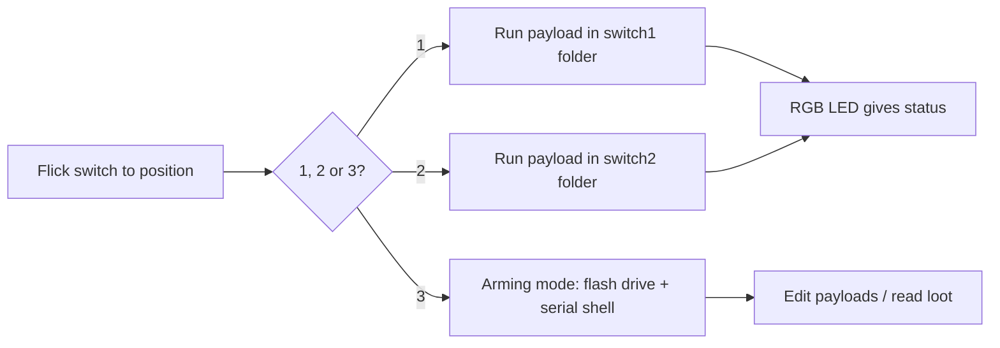

# Bash Bunny Mark II — The Complete Guide

> **一句話定位**：Bash Bunny Mark II 是 USB Rubber Ducky 的「全家桶」——同一支 USB 插進去，它同時可以是鍵盤、網路卡、序列埠和隨身碟，還能跑完整 Linux 工具。一顆四核 ARM 心臟配上 8GB 桌面級 SSD，插上後 7 秒完成滲透。

If the USB Rubber Ducky is a specialist, the Bash Bunny is a **swiss-army knife that plugs into USB**. It emulates *multiple* trusted device types at the same time — which matters, because a machine that would never let a rogue "keyboard" near your network will happily hand a DHCP lease to a "USB Ethernet adapter" and a root shell over a "serial console."

The Mark II upgrades the original with a quad-core CPU, desktop-class SSD, doubled RAM, and Bluetooth LE for remote triggering and geofencing. It's the workhorse of physical social-engineering engagements.

> **⚠️ Authorised testing only.** Multi-vector attacks on machines you don't own are illegal. Work in your own lab or with written permission.

---

## Specs at a glance

| Item | Specification |
|---|---|
| CPU | Quad-core ARM Cortex-A7 @ up to 1.3 GHz |
| Storage | 8 GB NAND SSD (desktop-class, fast) |
| Expansion | MicroSD XC (up to 2 TB for big exfiltration) |
| Wireless | Bluetooth LE (remote triggers, geofencing) |
| Attack interfaces | HID keyboard + USB Ethernet + serial + USB storage (simultaneously) |
| OS | Debian Linux with root shell (nmap, responder, impacket, metasploit pre-loaded) |
| Switch | 3-position mode selector |
| Indicator | 1× RGB LED |
| Console | Dedicated serial console (root terminal) + Cloud C² |
| Official docs | https://docs.hak5.org/bash-bunny |

## The 3-position switch

Position 3 (closest to the USB plug) is **arming mode** — the Bunny shows as a flash drive + serial console so you can load payloads. Positions 1 and 2 automatically run the payload stored in their folder.

```
USB plug ── switch positions ──>
   position 1: auto-run /payloads/switch1/
   position 2: auto-run /payloads/switch2/
   position 3: ARMING MODE (flash drive + serial)
```



---

## Quickstart — first payload

### Step 1 — Arm the Bunny
Flick the switch to **position 3**, plug it into your computer. Two things appear: a **flash drive** (the payload area) and a **serial console**.

### Step 2 — Drop a payload
Navigating the drive, put your script in:

```
/payloads/switch1/payload.txt
```

The simplest "prove it works" payload for a Windows target:

```bash
LED R                # red = running
ATTACKMODE HID STORAGE
DELAY 2000
GUI r
DELAY 500
STRING cmd
ENTER
DELAY 800
STRING echo pwned by Bash Bunny
ENTER
LED G                # green = done
```

> Bash Bunny payloads are **Bash** scripts (that's the "Bash" in the name) using Hak5's `ATTACKMODE`, `LED`, and helper commands. You can mix pure Bash (running `nmap`, copying files) with DuckyScript-style HID injection.

### Step 3 — Deploy
1. Eject, flick to **position 1**, unplug.
2. Plug into the target (your lab machine). Watch the LED turn red, then green.
3. `cmd` opens and prints `pwned by Bash Bunny`.

### Step 4 — Serial console (arming mode)
Flick to position 3, connect the serial console, and get a root shell to manage files and payloads:

```text
Username: root
Password: hak5bunny
# ls /root/loot/
```

---

## Multi-vector attacks — why it's powerful

A single Bash Bunny can do in one cable what used to take several:

| Attack vector | How the Bunny does it |
|---|---|
| Keystroke injection | HID mode types into the target |
| Network access | **USB Ethernet** mode — the target hands you an IP; you're now `on` the network |
| Data exfiltration | Switch to **storage** and copy files off; or push out over the USB-Ethernet link |
| Serial | Emulate a serial device to reach embedded/console boxes |
| Live tools | Full Debian: `nmap`, `responder`, `impacket`, `metasploit` right on device |
| Bluetooth triggers | Remote-trigger or geofence a payload via BLE |

**Example — grab a file and exfiltrate it:**

```bash
LED R
ATTACKMODE HID STORAGE
DELAY 2000
GUI r
DELAY 500
STRING powershell -c "copy C:\Users\Public\secret.txt X:\"
ENTER
DELAY 3000
LED G
```

This types a shell command to copy a file onto the Bunny's own storage drive, then turns green when done. (Practice on your own machine with your own file!)

---

## Advanced

| Capability | How |
|---|---|
| Payload switching | 2 auto-run switch positions + arming = run different payloads without editing |
| Remote/geofence | BLE: trigger a payload when you're physically close, or self-destruct if it leaves an area |
| Root Linux shell | Full Debian with pentest tools; drop into `nmap`/`metasploit` directly |
| Cloud C² management | Remote payload/device management via Hak5 Cloud C² |
| Mass exfiltration | 2 TB MicroSD for copying gigabytes of loot |
| `GET_SWITCH_POSITION` | Payloads can read which switch position they're in and branch |

---

## Troubleshooting

| Symptom | Cause | Fix |
|---|---|---|
| No flash drive in position 3 | Switch not fully in arming position | Push switch to position 3 fully; unplug & replug |
| LED flashes red | Payload error | Attach serial console, run the payload, read the error |
| Keystrokes wrong / nothing types | Layout or missing DELAY | Add `LED` + `DELAY`, and target the correct keyboard layout |
| Only HID works, no Ethernet | ATTACKMODE not set to include ETHERNET | Use `ATTACKMODE HID ETHERNET` in the payload |
| Can't reach serial | Wrong driver/baud | Use the Hak5 USB cable and documented serial settings (see product docs) |

---

## Related resources

- [USB Rubber Ducky](/hak5/products/usb-rubber-ducky/) — pure keystroke injection, DuckyScript basics
- [Key Croc](/hak5/products/key-croc/) — keylogging + interpreted DuckyScript
- [Packet Squirrel Mark II](/hak5/products/packet-squirrel-mark-ii/) — Ethernet-side manipulation
- [Firmware & Downloads](/hak5/firmware-downloads/) — Bash Bunny payload repo & firmware
- [Troubleshooting Index](/hak5/troubleshooting-index/)
- [Hak5 overview](/hak5/)
