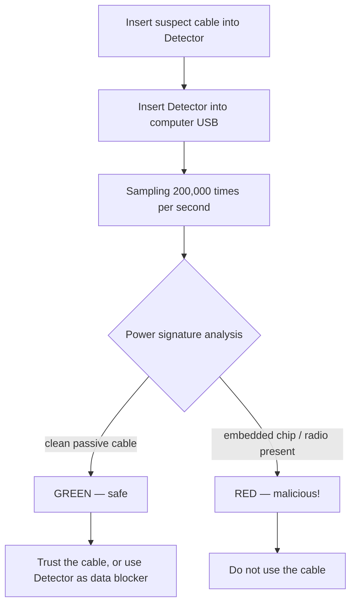

# Malicious Cable Detector — The Complete Guide

> **一句話定位**：Malicious Cable Detector 是目前市面上唯一能偵測「所有已知惡意 USB 線材」的防禦型小工具——包括 O.MG Cable 家族——它用每秒 20 萬次的側信道電力分析找出藏在線材裡的植入晶片。同時它也是一顆資料阻斷器，能安全充電。

This is the rare *defensive* tool in the Hak5 catalogue — and it's built by the same team that makes the O.MG malicious cables. That's the point: the people who build the best stealth implants know exactly how to find them.

Why is it needed? Most malicious cables can be caught by looking for odd signals on the USB data lines. But O.MG cables are **invisible on the data lines** until a payload triggers. Worse, they look physically normal. To catch a dormant implant, you have to look somewhere the implant can't hide: **power consumption**. The Detector samples the power draw of a cable 200,000 times per second and analyzes its "behavioral fingerprint" for the tell-tale electrical signatures of an embedded microcontroller/radio.

> **Honest limits:** it detects *all known* commercial malicious cables and prosumer designs sharing the same electrical family. No tool guarantees catching bespoke, nation-state-grade implants — but for corporate travel, conferences, and incident response, it's the practical defense.

---

## Specs at a glance

| Item | Specification |
|---|---|
| Detection method | Side-channel power analysis |
| Analysis rate | 200,000 samples/second |
| Interface | USB-A (to computer) + USB-A (cable under test) |
| Additional function | USB data blocker (safe charging, data blocked) |
| Indicator | LED activity light |
| Power | Bus-powered (no battery) |
| Moddability | 6-pin ISP header + solder jumpers (Arduino IDE modding, serial output, data block/pass-through select) |
| Dimensions / weight | ~17 × 9 × 1 cm, ~13 g |
| Official docs | https://docs.hak5.org |

---

## How detection works



| Signal | What the Detector reads |
|---|---|
| Pure passive cable | No embedded electronics → clean power draw → **safe** |
| Basic malicious cable | Shows activity on data lines → caught easily |
| **O.MG / dormant implant** | Data-line inactive, but power draw betrays a hidden chip → **caught** |

---

## Quickstart — test a cable in under a minute

### Step 1 — Connect
1. Plug the suspect USB cable into the **Detector's** cable-side port.
2. Plug the **Detector** into your computer's USB port.
3. Wait a few seconds for power to stabilise.

### Step 2 — Read the LED
Check the LED activity light:

| LED | Meaning |
|---|---|
| Green / clean | No implant detected — cable is safe to use |
| Red / warning | Implant detected — **do not use this cable** |

### Step 3 — Act on the result
- **Safe:** proceed to use the cable, or keep it through the Detector to also act as a data blocker.
- **Unsafe:** tag the cable for investigation / destroy it, and log the event with your security team.

> **You might be asking:** *"Can it detect an O.MG cable when dormant?"* **Yes — that's its headline capability.** Because O.MG cables hide on the data lines, the Detector's power-analysis approach is specifically designed to see them even fully dormant.

---

## Using it as a data blocker

The Detector doubles as a **USB data blocker (USB condom)** for safe charging:

- Passes power to your device.
- **Blocks the data lines**, so a hostile port can't exfiltrate or implant.
- Solder jumpers let you select between data-blocking and data-pass-through behavior (hardware mod).

---

## Advanced / modding

| Capability | How |
|---|---|
| Firmware modding | 6-pin ISP header — program with standard cheap programmers via Arduino IDE |
| Serial output | Enable via solder jumpers for debug/datastream |
| Data block vs passthrough | Solder-jumper selectable behavior |
| Incident-response kit | Pair with a label maker to tag good vs bad cables during audits |

---

## Hands-on: audit your desk

A concrete "cable hygiene" routine using the Detector:

```text
1. For each cable on your desk / travel bag:
   a. Plug it into the Detector → computer.
   b. Read the LED.
   c. Safe → label GREEN and return to use.
   d. Unsafe → label RED, quarantine, and report.
2. For conference/freebie cables: test every single one before use.
3. For travel: test your own cables before each trip (implants can be swapped).
```

---

## Troubleshooting

| Symptom | Cause | Fix |
|---|---|---|
| No LED at all | Detector not receiving power | Ensure firmly seated in a powered USB port |
| False-positive on a braided cable | Unusual shielding briefly shifts power | Re-test; hold a few seconds for stabilisation |
| Data passes through unexpectedly | Solder jumpers set to passthrough | Change jumpers to data-block (see docs) |
| Cable won't seat fully | Mechanical fit with a bulky connector | Use a standard-profile cable / adapter; re-seat firmly |
| Want video/photo evidence | — | Record the LED readout; a photo is useful for incident reports |

---

## Related resources

- [O.MG Cable](/hak5/products/omg-cable/) — the implant this Detector is built to find
- [O.MG UnBlocker](/hak5/products/omg-unblocker/) — a data blocker *with* an implant (test yours!)
- [Key Croc](/hak5/products/key-croc/) — the keylogger adapter to check for on suspect ports
- [Firmware & Downloads](/hak5/firmware-downloads/) — docs & update info
- [Troubleshooting Index](/hak5/troubleshooting-index/)
- [Hak5 overview](/hak5/)
