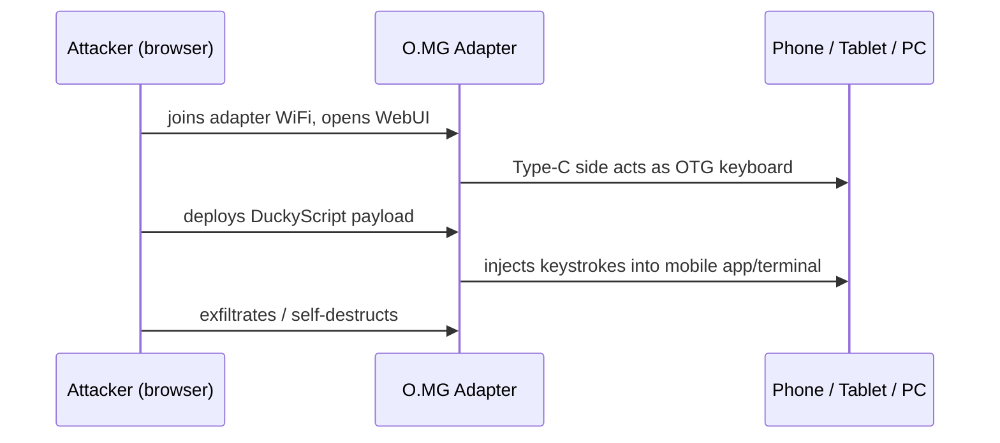

# O.MG Adapter — The Complete Guide

> **Quick Summary**: The O.MG Adapter conceals a covert wireless implant inside a USB adapter, enabling wireless payload triggers and keystroke injections against mobile devices, tablets, and desktop hosts.

The O.MG family hides implants in everyday USB objects. The **Adapter** picks the most common travel accessory there is: the USB-A-to-USB-C dongle everyone carries to charge modern devices. Because the Type-C side is the *active* side, it behaves as an **OTG adapter** — plug it into a phone or tablet's Type-C port and you can deploy payloads to mobile devices, not just computers.

When it's not transmitting payloads, the Adapter passes normal USB 2.0 data while the implant stays undetectable. It's the discreet way to bring O.MG capability to the mobile-first world.

> **⚠️ Authorised testing only — ships deactivated.** Test only on devices you own or with written permission. Pair with [Malicious Cable Detector](/hak5/products/malicious-cable-detector/) to understand the defensive side.

---

## Specs at a glance

| Item | Specification |
|---|---|
| Form factor | USB-A (host) → USB-C (active/attack side) adapter |
| Implant | WiFi-enabled wireless HID chip (WebUI + 802.11 radio) |
| Payload language | DuckyScript 3.0 (Elite) / 2.0 (Basic) |
| Mobile | OTG-active Type-C side — inject into phones & tablets |
| Activation | Required via [O.MG Programmer](/hak5/products/omg-programmer/) — ships deactivated |
| Distinctive features | Self-destruct, geofencing, WiFi triggers, spoofed identity, data passthrough |
| Official docs | https://docs.hak5.org/omg-cable |

---

## Why the adapter matters — mobile attacks



| Scenario | Why the Adapter |
|---|---|
| Phone/tablet pen-testing | Type-C OTG injects where a USB-A device can't |
| Charging-station social engineering | Everyone picks up an A-to-C adapter |
| Mobile-first engagement | Modern targets are smartphones |
| Computer + mobile coverage | Same adapter works on both |

---

## Quickstart (3-step activation)

1. **Activate:** plug the Adapter into the [O.MG Programmer](/hak5/products/omg-programmer/), into a Chrome/Edge machine, open the WebFlasher (https://o.mg.lol/setup/), 3-step wizard.
2. **Connect:** join the Adapter's WiFi from your browser; open its WebUI.
3. **Deploy:** insert the **Type-C** end into the target (phone, tablet, or PC), then trigger the payload — it injects over the OTG HID link.

```text
REM On an Android test device, open a terminal app and type
DELAY 1500
STRING echo hello from O.MG adapter
ENTER
```

---

## Advanced & stealth

| Feature | What it does |
|---|---|
| OTG active Type-C | Deploys payloads to smartphones/tablets (uses the Type-C side) |
| Data passthrough | Normal USB 2.0 data while dormant; implant invisible |
| Spoofable identity | Clone VID/PID / extended USB ID / MAC |
| Self-destruct / geofence / WiFi trigger | Standard O.MG security controls |
| Encrypted C² (Elite) | Remote control over encrypted tunnel from anywhere |
| Hardware keylogger (Elite) | FullSpeed USB keylogger add-on with extra storage |

---

## Troubleshooting

| Symptom | Cause | Fix |
|---|---|---|
| No WebUI | Not activated | Activate via Programmer |
| Mobile doesn't receive keystrokes | Wrong side / OTG mode | Use the Type-C side (active) on mobile; USB-A on a PC |
| WebFlasher can't detect | Browser / bootloader | Chrome or Edge (WebSerial); unplug until prompted |
| Data passes but no attack | Dormant / payload not triggered | Trigger via WebUI or WiFi beacon |

---

## Related resources

- [O.MG Cable](/hak5/products/omg-cable/) / [O.MG Plug](/hak5/products/omg-plug/) — sibling implants
- [O.MG UnBlocker](/hak5/products/omg-unblocker/) — implant in a data blocker
- [O.MG Programmer](/hak5/products/omg-programmer/) — activation & updates
- [Malicious Cable Detector](/hak5/products/malicious-cable-detector/) — detection
- [Firmware & Downloads](/hak5/firmware-downloads/) — O.MG firmware & WebFlasher
- [Troubleshooting Index](/hak5/troubleshooting-index/)
- [Hak5 overview](/hak5/)
