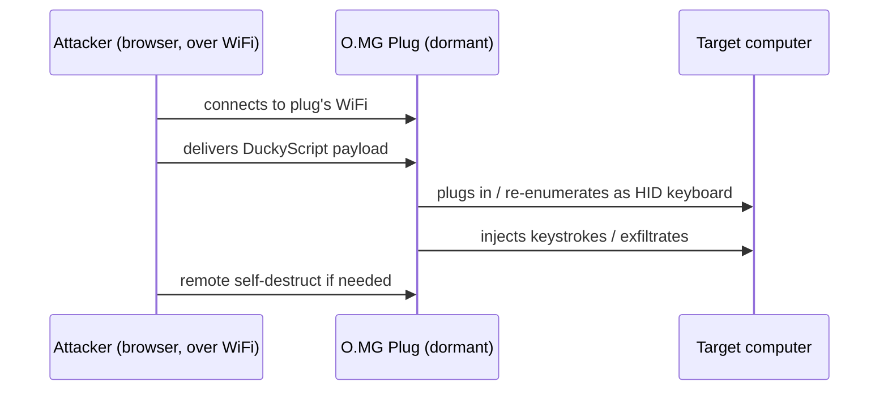

# O.MG Plug — The Complete Guide

> **一句話定位**：O.MG Plug 把 O.MG 的無線植入晶片塞進一支「鑰匙圈 USB 隨身碟」外型的插頭——掛在鑰匙上完全不起眼，一旦插進目標的 USB 孔，就能透過 Wi-Fi 遠端注入按鍵、執行 DuckyScript Payload。

The [O.MG Cable](/hak5/products/omg-cable/) hides its implant in a cable. The **O.MG Plug** hides the exact same implant in something even more mundane: a keychain USB plug that looks like a cheap thumb drive / phone charger block. It's the "leave it on the desk and hope they plug it in" social-engineering tool.

Same capabilities, different disguise. Because it's a plug rather than a cable, it's even easier to carry and easier to slot into a target's USB port — the classic "found a USB stick, curiosity killed the security posture" scenario.

> **⚠️ Authorised testing only — ships deactivated.** Use in your own lab or with explicit authorization. See [Malicious Cable Detector](/hak5/products/malicious-cable-detector/) for defense.

---

## Specs at a glance

| Item | Specification |
|---|---|
| Form factor | Keychain USB plug (looks like a thumb drive) |
| Implant | WiFi-enabled wireless HID chip (WebUI + 802.11 radio) |
| Payload language | DuckyScript 3.0 (Elite) / 2.0 (Basic) |
| Activation | Required via [O.MG Programmer](/hak5/products/omg-programmer/) — ships deactivated |
| Triggering | WiFi — long-range beacon trigger, geofencing |
| Distinctive features | Self-destruct, geofencing, spoofed VID/PID/MAC, WebUI control |
| Official docs | https://docs.hak5.org/omg-cable |

> The Plug's hardware tiers (Basic/Elite) mirror the O.MG Cable — see the [O.MG Cable page](/hak5/products/omg-cable/) for the full Basic vs Elite table (slots, speed, keylogger, stealth link, encrypted C²).

---

## Use case & attack flow

The thumbnail version of the O.MG family, for a plug:



| Scenario | Why the Plug fits |
|---|---|
| USB drop / "found a drive" | Looks like an innocent thumb drive |
| Keychain carry | Always with you, always deniable |
| Sneaker-net social engineering | Disguised as a charger block left on a desk |
| Red-team demonstration | Teach teams how removable-media attacks work |

---

## Quickstart (3-step activation)

1. **Activate:** insert the Plug into the [O.MG Programmer](/hak5/products/omg-programmer/), plug the Programmer into a Chrome/Edge machine, open the WebFlasher (https://o.mg.lol/setup/), and follow the 3-step wizard.
2. **Connect:** after activation, join the Plug's WiFi from your browser and open its WebUI.
3. **Deploy:** click a DuckyScript payload's **Run** — the Plug injects into whatever it's plugged into.

```text
REM Proof-of-concept — open notepad, type a message
DELAY 1000
GUI r
DELAY 500
STRING notepad
ENTER
DELAY 800
STRING Hello from an O.MG Plug!
ENTER
```

---

## Stealth & advanced

| Feature | What it does |
|---|---|
| Port Stealthing | Dormant until payload deploys — no enumeration, no logs |
| Spoofable identity | Clone VID/PID / extended USB ID / MAC |
| Self-destruct | Remote wipe → inert; recoverable via Programmer |
| Geofencing | Trigger or self-destruct based on location |
| WiFi triggers | Fire payloads long-range with a single beacon |
| Batch firmware (Elite) | Programmer can flash many units for bulk deployments |

---

## Troubleshooting

| Symptom | Cause | Fix |
|---|---|---|
| No WebUI / dormant | Not activated | Activate via Programmer |
| WebFlasher can't see it | Wrong browser / not in bootloader mode | Chrome or Edge (WebSerial); keep unplugged until prompted |
| Looks "off" as a thumb drive | Enumerates as HID when payload armed | Only enumerates when you trigger — expect normal when dormant |
| Payload doesn't type | Layout mismatch | Load correct keyboard layout / source the right DuckyScript version |

---

## Related resources

- [O.MG Cable](/hak5/products/omg-cable/) — the same implant in a cable disguise
- [O.MG Adapter](/hak5/products/omg-adapter/) — the implant in a USB-A-to-C adapter
- [O.MG UnBlocker](/hak5/products/omg-unblocker/) — the implant in a data blocker
- [O.MG Programmer](/hak5/products/omg-programmer/) — activation & updates
- [Malicious Cable Detector](/hak5/products/malicious-cable-detector/) — detection
- [Firmware & Downloads](/hak5/firmware-downloads/) — O.MG firmware & WebFlasher
- [Troubleshooting Index](/hak5/troubleshooting-index/)
- [Hak5 overview](/hak5/)
