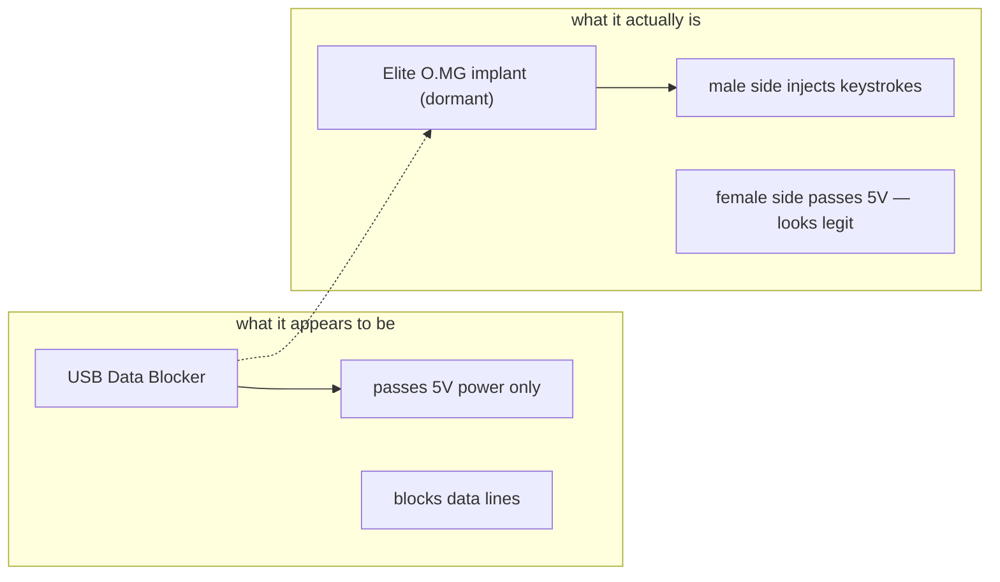

# O.MG UnBlocker — The Complete Guide

> **Quick Summary**: The O.MG UnBlocker conceals a covert wireless implant inside a standard-looking USB data blocker condom, illustrating critical hardware supply-chain and physical trust vulnerabilities.

There is a well-known piece of defensive hardware: the **USB data blocker** ("USB condom"). It passes only power and blocks the data lines, so you can safely charge from an unknown port. It's the go-to recommendation for travellers and executives. The O.MG UnBlocker weaponises that trust: it looks and works exactly like a data blocker, but inside sits a dormant O.MG wireless implant.

The **male** end is the active attack side — when plugged into a target, it can transmit payloads. The **female** end passes 5V power downstream just like a real blocker, so the deception holds. Customize the label to match your target environment for maximum believability. It contains the Elite-series implant, giving industry-leading speed and future firmware capability.

> **⚠️ Authorised testing only — ships deactivated.** This is the single most deceptive tool in the catalogue, aimed squarely at a *defensive* gadget people trust implicitly. Test it only on your own systems and within authorised engagements.

---

## Specs at a glance

| Item | Specification |
|---|---|
| Form factor | USB data blocker appearance (3 colors; custom labels/logos) |
| Implant | Elite-series O.MG wireless HID chip, dormant until triggered |
| Ports | USB-A male (active attack side) + USB-A female (5V power pass-through) |
| Payload language | DuckyScript 3.0 (Elite) |
| Injection speed | up to 890 keys/sec |
| Payload slots | up to 200 (with extra storage) |
| Keymaps | 192 global keymaps built in |
| Activation | Required via [O.MG Programmer](/hak5/products/omg-programmer/) — ships deactivated |
| Distinctive features | Self-destruct, geofencing, WiFi trigger, spoofed ID, Port Stealthing, built-in IDE in WebUI |
| Official docs | https://docs.hak5.org/omg-cable |

---

## The deception, explained



| Scenario | Why the UnBlocker |
|---|---|
| Trusted-device social engineering | Everyone plugs their phone into a "safe" data blocker |
| Executive travel | Pre-placed next to a trusted charger — the last device anyone suspects |
| Blue-team training | Demonstrate that even "security" hardware can be compromised |
| Red-team decoy | Custom label/logo to match the target environment |

---

## Quickstart (3-step activation + use)

1. **Activate:** insert into the [O.MG Programmer](/hak5/products/omg-programmer/), into a Chrome/Edge machine, open the WebFlasher (https://o.mg.lol/setup/), 3-step wizard.
2. **Connect:** join the UnBlocker's WiFi from your browser; open its WebUI (built-in IDE included).
3. **Deploy:** plug the **male** end into a target; trigger the DuckyScript payload from the WebUI.

```text
REM Proof-of-concept — open notepad and type
DELAY 1000
GUI r
DELAY 500
STRING notepad
ENTER
DELAY 800
STRING Hello from an O.MG UnBlocker!
ENTER
```

The WebUI's built-in IDE gives live feedback (syntax highlighting, error catching) while you build payloads.

---

## Stealth & advanced

| Feature | What it does |
|---|---|
| Port Stealthing | Dormant until a payload deploys — no enumeration, no logs |
| Spoofable identity | Clone VID/PID / extended USB ID / MAC |
| Global keymaps | 192 layouts to attack machines worldwide |
| Self-destruct | Remote wipe → inert; recoverable via Programmer |
| Geofencing | Trigger/self-destruct if the device leaves scope |
| WiFi triggers | Long-range single-beacon payload firing |
| Encrypted C² (Elite) | Remote control from anywhere; can disable onboard WebUI |
| HIDX StealthLink | Bidirectional tunnel Target ↔ O.MG ↔ control |

---

## Troubleshooting

| Symptom | Cause | Fix |
|---|---|---|
| No WebUI / inert | Not activated | Activate via Programmer |
| "Safe" behavior only | Dormant — hasn't been triggered | Trigger via WebUI / WiFi beacon |
| WebFlasher can't detect | Browser / bootloader | Chrome or Edge (WebSerial); connect device at prompt |
| Payload slow | Wrong DuckyScript version | Use DuckyScript 3.0 with the Elite implant on latest firmware |
| Accidental self-destruct | Geofence/rule fired out of scope | Recover with Programmer; tighten geofence scope |

---

## Related resources

- [O.MG Cable](/hak5/products/omg-cable/) / [O.MG Plug](/hak5/products/omg-plug/) / [O.MG Adapter](/hak5/products/omg-adapter/) — O.MG family
- [O.MG Programmer](/hak5/products/omg-programmer/) — activation & updates
- [Malicious Cable Detector](/hak5/products/malicious-cable-detector/) — the tool that can catch this
- [USB Rubber Ducky](/hak5/products/usb-rubber-ducky/) — DuckyScript reference
- [Firmware & Downloads](/hak5/firmware-downloads/) — O.MG firmware & WebFlasher
- [Troubleshooting Index](/hak5/troubleshooting-index/)
- [Hak5 overview](/hak5/)
