# Packet Squirrel Mark II — The Complete Guide

> **Quick Summary**: Packet Squirrel Mark II is an inline Ethernet man-in-the-middle micro-router. Bridging target and network ports transparently, it enables packet captures, covert VPN tunnels, and DNS spoofing in a compact field form factor.

While the [Shark Jack](/hak5/products/shark-jack/) jumps *onto* a network to scan it, the **Packet Squirrel** sits *inside* a network link and becomes the man-in-the-middle. It's the perfect way to demonstrate (and defend against) inline interception: plug it between a device and its network, flip a switch, and it captures, proxies, redirects, or isolates that device's traffic.

The Mark II runs DuckyScript, Bash, and Python payloads, and adds VPN support (WireGuard), dynamic proxying, DNS manipulation, and Cloud C². It's a favorite for red teams dropping a silent tap, and for the blue team wanting to understand exactly how inline MITM works.

> **⚠️ Authorised testing only.** Inline interception of traffic you don't own is illegal. Use the Squirrel on your own devices and network.

---

## Specs at a glance

| Item | Specification |
|---|---|
| Ports | 2× Ethernet (Target + Network) + USB 2.0 host |
| Power | USB-C (just 0.2 A) |
| Interface | Inline layer-2 / layer-3 device-in-the-middle |
| Payloads | DuckyScript + Bash + Python |
| Networking | NAT, BRIDGE, TRANSPARENT, JAIL, ISOLATE modes |
| Manipulation | Dynamic proxy, killport, killstream, spoof-DNS, DNS sinkhole, packet capture |
| VPN | WireGuard support in NAT/BRIDGE modes |
| Arming/Config | Web UI + SSH at `172.16.32.1` |
| Size / weight | 50 × 40 × 15 mm, 24 g |
| Official docs | https://docs.hak5.org/packet-squirrel-mk-ii |

## Anatomy

| Part | Purpose |
|---|---|
| **Target** Ethernet port (top-left) | The device you want to watch/manipulate |
| **Network** Ethernet port (top-right) | The real network / uplink |
| 3-position switch | Selects which payload runs |
| USB-C | Power |
| USB 2.0 host | Storage / additional interfaces |

---

## Network modes (the heart of it)

The Squirrel's behavior is set by payloads via the `NETMODE` command. This is where 90% of the learning happens:

| Mode | What it does | Stealth | VPN/C² |
|---|---|---|---|
| `NAT` | Routes Target → Network as its own router (DHCP 172.16.32.X) | Low | ✅ |
| `BRIDGE` | Transparent layer-2 bridge (Target gets IP from network) | Medium | ✅ |
| `TRANSPARENT` | Same as bridge but **visible nowhere** (no IP of its own) | Highest | ❌ |
| `JAIL` | Disconnects Target from the network; Squirrel keeps net access | — | ✅ |
| `ISOLATE` | Disconnects Target *and* drops the Squirrel off the net | — | ❌ |

```mermaid
%% name: hak5-product-packet-squirrel-mark-ii-inline
flowchart LR
    T[Target device] -->|Target port| S[Packet Squirrel]
    S -->|Network port| N[Real network / router]
    style S fill:#333,stroke:#fff
    subgraph inline["Traffic path — Squirrel is in the middle"]
        T
        S
        N
    end
    S -.->|"sniff / proxy / DNS / jail"| A[Loot + observations]
```



> **You might be asking:** *"Which mode should I use?"* For learning, **NAT** is easiest (you control the DHCP). For real stealth, **TRANSPARENT** leaves no trace — but you lose VPN/C². Choose by whether silence or connectivity matters more.

---

## Quickstart — first capture

### Step 1 — Wire it up
1. **Network** port → your router/switch.
2. **Target** port → the device you want to watch (your test laptop!).
3. Power over USB-C.

### Step 2 — Arming mode
Put the switch in the **arming** position. Set your NIC to `172.16.32.0/24` and browse to the web UI (or SSH):

```
http://172.16.32.1
```

Set an admin password, and you can load or edit payloads.

### Step 3 — Run a sniffing payload
Put a packet-capture payload on a switch position, flip to it, and watch the device's traffic:

```bash
# From the Squirrel shell (arming mode / SSH)
tcpdump -i eth0 -w /root/loot/capture.pcap
```

Then open the `.pcap` in Wireshark on your laptop for analysis.

---

## Payload ideas & commands

| Goal | Command / payload |
|---|---|
| Sniff to a file | `tcpdump -i eth0 -w /root/loot/capture.pcap` |
| Block a TCP port | `killport 80` (TCP RST injection) |
| Kill a TCP stream by content | `killstream "secret"` |
| Fake DNS answers | `spoofdns example.com 1.2.3.4` |
| Sinkhole all DNS | `DNS SINKHOLE` (redirect chosen domains) |
| Rewrite traffic | `DYNAMIC PROXY` (log/alter client-server data) |
| Big-button network toggle | `GATEKEEPER` — pop the pushbutton to cut the link |

```text
REM Example payload — capture traffic and sinkhole known-bad domains
NETMODE BRIDGE
LED R
DNS SINKHOLE bad-domain.example.com
tcpdump -i eth0 -w /root/loot/capture.pcap &
LED G
```

---

## Advanced

| Capability | How |
|---|---|
| WireGuard VPN | Encrypt the Squirrel's network path in NAT/BRIDGE mode |
| Cloud C² | Manage payloads + offload loot remotely |
| Python payloads | Full Python for scripting more logic |
| Background commands | Run long tasks, then interact from shell |
| Traffic detection (blue team) | Use JAIL + filters to isolate a compromised device mid-engagement |
| USB host expansion | Attach storage to grow the loot capacity |

---

## Troubleshooting

| Symptom | Cause | Fix |
|---|---|---|
| Target has no IP in TRANSPARENT | Fed IP from network — needs real uplink present | Verify Network port link; or use NAT for an independent DHCP |
| Internet slow through Squirrel | NAT mode rewriting | Expected in NAT; use BRIDGE/TRANSPARENT to keep IPs |
| Web UI unreachable | Wrong subnet | NIC to `172.16.32.0/24`, browse `172.16.32.1` |
| killport/killstream no effect | Target using a different port/pattern | Match the exact port; check payload syntax for your firmware |
| Payload not auto-running | Switch position vs payload folder mapping | Verify which switch position runs which payload |

---

## Related resources

- [Shark Jack](/hak5/products/shark-jack/) — jump *onto* a network (vs sitting *inside* it)
- [Plunder Bug LAN Tap](/hak5/products/plunder-bug-lan-tap/) — passive-only sniffing alternative
- [WiFi Pineapple Mark VII](/hak5/products/wifi-pineapple-mark-vii/) — wireless-side MITM
- [Firmware & Downloads](/hak5/firmware-downloads/) — packetsquirrel payload repo & firmware
- [Troubleshooting Index](/hak5/troubleshooting-index/)
- [Hak5 overview](/hak5/)
