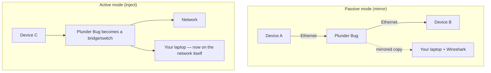

# Plunder Bug LAN Tap — The Complete Guide

> **Quick Summary**: Plunder Bug is a pocket-sized Ethernet TAP that mirrors bidirectional network traffic directly to a host computer over USB-C. Unpowered and passive, it is built for immediate field packet analysis with Wireshark and tcpdump.

The Plunder Bug is the network side of Hak5's physical-access toolkit: a tiny LAN tap that sits on an Ethernet link and mirrors traffic to your analysis computer. It works in **two modes**:

- **Passive mode** — silently mirror the traffic on the tapped link to your laptop.
- **Active mode** — inject your analysis device *into* the network (it becomes a simple switch/host) for active scanning.

Because it's USB-C powered with the ASIX AX88772C chipset, it works across platforms with tiny cross-platform scripts — and even with an Android root app for on-site mobile capture. It pairs perfectly with **Wireshark** for analysis.

> **⚠️ Authorised testing only.** Tapping a network link you don't own is illegal. Use on your own lab network or with written permission.

---

## Specs at a glance

| Item | Specification |
|---|---|
| Network interface | 2× 10/100BASE-T Fast Ethernet, auto-negotiation (up to 100 Mbps) |
| USB interface | USB-C (tap + power, 5V, 20–300 mA draw) |
| USB Ethernet chipset | ASIX AX88772C |
| Modes | Passive (mirror traffic) / Active (inject into network) |
| Analysis software | Wireshark & other open-source analyzers |
| Mobile support | Android root app for on-site pcap capture |
| Official docs | https://docs.hak5.org/plunder-bug |

## Anatomy

| Part | Purpose |
|---|---|
| Ethernet port A | One side of the tapped link |
| Ethernet port B | Other side of the tapped link |
| USB-C port | Connect to your analysis computer (power + data) |

---

## Passive vs active — the two personalities



| Mode | What happens | Best for |
|---|---|---|
| **Passive** | Traffic A↔B mirrored to your laptop; the link keeps working | Stealthy "what's on this line?" sniffing |
| **Active** | Your laptop joins the network through the Bug | Active scanning, ARP work, service discovery |

---

## Quickstart — sniff with Wireshark

### Step 1 — Wire it up
1. Connect one Ethernet end to a device/switch (lab network!).
2. Connect the other Ethernet end to a second device.
3. Plug the **USB-C** side into your laptop.

### Step 2 — Load the connection script
Hak5 ships cross-platform connection scripts. On Linux:

```bash
# Run Hak5's provided setup script, or configure manually:
sudo ip link set dev usb0 up
sudo dhclient usb0            # get an IP for active mode
```

For passive capture, the interface appears automatically (e.g. `usb0` / a new Ethernet adapter on Windows or macOS).

### Step 3 — Capture in Wireshark
Start Wireshark on the new interface and capture:

```text
$ wireshark                      # or tcpdump -i usb0 -w capture.pcap
```

Watch traffic on the tapped link appear live.

### Step 4 — Switch between modes
Toggle passive/active per the mode-switching instructions for your OS (Windows / Mac / Linux scripts included with the device).

---

## Hands-on: see it work on your own lab

To prove passive capture works, generate traffic:

```bash
# From a device on the tapped link, ping something
ping -c 3 8.8.8.8
```

In Wireshark you should see the ICMP echo requests/replies traversing the link. That's your tap doing its job.

---

## Advanced

| Capability | How |
|---|---|
| Passive mirroring | No IP needed on your laptop — just sniff the mirrored frames |
| Active injection | Bring your laptop onto the network for active recon |
| Mobile pcap | Android root app captures `.pcap` on the go |
| Protocol analysis | Feed captures into Wireshark / tcpdump |
| Simple switch use | Chain it to bridge a segment without analysis |

---

## Troubleshooting

| Symptom | Cause | Fix |
|---|---|---|
| No traffic in Wireshark | Interface wrong / link not active | Verify the new interface name (`ip link`); ensure Ethernet links are lit |
| Laptop gets no IP in active mode | DHCP not reaching | Set a manual IP matching the segment |
| Windows driver missing | ASIX driver not installed | Install the ASIX AX88772C driver, or use the provided script |
| Android not seeing it | App needs root + OTG | Use the Android root app; enable USB OTG |
| One side no link | Cable or port fault | Swap/test both Ethernet ends independently |

---

## Related resources

- [Shark Jack](/hak5/products/shark-jack/) — active network recon, no tap needed
- [Packet Squirrel Mark II](/hak5/products/packet-squirrel-mark-ii/) — inline manipulation vs passive mirroring
- [Screen Crab](/hak5/products/screen-crab/) — flip the tap to video
- [ALFA Network](/alfa-network/) — Wi-Fi adapters for wireless capture
- [Troubleshooting Index](/hak5/troubleshooting-index/)
- [Hak5 overview](/hak5/)
