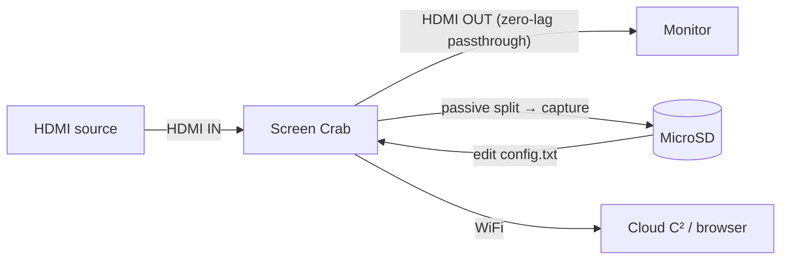

# Screen Crab — The Complete Guide

> **一句話定位**：Screen Crab 是一台「藏在 HDMI 線中間的隱形監視器」——把它夾在電腦與螢幕（或遊戲機與電視）之間，它零延遲地把畫面截圖或錄影存進 MicroSD，還能透過 Wi-Fi 串流到 Cloud C²。系統管理員、滲透測試與想「看到別人看到什麼」的人最愛它。

The Screen Crab is the first HDMI **man-in-the-middle** device made for pentesters. It doesn't intercept network traffic — it intercepts the *video signal itself*. Because it splits the HDMI signal passively (no re-encoding in the data path), the output display sees **zero lag and zero interruption** while the Crab quietly captures a second copy.

It's disarmingly simple: plug it inline, power it over USB, and it starts saving screenshots to the MicroSD card out of the box. Edit a `config.txt` file to change intervals, enable video, or connect it to Wi-Fi + [Cloud C²](/hak5/firmware-downloads/) to watch screens live from a browser.

> **⚠️ Authorised testing only.** Capturing someone's screen without consent is illegal (Taiwan: 刑法第三一五條之一妨害秘密罪, among others). Use on your own machines/displays or with explicit authorization.

---

## Specs at a glance

| Item | Specification |
|---|---|
| Interface | 2× full-size HDMI (IN / OUT) + USB-C (power) + MicroSD |
| Standards | HDMI 1.4 / DVI 1.0; 802.11 b/g/n (WiFi, 2.4 GHz) |
| Resolution | Most 16:9 formats up to 1920×1080 (Full HD 1080p), auto up/downscale |
| Capture modes | Interval screenshots, or full-motion video (MPEG-4 at 2 / 4 / 16 Mbps) |
| Storage | MicroSD (SDXC support); loop recording overwrites oldest files |
| Latency | Zero — passive signal splitter, no lag on output |
| WiFi | RP-SMA dipole antenna for Cloud C² streaming |
| Power | USB 5V 1A (5 W) |
| Dimensions | 105 × 51 × 21 mm |
| Official docs | https://docs.hak5.org/screen-crab |

## Anatomy

| Part | Purpose |
|---|---|
| HDMI **IN** | From the source (computer / console) |
| HDMI **OUT** | To the monitor / TV (pass-through, zero-lag) |
| USB-C | Power |
| MicroSD slot | Screenshots / video storage |
| WiFi antenna (RP-SMA) | Cloud C² streaming |
| RGB LED + button | Status (disable LED for stealth) |

---

## Installation & data flow



1. Connect the source to the Crab's **HDMI IN**.
2. Connect your monitor to the Crab's **HDMI OUT** (normal operation, no lag).
3. Power over USB-C. Screenshots begin saving to the MicroSD at default intervals.

---

## Quickstart — first capture in 2 minutes

### Step 1 — Insert a MicroSD card
Any MicroSD works; SDXC gives months of storage. The Crab auto-generates a `config.txt` on first boot.

### Step 2 — Wire it inline
- **HDMI IN** ← your computer.
- **HDMI OUT** → your monitor.
- **USB-C** → power.

Expected result: the monitor works exactly as before (no delay), and the MicroSD starts collecting screenshots.

### Step 3 — Read the captures
Eject the MicroSD and browse:

```text
/root/
  loot/
    2026-08-21-1430/screenshot_001.jpg
    2026-08-21-1430/screenshot_002.jpg
    ...
  config.txt
```

### Step 4 — Enable video
Edit `config.txt` on the MicroSD root:

```text
# Capture mode: image or video
capture_mode = video
# MPEG4 quality: 2, 4, or 16 Mbps
bitrate = 4
# Seconds between captures
interval = 30
```

Safely remove the MicroSD, reinsert, power-cycle. The Crab now records MPEG-4 video.

---

## Cloud C² — watch from anywhere

To stream screens/video remotely:

1. Edit `config.txt` and add your Wi-Fi network:

```text
wifi_ssid = OfficeWiFi
wifi_pass = hunter2example
```

2. Add your [Cloud C²](/hak5/firmware-downloads/) device file to the MicroSD.
3. Boot. The Crab connects to Wi-Fi and registers with C² — you can now stream screenshots and download captures from the browser.

> **You might be asking:** *"Zero lag — how?"* The Crab uses a **passive video signal splitter** on the HDMI path. The source's signal is mirrored to the monitor untouched; a duplicate is fed to the capture hardware. Nothing in the original path is re-encoded, so there's no added latency. That's also what makes it so invisible.

---

## Advanced

| Capability | How |
|---|---|
| Loop recording | Continuous capture deletes oldest files to make room (never fills up) |
| Interval screenshots | Configurable `interval` in seconds |
| Multiple bitrates | 2 / 4 / 16 Mbps MPEG-4 quality tiers |
| Stealth LED | Disable the RGB LED for covert operation |
| Resolution handling | Auto up/downscale to 1080p from most sources |
| Remote management | Cloud C²: change settings, download captures, live view |

---

## Troubleshooting

| Symptom | Cause | Fix |
|---|---|---|
| No screenshots saved | MicroSD not seated / write-protected | Re-seat; check lock switch; test with a known-good card |
| Monitor blinks when Crab inserted | Power / HDMI negotiation | Verify 5V/1A USB power; reseat HDMI connections |
| Video choppy | Bitrate too low for the scene | Raise to 16 Mbps |
| Cloud C² never connects | Wi-Fi creds wrong / no device file | Recheck `config.txt`; copy the C² device file to the card |
| Can't find config.txt | Card not booted once | Insert card, boot once, it auto-generates the config |

---

## Related resources

- [Firmware & Downloads](/hak5/firmware-downloads/) — Cloud C² server setup
- [Key Croc](/hak5/products/key-croc/) — keystroke-level interception (complementary: keys *and* screens)
- [Packet Squirrel Mark II](/hak5/products/packet-squirrel-mark-ii/) — network-side interception
- [Troubleshooting Index](/hak5/troubleshooting-index/)
- [Hak5 overview](/hak5/)
