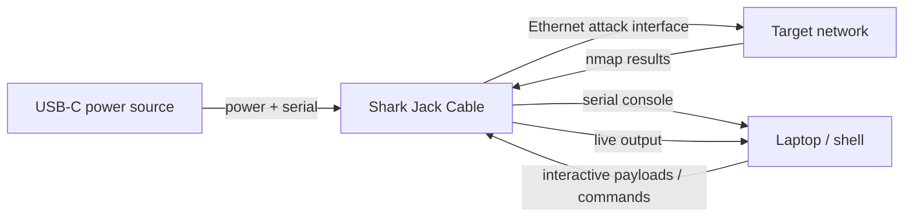

# Shark Jack Cable — The Complete Guide

> **Quick Summary**: The Shark Jack Cable is the continuous-power edition of the Shark Jack network reconnaissance tool—powered via USB-C with dedicated serial console access for multi-hour scanning and immediate live shell debugging.

The classic [Shark Jack](/hak5/products/shark-jack/) is limited by its 10–15 minute battery. The **Cable edition** fixes the one thing that limited its predecessor: power. Run it off any USB-C power source (a laptop, a power bank, a charger) and it can maintain network recon for as long as you need.

The extra payoff is a **dedicated USB-C serial console**. On the classic Shark Jack you flip to arming mode, move the cable to a laptop, and SSH in. The Cable edition gives you a live shell *over serial* — you can watch a scan progress in real time, interact with payloads, and never remove the device from the network.

> **⚠️ Authorised testing only.** Long-duration recon on a network you don't own is illegal. Use in your own lab.

---

## Specs at a glance

| Item | Specification |
|---|---|
| Attack interface | Fast Ethernet (RJ45) |
| Power | USB-C (runs as long as power is supplied) |
| Extra vs classic | Dedicated USB-C serial console (live shell) |
| OS | Linux, root shell, DuckyScript/Bash payloads |
| Default payload | nmap scan → `/root/loot/` |
| Arming address | `172.16.24.1` (over SSH) |
| Default credentials | `root` / `hak5shark` |
| Official docs | https://docs.hak5.org/shark-jack |

## Classic vs Cable — what changed

| | Shark Jack | Shark Jack Cable |
|---|---|---|
| Power | Built-in battery (~10–15 min) | USB-C (unlimited while powered) |
| Serial console | No | **Yes — live shell over USB-C** |
| Runtime | Short, on keychain | Long, sustained engagements |
| Best for | Quick, portable recon | Extended monitoring + interactive work |



---

## Quickstart

### Step 1 — Connect it
1. Plug the **USB-C** side into a power source / your laptop — this both powers it and gives you the serial console.
2. Plug the **Ethernet** side into the target network (your lab).

### Step 2 — Choose a mode
- **Attack mode:** flip the switch; the default nmap payload runs and logs to `/root/loot/`.
- **Arming mode:** flip to the other position; connect over serial and you get an immediate root shell.

### Step 3 — Live shell over serial
Unlike the classic, you don't need a separate SSH hop to see results. Connect the USB-C serial console and interact in real time:

```bash
# Typical: open the serial console (exact device depends on your OS)
screen /dev/ttyACM0 115200
```

Expected output — the device shell:

```text
Welcome to Shark Jack (kernel 4.x.y)
# 
```

### Step 4 — Load payloads & grab loot
From the shell:

```bash
cat /root/loot/scan/*.txt      # read scan results
UPDATE_PAYLOADS                 # sync community payload library
```

Expected output:

```text
Nmap scan report for 192.168.1.20
PORT     STATE SERVICE
22/tcp   open  ssh
445/tcp  open  microsoft-ds
```

---

## Commands from the serial console

The Cable edition ships helpful shell commands (firmware 1.2.0+):

| Command | What it does |
|---|---|
| `HELP` | List all Shark Jack helpers and commands |
| `ACTIVATE` / `ACTIVATE_PAYLOAD` | Run the selected payload |
| `LIST` / `LIST_PAYLOADS` | List the local payload library |
| `UPDATE_PAYLOADS` | Sync the library with the remote repo |
| `UPDATE_FIRMWARE` | Check for and install firmware updates |
| `SERIAL_WRITE` | Write directly to the serial console |
| `LED` | Configure the LED |

---

## Advanced

| Capability | How |
|---|---|
| Long-duration passive recon | Powered by a power bank, monitor a network all day |
| Live payload development | Serial shell → edit payload → `ACTIVATE` without re-cabling |
| Interactive nmap | Watch scans stream to the serial console in real time |
| Exfiltration over network | Payloads push loot off over the Ethernet link |
| `NETMODE` control | DHCP client/server/bridge per payload |

---

## Troubleshooting

| Symptom | Cause | Fix |
|---|---|---|
| Serial console shows nothing | Wrong serial speed / wrong device node | Use the documented baud rate (115200) and correct `/dev/tty*` |
| No power / no serial | USB-C not connected properly | Ensure the USB-C carries both power and data |
| Ethernet link but no scan | Payload missing | Re-arm and `UPDATE_PAYLOADS` / place `payload.sh` |
| Can't read loot | Wrong path | Loot lives in `/root/loot/` per payload |

---

## Related resources

- [Shark Jack](/hak5/products/shark-jack/) — the battery-powered original
- [Packet Squirrel Mark II](/hak5/products/packet-squirrel-mark-ii/) — inline Ethernet MITM
- [Plunder Bug LAN Tap](/hak5/products/plunder-bug-lan-tap/) — passive sniffing
- [Firmware & Downloads](/hak5/firmware-downloads/) — payload repo & firmware
- [Troubleshooting Index](/hak5/troubleshooting-index/)
- [Hak5 overview](/hak5/)
